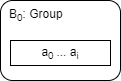
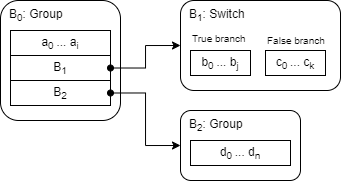
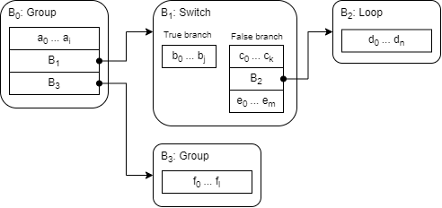
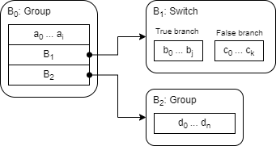
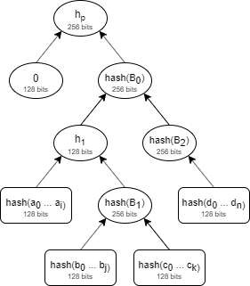

# Programs in Distaff VM
Distaff VM consumes programs are structured in a form of an execution graph. The purpose of this graph is twofold:

1. To describe program execution semantics.
2. To define structure of program hash.

These are related but distinct because two programs which are semantically the same can be reduced to two distinct hashes, depending on how the execution graph is structured.

Program execution graph is constructed from a set of nodes called *program blocks*. Each program block has its own structure and execution semantics. In the following sections we describe these programs blocks, give a few examples of how program graphs are constructed from these blocks, define methodology for computing program hashes from program graphs, and finally, describe how program hash is computed within the VM.

## Program blocks
At the high level, there are two types of program blocks: instruction blocks and control blocks. Both are explained below.

### Instruction blocks
An instruction block is just a sequence of instructions, where each instruction is a tuple *(op_code, op_value)*. For vast majority of instructions `op_value = 0`, but there are some instructions where it is not. For example, for a `PUSH` instruction, `op_value` is set to the value which is to be pushed onto the stack.

Instruction blocks impose the following restrictions on their content:
* Number of instructions in a block must be one less than a multiple of 16 (e.g. 15, 31, 47 etc.).
* An instruction block cannot contain any of the flow control instructions: `BEGIN`, `TEND`, `FEND`, `LOOP`, `WRAP`, `BREAK`, `HACC`, and `VOID`.
* An instruction which carries non-zero `op_value` must be located at a step which is a multiple of 8 (e.g. 8, 16, 32 etc.).

Due to alignment rules within the VM, the first instruction of an instruction block is guaranteed to be executed on a step which is a multiple of 16.

### Control blocks
Control blocks are used to specify flow control logic of a program. Currently, there are 3 types of control blocks: (1) group blocks, (2) switch blocks, and (3) loop blocks. Specifics of each type of these are described below.

#### Group blocks
A group block is used to group several blocks together, and has the following structure:
```
Group {
    body : Vector<ProgramBlock>,
}
```
where, `ProgramBlock` can be an instruction block or a control block.

Execution semantics of a group block are as follows:
* Each block in the `body` vector is executed one after the other. 

Group blocks impose the following restrictions on their content:
* There must be at least one block in the `body` vector.
* The first block in the `body` vector must be an instruction block.
* An instruction block cannot be followed by another instructions block.

#### Switch blocks
A switch block is used to describe conditional branching (i.e. *if/else* statements), and has the following structure:
```
Switch {
    true_branch  : Vector<ProgramBlock>,
    false_branch : Vector<ProgramBlock>,
}
```
Execution semantics of a switch block are as follows:
* If the top of the stack is `1`, blocks in the `true_branch` is executed one after the other;
* If the top of the stack is `0`, blocks in the `false_branch` is executed one after the other.
* If the top of the stack is neither `0` nor `1`, program execution fails.

Switch blocks impose the following restrictions on their content:
* The first block in the `true_branch` vector must be an instruction block which has `ASSERT` as its first operation. This guarantees that this branch can be executed only if the top of the stack is `1`.
* The first block in the `false_branch` vector must be an instruction block which has `NOT ASSERT` as its first two instructions. This guarantees that this branch can be executed only if the top of the stack is `0`.
* Within `true_branch` and `false_branch` vectors, an instruction block cannot be followed by another instructions block.

#### Loop block
A loop block is used to describe a sequence of instructions which is to be repeated zero or more times based on some condition (i.e. *while* statement). Structure of a loop block looks like so:
```
Loop {
    body : Vector<ProgramBlock>,
    skip : InstructionBlock,
}
```
where, `skip` is an instruction block containing the following sequence of instructions: `NOT ASSERT` followed by 14 `NOOP`'s.

Execution semantics of a loop block are as follows:
* If the top of the stack is `1`, blocks in the `body` vector are executed one after the other.
  * If after executing all blocks in the `body` vector, the top of the stack is `1`, the `body` blocks are executed again. This process is repeated until the top of the stack is `0`.
  * Once the top of the stack becomes `0`, `skip` block is executed.
* If the top of the stack is `0`, `skip` block is executed.
* If the top of the stack is neither `0` nor `1`, program execution fails.

Loop blocks impose the following restrictions on their content:
* The first block in the `body` vector must be an instruction block which has `ASSERT` as its first operation. This guarantees that a loop iteration can be entered only if the top of the stack is `1`.
* Within the `body` vector, an instruction block cannot be followed by another instructions block.

It is expected that at the end of executing all `body` blocks, the top of the stack will contain a binary value (i.e. `1` or `0`). However, this is not enforced at program construction time, and if the top of the stack is not binary, the program will fail at execution time.

## Example programs

### Linear program
The simplest program is a linear sequence of instructions with no branches or loops:
```
a0, a1, ..., a_i
```
where, a<sub>0</sub>, a<sub>1</sub> etc. are instructions executed one after the other. Such a program can be described by a single group block like so:

<p align="center">
    
</p>
To briefly explain the diagram:

* The outer rectangle with rounded corners represents a control block. In this case, it is a group block B<sub>0</sub>.
* This group block contains a single instruction block, which is represented by the inner rectangle with square corners.

### Program with branches
Let's add some conditional logic to our program. The program below does the following:
* First, instructions a<sub>0</sub> . . . a<sub>i</sub> are executed.
* Then, if the top of the stack is `1`, instructions b<sub>0</sub> . . . b<sub>j</sub> are executed. But if the top of the stack is `0`, instructions c<sub>0</sub> . . . c<sub>k</sub> are executed.
* Finally, instructions d<sub>0</sub> . . . d<sub>n</sub> are executed.

```
a0, a1, ..., a_i
if.true
    b0, b1, ..., b_j
else
    c0, c1, ..., c_k
end
d0, d1, ..., d_n
```
A diagram for this program could look like so:

<p align="center">
    
</p>

Here we have block B<sub>0</sub> which groups 3 other blocks together. The first one is an instruction block, the second one is a switch block describing the *if/else* statement, and the last one is another group block which contains a single instruction block with instructions d<sub>0</sub> . . . d<sub>n</sub>.

### Programs with nested blocks
Let's add nested control logic to our program. The program below is the same as the program from the previous example, except the *else* clause of the *if/else* statement now also contains a loop. This loop will keep executing instructions d<sub>0</sub> . . . d<sub>n</sub> as long as, right after d<sub>n</sub> is executed, the top of the stack is `1`. Once, the top of the stack becomes `0`, instructions e<sub>0</sub> . . . e<sub>m</sub> are executed, and then execution moves on to instructions f<sub>0</sub> . . . f<sub>l</sub>.
```
a0, a1, ..., a_i
if.true
    b0, b1, ..., b_j
else
    c0, c1, ..., c_k
    while.true
        d0, d1, ..., d_n
    end
    e0, e1, ..., e_m
end
f0, f1, ..., f_l
```
A diagram for this program would look like so:

<p align="center">
    
</p>

Here, we have 4 control blocks, where loop blocks B<sub>2</sub> is nested within the *else* branch of block B<sub>1</sub>.

## Program hash
All Distaff programs can be reduced to a 32-byte hash represented by a pair of elements in a 128-bit field. The hash is designed to target 128-bit preimage and second preimage resistance, and 64-bit collision resistance.

Program hash is computed from hashes of individual program blocks in a manner similar to computing roots of Merkle trees.

For example, let's say our program consists of 3 control blocks and looks like so:

<p align="center">
    
</p>

Hash of this program is computed like so:

1. First, we compute hash of instruction block *a<sub>0</sub> . . . a<sub>i</sub>*.
2. Then, we compute hashes of *b<sub>0</sub> . . . b<sub>j</sub>* and *c<sub>0</sub> . . . c<sub>k</sub>*, and combine them into the hash of block B<sub>1</sub>.
3. Then, we merge hash of block B<sub>1</sub> with hash of *a<sub>0</sub> . . . a<sub>i</sub>*, and call the resulting value *h<sub>1</sub>*.
4. Then, we compute hash of *d<sub>0</sub> . . . d<sub>n</sub>* and transform it into hash of block B<sub>2</sub>.
5. Then, we merge hash of block B<sub>2</sub> with *h<sub>1</sub>* to get the hash of block B<sub>0</sub>.
6. Finally, we merge hash of block B<sub>0</sub> with value `0` to obtain the hash of the entire program *h<sub>p</sub>*.

Graphically, this process looks like so:

<p align="center">
    
</p>

As mentioned above, hashes of Distaff programs are computed in a manner similar to roots of Merkle trees. This is by design. Using this property of program hashes, we can selectively reveal any of the program blocks while keeping the rest of the program private (e.g. secret programs with public pre/post conditions).

For example, if we wanted to reveal instruction sequence *d<sub>0</sub> . . . d<sub>n</sub>*, we could do so by making intermediate hash *h<sub>1</sub>* public. Then, anyone would be able to reconstruct the root hash from these two pieces of data and be sure that *d<sub>0</sub> . . . d<sub>n</sub>* is, in fact, the last sequence of instructions executed in the program with hash *h<sub>p</sub>*.

To compute program hash, we employ several rules and procedures:

* [Rules](#Hashes-of-control-blocks) for constructing hashes of control blocks from hashes of their contents.
* Procedure *[hash_ops](#hash_ops-procedure)* for computing a hash of a sequence of instructions.
* Procedure *[hash_acc](#hash_acc-procedure)* for merging hashes of control blocks with 128-bit values.
* Procedure *[hash_seq](#hash_seq-procedure)* for hashing of sequences of program blocks into 128-bit values.

All of these are described below.

### Hashes of control blocks
Hashes of control blocks are defined as tuples of two 128-bit elements *(v<sub>0</sub>, v<sub>1</sub>)*. These tuples are constructed as follows:

For **group blocks**, it is just a hash of `body` blocks contained within the group:
* *v<sub>0</sub> = hash_seq(blocks)*
* *v<sub>1</sub> = 0*

For **switch blocks**, it is hashes of both branches:
* *v<sub>0</sub> = hash_seq(true_branch)*
* *v<sub>1</sub> = hash_seq(false_branch)*

For **loop blocks**, it is a hash of the loop's `body` and the `skip` block:
* *v<sub>0</sub> = hash_seq(body, skip)*
* *v<sub>1</sub> = hash_seq(skip)*

For loop blocks we also define a value called **loop image** which is equal to *hash_seq(body)*. This value binds each iteration of the loop to a specific hash (see [here](#Loops)).

### hash_ops procedure
The purpose of *hash_ops* procedure is to hash a sequence of instructions. The procedure takes a state of four 128-bit elements as an input, merges each instruction into the state, and returns the updated state as the output.

The pseudo-code for this procedure looks like so:
```
with inputs: state[], instructions[]:
for each instruction in instructions do:
    state = add_round_constants(state);
    state = apply_sbox(state);
    state = apply_mds(state);
    state[0] = state[0] + instruction.op_code;
    state[1] = state[1] + instruction.op_value;
    state = add_round_constants(state);
    state = apply_inverse_sbox(state);
    state = apply_mds(state);
return state;
```
where:
  * `state` is an array of four 128-bit elements.
  * `instructions` is a vector of instruction tuples.

The body of the above loop is similar to the round of [Rescue](https://eprint.iacr.org/2019/426) hash function. But there are significant differences. Specifically, injecting values in the middle of every round invalidates security proof of sponge construction. Thus, it is possible that this approach is insecure, and will need to be modified in the future.

### hash_acc procedure
The purpose of *hash_acc* procedure is to merge hash of a control block, which is a tuple of two 128-bit values, with a single 128-bit value. The output of the *hash_acc* procedure an array of four 128-bit elements.

Denoting *(v<sub>0</sub>, v<sub>1</sub>)* to be the hash of the control block, and *h* to be the 128-bit value, high-level pseudo-code for *hash_acc* procedure looks like so:
```
with inputs: h, v0, v1:
let state = [h, v0, v1, 0];
for 14 rounds do:
    state = add_round_constants(state);
    state = apply_sbox(state);
    state = apply_mds(state);
    state = add_round_constants(state);
    state = apply_inverse_sbox(state);
    state = apply_mds(state);
return state;
```
The above is a modified version of [Rescue](https://eprint.iacr.org/2019/426) hash function. This modification adds half-rounds to the beginning and to the end of the standard Rescue hash function to make the arithmetization of the function fully foldable. This should not impact security properties of the function, but it is worth noting that it has not been studied to the same extent as the standard Rescue hash function.

### hash_seq procedure
The purpose of *hash_seq* procedure is to hash a sequence of program blocks into a single 128-bit value. The procedure works as follows:

1. First, we initialize a `state` of four 128-bit elements to `0`'s.
2. Then, we consume blocks from the sequence one by one, hash them, and merge their hashes into the `state`. Hashing and merging is performed as follows:
    1. Instruction blocks are hashed using [hash_ops](#hash_ops-procedure) procedure described above, and the return value of the *hash_ops* procedure becomes the new `state`.
    2. Control blocks are hashed according to the [rules](#Hashes-of-control-blocks) described above. The resulting hash is merged into the state using [hash_acc](#Hash_acc-procedure) procedure.
3. Finally, we return the first element of the state as the hash value of the sequence.

High-level pseudo-code for the *hash_seq* procedure is as follows:
```
with input blocks[]:
let state = [0, 0, 0, 0];
for each block in blocks
    if block is instruction block
		state = hash_ops(state, block.instructions);
	else
		if block is group block
			v0 = hash_seq(block.blocks);
			v1 = 0;
		else if block is switch block 
			v0 = hash_seq(block.true_branch);
			v1 = hash_seq(block.false_branch);
		else if 
			v0 = hash_seq(block.body, block.skip);
			v1 = hash_seq(block.skip);
		end if
		state = hash_acc(state[0], v0, v1);
	end if
end loop
return state[0];
```

For example, let's say we want to hash a sequence of blocks `[b0, b1, b2]`, where `b0` and `b2` are instruction blocks, and `b1` is a control block. Hashing of this sequence will work as follows:

1. First we initialize the state as `state = [0, 0, 0, 0]`.
2. Then, we merge `b0` into the state as `state = hash_ops(state, b0)`;
3. Then, we compute the hash of `b1` as `(v0, v1) = hash(b1)`, and merge it into the state as `state = hash_acc(state[0], v0, v1)`.
4. Then, we merge `b0` into the state as `state = hash_ops(state, b2)`.
5. Finally, we return `state[0]` as the hash of the sequence.

## Hash computations in the VM
Distaff VM computes program hash as the program is executed in the VM. Hash computations are structured so that even if a single instruction is added, removed, or replaced with a different instruction, the computed hash will not match the original hash of the program.

There are several components in the VM which facilitate hash computations:

* **sponge state** which holds running hash of the currently executing program block; sponge state takes up 4 registers.
* **context stack** which holds hashes of parent blocks to the currently executing control block; context stack takes up between 1 and 16 registers (depending on the level of nesting in the program).

General intuition for the hashing process is as follows:

1. At the start of every control block, we push current hash of its parent block onto the `context stack`, and set hash of the new block to `0` (this is done be resetting `sponge state`).
2. Then, as we read instructions contained in the block, we merge each instruction into the block's hash.
    1. If we encounter a new block, we process it recursively starting at step 1.
3. Once the end of the block is reached, we pop hash of the parent block from the `context stack` and merge our block hash into it.

Each of these steps is explained in detail below.

### Initiating a new control block
A new control block is started by the `BEGIN` operation. The operation does the following:

1. Pushes hash of the current block onto the `context stack`;
2. Sets all registers of `sponge state` to `0`.

A diagram of `BEGIN` operation is shown below. By convention, result of hashing is in the first register of `sponge state`. So, `s0` is the hash of the current block right before `BEGIN` operation is executed.
```
╒═══ sponge ═══╕  ╒══ context ═══╕
[s0, s1, s2, s3], [              ]
                🡣
[ 0,  0,  0,  0], [s0            ]
```

### Accumulating block hash
As instructions are executed in the VM, each instruction is merged into the `sponge state` using a modified version of Rescue round as described in the *[hash_ops](#hash_ops-procedure)* procedure above.

If we encounter a control block, we start a new block with the `BEGIN` operation as described above.

### Merging block hash into parent hash
A block can be terminate by one of two operations: `TEND` or `FEND`. These operations behave similarly. Specifically:

* Both operations carry a value which they move into the `sponge state`.
* Both operations pop hash of the parent block from the `context stack` and move it into the `sponge state`.
* Both operations propagate hash of the current block into the `sponge state` at the next step.

However, these operations arrange `sponge state` slightly differently, and are intended to terminate different branches of execution.

For example, recall that hash of a switch block is defined as tuple *(v0, v1)*, where:
* *v<sub>0</sub> = hash(true_branch)*
* *v<sub>1</sub> = hash(false_branch)*

When the VM executes *true_branch* of a switch block, the block must be terminated with `TEND(v1)` operation. A diagram of this operation looks like so:
```
╒═══ sponge ═══╕  ╒══ context ═══╕
[s0, s1, s2, s3], [c0            ]
                🡣
[c0, s0, v1,  0], [              ]
```
Note that by the time `TEND` instruction is reached, the first register of the sponge will contain hash of the *true_branch*. Thus, `s0 = v0`, and the result of executing `TEND(v1)` will be sponge state set to `[c0, v0, v1, 0]`, where `c0` is the hash of the parent block.

On the other hand, when the VM executes *false_branch* of a switch block, the block must terminate with `FEND(v0)` operation. A diagram of this operation looks like so:
```
╒═══ sponge ═══╕  ╒══ context ═══╕
[s0, s1, s2, s3], [c0            ]
                🡣
[c0, v0, s0, 0], [              ]
```
Note again that by the time `FEND` instruction is reached, the first register of the sponge will contain hash of the *false_branch*. Thus, `s0 = v1`, and the result of executing `FEND(v0)` will be sponge state set to `[c0, v0, v1, 0]`.

The ***crucially important*** thing here is that by the time we exit the block, `sponge state` is the same, regardless of which branch was taken.

Similar methodology applies to other blocks as well:

* To exit a group block, we execute `TEND(0)` operation.
* To exit a loop block, we execute `TEND(v1)` if the body of the loop was executed at least once, and `FEND(v0)`, if the body of the loop was never entered (see next section for more details).

After `sponge state` has been arranged as described above, `HACC` operation is executed 14 times to perform [hash_acc](#hash_acc-procedure) procedure. After this, program execution can resume with the following instruction or the next code block in the sequence.

#### A note on operation alignment
`TEND` and `FEND` operations can be executed only on steps which are multiples of 16 (e.g. 16, 32, 48 etc.), while `BEGIN` instruction can be executed only on steps which are one less than a multiple of 16 (e.g. 15, 31, 47 etc.). Trying to execute them on other steps will result in program failure.

Since `TEND`/`FEND` instruction is followed by 14 `HACC` instruction, we have a cycle of 16 instructions with the last slot empty. This is convenient because we can fill it with a `BEGIN` instruction in cases when one control block is immediately followed by another. Specifically, the inter-block sequence of instructions could look like so:
```
... TEND(v1) HACC HACC HACC HACC HACC HACC HACC
    HACC     HACC HACC HACC HACC HACC HACC BEGIN ...
```
In cases when a control block is followed by an instruction block, the last operation in the inter-block sequence is set to `NOOP`.

### Loops
Ability to execute unbounded loops requires additional structures. Specifically, we need a `loop stack` to holds images of loop bodies for currently active loops. Loop stack takes up between 0 and 8 registers to support nested loops up to 8 levels deep.

Loop execution works as follows:

First, we check if the top of the stack is `1` or `0`. If it is `0`, we don't need to enter the loop, and instead we execute the following sequence of operations (padding with `NOOP`s is skipped for brevity):
```
BEGIN NOT ASSERT FEND(v0)
```
Recall that hash of a loop block is defined as a tuple *(v<sub>0</sub>, v<sub>1</sub>)*, where:
* *v<sub>0</sub> = hash(body, skip)*
* *v<sub>1</sub> = hash(skip)*

Where *skip* is a sequence of instructions starting with `NOT ASSERT` and followed with 14 `NOOP`'s.

So, executing `FEND(v0)` operation puts `sponge state` to the following: `[c0, v0, v1, 0]`, where `c0` is the hash of the parent block. Then, we executed 14 `HACC` operations and we are done.

If, however, the top of the stack is `1`, we do need to enter the loop. We do this by executing a `LOOP` operation. This operation is similar to the `BEGIN` operation but it also carries a value. This value is set to the loop's image (hash of loop body).

Executing `LOOP(i0)` operation (where `i0` is the loop's image) does the following:

1. Pushes the operation value `i0` onto the `loop stack`;
2. Pushes hash of the current block onto the `context stack`;
3. Sets all registers of `sponge state` to `0`.

A diagram of `LOOP(i0)` operation is shown below:
```
╒═══ sponge ═══╕  ╒══ context ═══╕ ╒═ loop stack ═╕
[s0, s1, s2, s3], [              ] [              ]
                         🡣
[ 0,  0,  0,  0], [s0            ] [i0            ]
```

After the `LOOP` operation, the body of the loop is executed similar to any other block.

If after executing the loop's body, the top of the stack is `1`, we execute a `WRAP` operation. `WRAP` operation does the following:

1. Checks whether the first register of the `sponge` is equal to the value at the top of the `loop stack` (i.e. `s0 = i0`). If it is not, the program fails.
2. Check whether the value at the top of the user stack is `1`. If it is not, the program fails.
3. Resets `sponge state`

A diagram of `WRAP` operation is as follows:
```
╒═══ sponge ═══╕  ╒══ context ═══╕ ╒═ loop stack ═╕
[s0, s1, s2, s3], [c0            ] [i0            ]
                         🡣
[ 0,  0,  0,  0], [c0            ] [i0            ]
```
The above ensures that the sequence of instructions executed in the last iteration of the loop was indeed the loop's body, and prepares the sponge for the next iteration of the loop. At this point, loop body can be executed again.

If after executing the loop's body, the top of the stack is 0, we execute BREAK operation. `BREAK` operation does the following:

1. Pops the value from the loop stack, and checks whether it is equal to the first register of the sponge state (i.e. `s0 = i0`). If it is not, the program fails.
2. Checks whether the value at the top of the user stack is `0`. If it is not, the program fails.

A diagram of `BREAK` operation, when top of user stack is `0`, is as follows:
```
╒═══ sponge ═══╕  ╒══ context ═══╕ ╒═ loop stack ═╕
[s0, s1, s2, s3], [c0            ] [i0            ]
                         🡣
[s0, s1, s2, s3], [c0            ] [              ]
```
The above ensures that the sequence of instructions executed in the last iteration of the loop was indeed the loop's body, and clears top values from the `loop stack` to indicate that the loop is complete. The state of the sponge is preserved.

After the `BREAK` operation, we execute instructions of the `skip` block, and then execute `TEND(v1)` operation. This sets the `sponge state` to `[c0, v0, v1, 0]`. We, then, execute 14 `HACC` operations.

Again, it is important to note that regardless of whether we enter the loop or not, `sponge state` ends up set to  `[c0, v0, v1, 0]` before we start executing `HACC` operations.

#### Loop execution example
To illustrate execution of a loop on a concrete example, let's say we have the following loop:
```
while.true
  a0, a1, ... a14
end
```
Hash of this loop will be defined as:
* *v<sub>0</sub> = hash(a<sub>0</sub> . . . a<sub>14</sub>, skip)*
* *v<sub>1</sub> = hash(skip)*

Also, remember that body of the loop must start with `ASSERT` (i.e. `a0 = ASSERT`), and skip block must start with `NOT ASSERT` followed by 14 `NOOP`'s.

Let's also say that for a given input, the top of the stack is `1`, and it changes to `0` after we execute *a<sub>0</sub>, a<sub>1</sub>, . . ., a<sub>14</sub>* instructions twice. Then, the sequence of instructions executed on the VM to complete this loop will be:
```
LOOP(v0)
  ASSERT  a1     a2   a3   a4   a5   a6   a7
  a8      a9     a10  a11  a12  a13  a14  WRAP
  ASSERT  a1     a2   a3   a4   a5   a6   a7
  a8      a9     a10  a11  a12  a13  a14  BREAK
  NOT     ASSERT NOOP NOOP NOOP NOOP NOOP NOOP
  NOOP    NOOP   NOOP NOOP NOOP NOOP NOOP NOOP
TEND(v1)
```

If, however, the top of the stack is `0` before we enter the loop, the sequence of instructions will be:
```
BEGIN
  NOT  ASSERT NOOP NOOP NOOP NOOP NOOP NOOP
  NOOP NOOP   NOOP NOOP NOOP NOOP NOOP NOOP
FEND(v0)
```