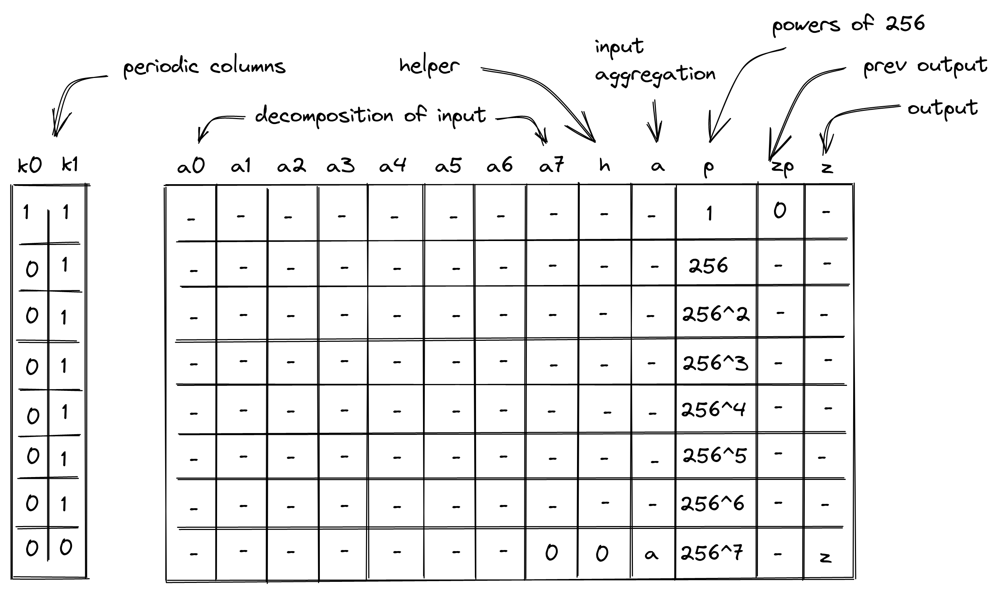

# Power of Two Processor

In this note, we describe how to compute a 32-bit or 64-bit power of two, $2^a$, given an exponent $a$ in the range $[0,64)$ as input.

The general approach is to decompose the exponent value $a$ into 1's, representing single powers of two, and then re-aggregate the value of $a$ while also aggregating the powers of two into the output result $z = 2^a$.

To perform this operation, we'll use a table with 13 columns and two periodic columns, as shown below. Computing a power of $2^a$ for input $a$ where $0 \leq a < 64$ will require 8 table rows.

The columns shown above have the following meanings:

- **Selector columns $k_0$ and $k_1$**, used to selectively apply different sets of constraints to different rows. $k_0$ contains a repeating sequence of one 1 followed by seven 0s. $k_1$ contains a repeating sequence of seven 1s followed by a single 0.
- **Columns $a_0$ to $a_7$** contain the decomposition of the exponent $a$. Each cell's value is set to 1 or 0, and the sum of all $a_i$ cells over the entire 8-row cycle will be the input value $a$. If $a = 0$ then all cells will contain 0s. Otherwise, the value of $a_0$ in row 0 should be 1, and each subsequent cell should contain 1 until $a$ has been fully aggregated, at which point the next cell should be 0 and all subsequent $a_i$ cells should be 0. Therefore a transition from $1 \to 0$ can happen exactly once, and a transition from $0 \to 1$ is not allowed.
- **Helper column $h$** is used to help aggregate the powers of two into the output column and to ensure correctness of the transition of $a_i$ values from one row to the next.
- **Input column $a$** will contain the aggregated sum of the $a_i$ values in each row plus the previous value in column $a$. By the final row of the 8-row cycle, the value in column $a$ will be the input value of the exponent $a$.
- **Column $p$** will contain increasing powers of 256, which will be used in the aggregation of the output result in column $z$. This represents the 8 powers of two that can be accumulated in each row by the 8 $a_i$ columns.
- **Output column $zp$** will contain the aggregated output over all rows excluding the current row.
- **Output column $z$** will contain the aggregated output over the current row plus the previous value of $z$ i.e. current value of $zp$. By the final row of the 8-row cycle, the value in column $z$ will be the result of $2^a$.

In addition to these columns, the table also depends on one running product column $p_0$ which is used for permutation checks and shared across multiple co-processors. The purpose here is the same as in the [hash processor](https://hackmd.io/Rpxt26PkScKltE469_nhRA?view).

As described in that note, $p_0$ is used to associate the processor table with the main stack of the VM.

> That is, inputs consumed by the processor and outputs produced by the processor are added to p0, while the main VM stack removes them from p0. Thus, if the sets of inputs and outputs between the main VM stack and hash processor are the same, value of p0 should be equal to 1 at the start and the end of the execution trace.

In our case, replace "hash processor" above with "power of two processor". The rest is the same.

### Output aggregation with the help of "virtual rows"

Powers of two will only be aggregated into the output column in the row in which the transition between $a_i$ values from $1 \to 0$ occurs (or in the first row, if $a=0$). That is, the output value $z$ will change in the row where $a_i = 1$ and $a_{i+1} = 0$ for some $i \in \{0, ..., 7\}$, indicating that our decomposition of $a$ is complete. In all subsequent rows, the value in column z will remain the same. In all prior rows, z will be 0.

Because each $a_i$ value represents a single power of 2, each full row in which $a_i = 1$ for all values of $i$ represents $2^8$ or 256 to be included as a multiple in the final output value. Each subsequent full row represents an increase to the final output by another multiple of 256.

By tracking powers of 256 in column $p$, we ensure that when we aggregate our output we can simply include the value of $p$ for that row in order to account for all previous full rows where $a_i = 1$ for all values of $i$.

We also need to include any remaining powers of two from the transition row. For simplicity, we'll imagine a "virtual row" below each of our trace rows to help define some intermediate helper values. Each virtual row will have values $t_0$ to $t_8$ in columns $a_0$ to $h$ as follows:

- Column $a_0$:
  - In the first virtual row, the value in column $a_0$ must be set to $t_0 = 1-a_0$, where $a_0$ comes from the trace row. This ensures that the output will be 1 when $a=0$.
  - In all other virtual rows, the value in this column is set to $t_0 = 0$.
- All other columns $a_i$ for $i \in \{{1, ..., 7}\}$ and column $h$:
  - Set the value in columns $a_i$ to $t_i = a_{i-1}-a_i$ and $t_8 = a_7 - h$ in column $h$, where the $a_i$ and $h$ values come from the corresponding trace row.

Thus the virtual row will contain a single 1 at the point where the decomposition of $a$ ends, and the index of that cell will represent the power of two which needs to be included in the result.

The resulting power of two for $z$ can then be aggregated over the values in the virtual row and the value of $p$ in the trace row by:

$$z = \sum\limits_{i=0}^8 p \cdot t_i \cdot 2^i$$

Finally, in order to ensure that the value of z does not change after it is aggregated, we need to include the previous value of column $z$, giving us the following:

$$z = \sum\limits_{i=0}^8 p \cdot t_i \cdot 2^i + z_{prev}$$

## Example

Let's illustrate the entire construction with an example. For simplicity, we'll use a table with a maximum input value of 31 so that this can be shown in just 4 rows, rather than 8. (The maximum power of two that this table can compute is therefore $2^{31}$).

For our example, let's set our exponent input value as $a=23$.

| p       | $a_0$ | $a_1$ | $a_2$ | $a_3$ | $a_4$ | $a_5$ | $a_6$ | $a_7$ | h   | a   | zp                | z                 |
| ------- | ----- | ----- | ----- | ----- | ----- | ----- | ----- | ----- | --- | --- | ----------------- | ----------------- | --- |
| 1       | 1     | 1     | 1     | 1     | 1     | 1     | 1     | 1     | 1   | 8   | 0                 | 0                 |
| 256     | 1     | 1     | 1     | 1     | 1     | 1     | 1     | 1     | 1   | 16  | 0                 | 0                 |
| $256^2$ | 1     | 1     | 1     | 1     | 1     | 1     | 1     | 0     | 0   | 23  | 0                 | $256^2 \cdot 2^7$ |     |
| $256^3$ | 0     | 0     | 0     | 0     | 0     | 0     | 0     | 0     | 0   | 23  | $256^2 \cdot 2^7$ | $256^2 \cdot 2^7$ |

Now we can use the same example to demonstrate the "virtual rows" we use to help aggregate the output value in $z$. The virtual rows are shaded below, and are not included in the trace.

| p       | $a_0$ | $a_1$ | $a_2$ | $a_3$ | $a_4$ | $a_5$ | $a_6$ | $a_7$ | h   | a   | zp                | z                 |
| ------- | ----- | ----- | ----- | ----- | ----- | ----- | ----- | ----- | --- | --- | ----------------- | ----------------- |
| 1       | 1     | 1     | 1     | 1     | 1     | 1     | 1     | 1     | 1   | 8   | 0                 | 0                 |
| -       | 0     | 0     | 0     | 0     | 0     | 0     | 0     | 0     | 0   | -   | -                 | -                 |
| 256     | 1     | 1     | 1     | 1     | 1     | 1     | 1     | 1     | 1   | 16  | 0                 | 0                 |
| -       | 0     | 0     | 0     | 0     | 0     | 0     | 0     | 0     | 0   | -   | -                 | -                 |
| $256^2$ | 1     | 1     | 1     | 1     | 1     | 1     | 1     | 0     | 0   | 23  | 0                 | $256^2 \cdot 2^7$ |
| -       | 0     | 0     | 0     | 0     | 0     | 0     | 0     | 1     | 0   | -   | -                 | -                 |
| $256^3$ | 0     | 0     | 0     | 0     | 0     | 0     | 0     | 0     | 0   | 23  | $256^2 \cdot 2^7$ | $256^2 \cdot 2^7$ |
| -       | 0     | 0     | 0     | 0     | 0     | 0     | 0     | 0     | 0   | -   | -                 | -                 |

In this example, the third virtual row has a 1 in the $a_7$ column, so the value in $z$ is the value of $p$ in the third trace row ($256^2$) multiplied by $2^7$.

## Constraints

The correctness of the above table is ensured by the following AIR constraints. $x'$ indicates a value in column $x$ in the next row, while $x$ indicates a value in the current row.

### Input decomposition

To ensure that the input value $a$ is decomposed correctly into the $a_i$ columns, we need to ensure the following:

1. Values are binary (0 or 1).
2. Adjacent cells may either remain the same or transition from $1 \to 0$.
3. $a_i$ transitions from the end of one row to the beginning of the next within an 8-row cycle must follow the same transition rule as above. In other words, between $a_7$ and $a_0'$ the value must also either stay the same or transition from $1 \to 0$.

The first two conditions can be enforced by the following constraints for each $a_i$.

$a_i^2 - a_i = 0$ for $i \in \{0, 1, ..., 7\}$

$(1 - a_i) \cdot a_{i+1} = 0$ for $i \in \{0, 1, ..., 6\}$

This second constraint enforces that if $a_i = 0$ then $a_{i+1}$ must also be 0, but if $a_i=1$ then $a_{i+1}$ can be either 0 or 1.

We can enforce the third condition with the aid of our helper column $h$. To do this, values in $h$ must be binary, must adhere to the same transition requirement as adjacent $a_i$ cells, and must be equal to the value of $a_0$ on the next row for all but the last row of each 8-row cycle. Here are the constraints for $h$:

$$h^2 - h = 0$$

$$(1 - a_7) \cdot h = 0$$

$$ k_1 \cdot (a_0' - h) = 0$$

Finally, to ensure that the input $a$ is never greater than the maximum exponent value for the table, we should also constrain the value of $a_7$ in the final row of the cycle to be 0.

$$(1-k_1) \cdot a_7 = 0$$

### Input aggregation

In order to finish constraining the input, we must re-aggregate the decomposed input into column $a$ so that the final value in column $a$ at the end of each 8-row cycle holds the input value of the exponent for the power of two operation. The aggregation in column $a$ must also be reset at the beginning of each new 8-row cycle.

We can accomplish this by aggregating the sum of $a_i$ values in the row and using the $k_1$ selector column to selectively include the previous value of $a$ for all but the first row of each 8-row cycle.

$$a' - (a_0' + a_1'+a_2'+ ... + a_7' + k_1 \cdot a) = 0$$

### Powers of 256

Column p contains increasing powers of 256, which are used for output aggregation. We need to ensure that the value of $p$ in the first row of each 8-row cycle is initialized to 1 and that the value in each subsequent row in the cycle is multiplied by 256.

$$k_0 \cdot (p-1) = 0$$

$$k_1 \cdot (p' - 256 \cdot p) = 0$$

### Output aggregation

To aggregate the output into column $z$, we'll enforce the following conditions using a validity constraint for the first row and a transition constraint for the rest of the rows in the cycle.

1. In the first row of each 8-row cycle, $zp$ should be set to 0.
2. For all the rows except the last one, the next value of $zp$ should be the same as the current value of $z$ .
3. For all rows except the last one, the current output $z$ should equal the output value copied from previous row $zp$ plus the current row $p$ times the aggregation of the decomposed powers in the current row.

To enforce these constraints on column $z$, we can make use of intermediate helper variables from the "virtual rows" described above.

Let $t_i$ be a value in our virtual row computed from values $a_i$ and $h$ in the corresponding trace row, such that:

- $t_0 = (1 - a_0)$ in the first row, to ensure correct output aggregation when the input value is 0.
- $t_0 = 0$ for all other rows in the cycle.
- $t_i = a_{i-1} - a_i$ for $i \in \{1, 2, ..., 7\}$
- $t_8 = a_7 - h$

We can use selector $k_0$ to turn on the constraint for the first row of $zp$ and selector $k_1$ to apply the transition constraint to all but the last row in the cycle. This gives us the following constraints.

$$k_0 \cdot zp = 0$$

$$k_1 \cdot (zp' - z) = 0$$

$$ z - (p \cdot \sum\limits\_{i=0}^8 t_i \cdot 2^i + zp) = 0$$

The first constraint ensures that in the first row of each cycle $zp$ is set to 0, the second one ensures that for all other rows in the cycle the next value of $zp$ is same as the current value of $z$, while the last constraint ensures that for all rows $z$ is the sum of the aggregation of the powers in that row and the value $zp$.

## Permutation Product

For the permutation check, we only need to include the final row of each 8-row cycle, since that row includes both the input and output values that need to be checked against the main execution trace.

The value $v$ which we will add to our permutation product includes both the input and output values as follows, where $\alpha$ and $\beta$ are both random values provided by the verifier after the prover has committed to the execution trace.

$$v = \beta + \alpha \cdot a + \alpha^2 \cdot z$$

We can once again use our selector column $k_1$ to restrict our constraint on $p_0$ so that it is only modified in the final row of each cycle.

$$p_0' = p_0 \cdot ((1-k_1) \cdot v + k_1)$$

This ensures that when $k_1 = 0$, in the final row of the cycle, $p_0$ will be updated. In all other rows, where $k_1 = 1$, $p_0$ will remain the same.
