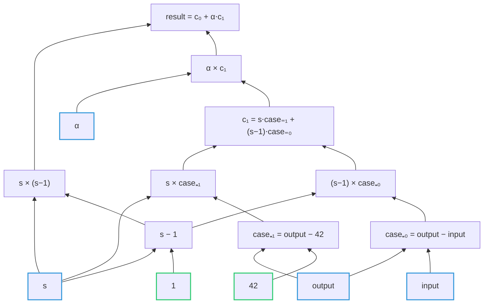

# ACE chiplet

The following note describes the design and functionality of the Arithmetic Circuit Evaluation (ACE) chiplet.

Given a description of an arithmetic circuit and a set of input values, it ensures this circuit evaluates to zero over these inputs.
Its main purpose is to reduce the number of cycles required when recursively verifying a STARK proof in Miden assembly.
In particular, it performs the DEEP-ALI constraint composition polynomial check over the evaluations of the trace column polynomials at the out-of-domain point.

The chiplet expects the caller to have prepared a region of memory containing

- **inputs** to circuit,
- **constants** which make up the circuit,
- **instructions** describing the arithmetic operations evaluated by the circuit.

The term **variable** refers to a value, which is either an input or a constant.

Mathematically, we can represent an arithmetic circuit as a DAG, where leaves correspond to inputs and constants, and the nodes are the operations computing the result (which must be zero).
For example, take the following composition polynomial to be evaluated by the chiplet

$$
s(s - 1) + \alpha \left[ s \cdot (\text{output} - 42) + (s - 1) \cdot (\text{output} - \text{input}) \right].
$$

Given an input selector $s$, and input variables $\alpha, \text{input}, \text{output}$, the two combined constraints ensure that

$$
s \in \{0,1\}, \quad
\text{output} =
\begin{cases}
\text{input}, &s = 0,\\
42, &s = 1.
\end{cases}
$$

The following graph describes the evaluation of the circuit describing the above polynomial. The leaf nodes correspond to the variables of the polynomial: blue for inputs and green for constants.
Note that the circuit is able to reuse evaluation, as is the case for the node $s-1$.

<!-- @formatter:off -->

<!-- @formatter:on -->

The chiplet constructs and verifies the correctness of such a DAG by using a logUp argument, which we interpret as a _wiring bus_.
In each row, the chiplet can either insert a new node with the next fresh identifier and desired value or request a node’s value by providing the identifier of a previously inserted node.
Whenever we create a new node in the DAG (when loading a variable or evaluating an operation), we “insert” it onto the wiring bus by emitting a tuple $(id,v)$ together with its final fan‐out count $m$.
In other words, at insertion time we record $(id,v)$ with multiplicity $m$, where $m$ is exactly the number of times this node will later be used as an input to downstream operations.
Then, each time some later instruction reads that node $(id,v)$, we “consume” one copy of $(id,v)$ - i.e., we remove it once from the wiring bus — decrementing the stored multiplicity by exactly 1.
By the time we finish inserting and consuming all nodes, two things must hold:

1. The very last node we produced (the root of the DAG) has value 0.
2. Every inserted tuple has been consumed exactly $m$ times, so the wiring bus is empty.

## Trace layout

The ACE chiplet produces a trace with 16 internal columns.
Each *section* of the trace corresponds to exactly one circuit evaluation.  
Within each section, there are two ordered *blocks*:

1. A READ block, which loads inputs/constants from memory and inserts them into the DAG.
2. An EVAL block, which executes each instruction — fetching two existing DAG nodes, computing $v_{out}$, and inserting a new node.

In what follows, we'll refer to READ/EVAL blocks depending on which operation is being performed in a given row, though we sometimes refer to a row's _mode_ when it would conflict with the term _operation_.

### Columns

The following table describes the 16 columns used by the chiplet, and their interpretation in each block.

| **BLOCK** | $s_{start}$ | $s_{block}$ | $ctx$ | $ptr$ | $clk$ |      | $id_0$ | $v_{0,0}$ | $v_{0,1}$ | $id_1$ | $v_{1,0}$ | $v_{1,1}$ |            |           |           | $m_0$ |
|-----------|-------------|-------------|-------|-------|-------|------|--------|-----------|-----------|--------|-----------|-----------|------------|-----------|-----------|-------|
| **READ**  | =           | =           | =     | =     | =     |      | =      | =         | =         | =      | =         | =         | $n_{eval}$ |           | $m_1$     | =     |
| **EVAL**  | =           | =           | =     | =     | =     | $op$ | =      | =         | =         | =      | =         | =         | $id_2$     | $v_{2,0}$ | $v_{2,1}$ | =     |

- "=" means the interpretation is the same in both READ/EVAL.
- Empty cell means the cell is unused in this block.
- Unlabeled columns appear under a block‐specific heading instead.

While we will later describe the purpose of each comment, we provide some intuition about how to interpret the labels themselves:

- $s_{start}$ is a boolean selector indicating the first row of a section,
- $s_{block}$ is a boolean selector indicating the type of block the row is a part of (0 for READ, and 1 for EVAL),
- $(ctx, ptr, clk)$ identifies the memory request when reading variables or circuit instructions.
- $(id_i, v_{i,0}, v_{i,1})$ refers to a node in the evaluation graph at index $id_i$ whose value is the extension field element $v_i = (v_{i,0}, v_{i,1})$, for $i = 0, 1, 2$.
- $m_i$ is used when inserting a node $(id_i, v_i)$ into the evaluation graph, corresponding to its _fan-out degree_. It is also interpreted as the _multiplicity_ of the element being added to the wiring bus.

### Memory layout

The chiplet trace contains multiple sections, each performing a distinct circuit evaluation.  
Within a section, the chiplet reads through a contiguous, word‐aligned memory region that contains:

- **$I$ input variables** each stored as an extension‐field element, with two elements per word.
- **$C$ circuit constants** also stored two per word, which are part of the circuit description and hence included in its commitment.
- **$N$ circuit instructions** each encoded as one field‐element representing a packed triple $(op,id_l,id_r)$.

The caller is responsible for writing the inputs and circuit into memory before invoking the chiplet.  
If the same circuit is evaluated multiple times, the caller must overwrite the input region with the new inputs for each evaluation.  
To start a circuit evaluation, the caller pushes one chiplet‐bus message:  
$$
(\mathsf{ACE\_LABEL},ctx,ptr,clk,n_{read},n_{eval}),
$$
where:

- $(ctx,clk)$ identifies the memory‐access context that every row will use.
- $ptr$ is the word-aligned pointer to the first input variable.
- $n_{read} = I + C$ is the total count of input and constant elements that the chiplet will read.
- $n_{eval} = N$ is the total number of arithmetic operations (instructions) the chiplet will evaluate.

For both inputs and constants, it is permissible to pad their respective regions with zeros.  
Any padded zero will simply be ignored by the instructions (they are not referenced by any instruction, so their multiplicity will be set to 0).
To ensure the entire region is word-aligned, we add up to three "dummy" instructions which square the last node.
This has no effect when the last evaluation is zero, as required.

## Circuit evaluation

The evaluation is initialized in the first row of the section by setting

- $id_0 = n_{read} + n_{eval} -1$, indicating the expected number of nodes in the DAG. Whenever the chiplet adds a new wire to the bus, this identifier decrements by 1, until it reaches 0.
- $s_{start} = 1$, indicating the start of the section (it is set to 0 in all remaining rows)
- $s_{block} = 0$, ensuring the evaluation starts by reading variables
- $ctx, clk, n_{eval}, ptr$ provided by the bus request. $(ctx, clk)$ remain constant for the entire section, while $n_{eval}$ is constant only across the READ block.

In every row, the chiplet the following actions in each block:

**READ** (when $s_{block} = 0$):

- Reads a word from memory at $(ctx,ptr,clk)$, containing two extension-field elements $(v_{0},v_{1})$.
- Assigns two new node IDs $(id_0,id_1)$ to those elements, where $id_1 = id_0 - 1$
- Inserts each new node into the evaluation graph (wiring bus) with a specified fan-out count $m_i$.
- Increments $ptr$ by 4 in the next row.
- Decrements $id_0$ by 2 in the next row.
- If $id_0'$ in the next row is equal to $n_{eval}$, it switches to the EVAL operation by setting $s_{block}' = 1$

**EVAL** (when $s_{block} = 1$):

- Reads a single field-element $instr$ (an encoded instruction) from memory at $(ctx,ptr,clk)$.
- Decodes $(op,id_1,id_2)$ from $instr$.
- Fetches the two input nodes $(id_1,v_1), (id_2, v_2)$ from the wiring bus, consuming one fan-out from each (i.e., with multiplicity $m_i = -1$).
- Computes  
  $$
  v_{0} =
  \begin{cases}
  v_1 - v_2, & op = -1,\\
  v_1 \times v_2, & op = 0,\\
  v_1 + v_2, & op = 1.
  \end{cases}
  $$
- Inserts $(id_0,v_{0})$ onto the wiring bus with its final fan-out count $m_0$.
- Increments $ptr$ by 4 in the next row.
- If $id_0 = 0$, checks that $v_0 =0$ and ends the evaluation.
- Otherwise, decrements $id_0$ by 1 in the next row.

_**Note**: Wire bus requests also include the memory access pair $(ctx, clk)$ which ensures that the wires produced by different circuit evaluations are distinct._

### Example

The following is a section of the trace representing the evaluation of the expressions

$$
s(s - 1) + \alpha \left[ s \cdot (\text{output} - 42) + (s - 1) \cdot (\text{output} - \text{input}) \right].
$$

We start by assigning values to both the inputs and constants nodes, stored in memory in addresses `0x0000 - 0x0005`

$$
\begin{aligned}
v_{14} &= \alpha, & v_{10} &= 42, \\
v_{13} &= \text{output}, & v_{9} &= 1. \\
v_{12} &= s, \\
v_{11} &= \text{input}, \\
\end{aligned}
$$

We can then write down the values of all evaluated nodes.
Their instructions are stored in the memory region `0x0006 - 0x00014`

$$
\begin{aligned}
v_{8} &= v_{12} - v_{9} &&|\ s - 1 \\
v_{7} &= v_{12} \times v_8 &&|\ c_0 = s \times (s - 1) \\
v_{6} &= v_{13} - v_{10} &&|\ \text{case}_{s=1} = \text{output} - 42 \\
v_{5} &= v_{13} - v_{11} &&|\ \text{case}_{s=0} = \text{output} - \text{input} \\
v_{4} &= v_{12} \times v_{6} &&|\ s \times \text{case}_{s=1} \\
v_{3} &= v_{8} \times v_{5} &&|\ (s-1) \times \text{case}_{s=0} \\
v_{2} &= v_{4} + v_{3} &&|\ c_1 = s × \text{case}_{s=1} + (s - 1) \times \text{case}_{s=0} \\
v_{1} &= v_{14} \times v_{2} &&|\ \alpha \times c_1 \\
v_{0} &= v_{7} + v_1 &&|\ \text{result} = c_0 + \alpha × c_1 \\
\end{aligned}
$$

| $s_{start}$ | $s_{block}$ | $ctx$ | $ptr$  | $clk$ | $op$     | $id_0$ | $v_{0}$                       | $id_1$ | $v_{1}$                  | $n_{eval}$/$id_{2}$ | $m_1$/$v_2$             | $m_0$        |
|-------------|-------------|-------|--------|-------|----------|--------|-------------------------------|--------|--------------------------|---------------------|-------------------------|--------------|
| 1           | 0           | ctx   | 0x0000 | clk   |          | 14     | $v_{14} = \alpha$             | 13     | $v_{13} = \text{input}$  | 8                   | $m_{13} = 2$            | $m_{14} = 1$ |
| 0           | 0           | ctx   | 0x0004 | clk   |          | 12     | $v_{12} = s$                  | 11     | $v_{11} = \text{output}$ | 8                   | $m_{11} = 1$            | $m_{12} = 3$ |
| 0           | 0           | ctx   | 0x0008 | clk   |          | 10     | $v_{10} = 42$                 | 9      | $v_{9} = 1$              | 8                   | $m_{9} = 1$             | $m_{10} = 1$ |
| 0           | 1           | ctx   | 0x000c | clk   | $-$      | 8      | $v_{8} = v_{12} - v_{9} $     | 12     | $v_{12} = s$             | 9                   | $v_{9}$                 | 2            |
| 0           | 1           | ctx   | 0x000d | clk   | $\times$ | 7      | $v_{7} = v_{12} \times v_8$   | 12     | $v_{12} = s$             | 8                   | $v_{8}$                 | 1            |
| 0           | 1           | ctx   | 0x000e | clk   | $-$      | 6      | $v_{6} = v_{13} - v_{10}$     | 13     | $v_{13} = \text{output}$ | 10                  | $v_{10} = 42$           | 1            |
| 0           | 1           | ctx   | 0x000f | clk   | $-$      | 5      | $v_{5} = v_{13} - v_{11}$     | 13     | $v_{13} = \text{output}$ | 11                  | $v_{11} = \text{input}$ | 1            |
| 0           | 1           | ctx   | 0x0010 | clk   | $\times$ | 4      | $v_{4} = v_{12} \times v_{6}$ | 12     | $v_{12} = s$             | 6                   | $v_{6}$                 | 1            |
| 0           | 1           | ctx   | 0x0011 | clk   | $\times$ | 3      | $v_{3} = v_{8} \times v_{5}$  | 8      | $v_{8}$                  | 5                   | $v_{5}$                 | 1            |
| 0           | 1           | ctx   | 0x0012 | clk   | $+$      | 2      | $v_{2} = v_{4} + v_{3}$       | 4      | $v_{4}$                  | 3                   | $v_{3}$                 | 1            |
| 0           | 1           | ctx   | 0x0013 | clk   | $\times$ | 1      | $v_{1} = v_{14} \times v_{2}$ | 14     | $v_{14} = \alpha$        | 2                   | $v_{2}$                 | 1            |
| 0           | 1           | ctx   | 0x0014 | clk   | $+$      | 0      | $v_{0} = v_{7} + v_{1}$       | 7      | $v_{7}$                  | 1                   | $v_{1}$                 | 0            |

## Constraints

### Flags

In this section, we derive boolean flags that indicate whether a row is at the boundary (first, last, or transition) of the ACE chiplet trace, a section, or a READ/EVAL block.

#### Chiplet flags

The chiplet trace activates different chiplet constraints using a common set of binary selectors $s_1, \ldots$.
While it is likely that the ACE chiplet will appear in third position, we derive the flags and boundary constraints for the general case where the chiplet appears in the d-th position.
Accounting for this degree allows us to evaluate whether we need a separate degree-1 internal selector for activating the chiplet's constraints.
The layout of the chiplet trace will look something like the following.

| Chiplet  | $s_1, \ldots, s_{d-1}$ | $s_{d}$       | ...           |
|----------|------------------------|---------------|---------------|
| Previous | $[1, ..., 1, 0]$       | $cols_{prev}$ | $cols_{prev}$ |
| ACE      | $[1, ..., 1, 1]$       | $0$           | $cols_{ace}$  |
| Next     | $[1, ..., 1, 1]$       | $1$           | $0$           |

From these common selectors, we derive the following binary flags which indicate which portion of the ACE chiplet is active.

- $f_{prev}$: The previous chiplet is active.
- $f_{ace}$: The ACE chiplet is active.
- $f_{ace, first}'$: Next row is the first row in ACE chiplet.
- $f_{ace, next}$: Current and next rows are in ACE chiplet.
- $f_{ace, last}$: Last row in ACE chiplet.

> $$
\begin{aligned}
f_{prev} &\gets (1 - s_{d-1}) \cdot \prod_{i=1}^{d-2} s_{i} && | \deg = d-1\\
f_{ace} &\gets (1 - s_{d}) \cdot \prod_{i=1}^{d-1} s_{i} && | \deg = d\\
f_{ace, first}' &\gets f_{prev} \cdot (1 - s_{d-1}') && | \deg = d \\
f_{ace, next} &\gets f_{ace} \cdot (1 - s_{d}') && | \deg = d + 1\\
f_{ace, last} &\gets f_{ace} \cdot s_{d}' && | \deg = d + 1\\
\end{aligned}
$$

### Section and block flags

The selector $s_{start}$ indicates the start of a new section, from which we can derive the following flags indicating which part of the section the current row is in:

- $f_{start}$: the current row initializes the section.
- $f_{next}$: the current and next rows are in the same section.
- $f_{end}$: the current row finalizes the section.

> $$
\begin{aligned}
f_{start} &\gets f_{ace} \cdot s_{start} && | \deg = d+1\\
f_{next} &\gets f_{ace, next} \cdot (1 - s_{start}')  && | \deg = d+2\\
f_{end} &\gets f_{ace, next} \cdot s_{start}' + f_{ace,last} && | \deg = d+2\\
\end{aligned}
$$

These flags require the following constraints on $s_{start}$.

- it is binary.
- it must equal 1 in the first row.
- it must equal 0 in the last row.
- two consecutive rows cannot initialize a section, so a section contains at least two rows.

> $$
\begin{aligned}
f_{ace} \cdot s_{start} \cdot (1 - s_{start}) &= 0 && | \deg = d + 2\\
f_{ace, first}' \cdot (1 - s_{start}') &= 0 && | \deg = d + 1\\
f_{ace, last} \cdot s_{start} &= 0 && | \deg = d + 2\\
f_{ace, next} \cdot s_{start} \cdot s_{start}' &= 0 && | \deg = d + 2.\\
\end{aligned}
$$

A section is composed of a READ block followed by an EVAL block.
The flag indicating which block is active is derived from the binary selector $s_{block}$.
These constraints ensure they are mutually exclusive
> $$
\begin{aligned}
f_{read} \gets (1-s_{block}) & &&| \deg = 1\\
f_{eval} \gets s_{block} & &&| \deg = 1\\
\\
f_{ace} \cdot (1-s_{block}) \cdot s_{block} = 0 && &| \deg = d + 2\\
\end{aligned}
$$

The following constraints ensure the proper layout of the trace. In particular, it contains one or more sections each with consecutive READ and EVAL blocks.

- The first row cannot be EVAL, so it must be READ.
- A row after EVAL cannot be READ.
- The last row cannot be READ, so it must be EVAL.

> $$
\begin{aligned}
f_{start} \cdot f_{eval} &= 0 && | \deg = d + 2\\
f_{next} \cdot f_{eval} \cdot f_{read}' &= 0 && | \deg = d + 4\\
f_{end} \cdot f_{read} &= 0 && | \deg = d + 3\\
\end{aligned}
$$

In particular, we can infer from the above that

- each section contains at least two rows (a READ and an EVAL row), and,
- a row following a READ is always in the same section.

A READ row checks whether $id_0'$ in the next row is equal to $n_{eval} - 1$ provided by the caller at initialization,
in which case we ensure the following row is an EVAL.
Otherwise, $n_{eval}$ remains the same.
> $$
f_{ace} \cdot f_{read} \cdot
\big[f_{read}' \cdot n_{eval}' + f_{eval}' \cdot (id_0' + 1) - n_{eval}\big] = 0 \quad | \deg = d + 3.
$$

### Section constraints

These constraints apply to all rows within the same section/

- Across the section, $ctx$ and $clk$ are constant.
- A READ/EVAL block requests a word/element from memory, so the $ptr$ increases by 4/1, respectively in the next row.
- A READ/EVAL block adds 2/1 new nodes to the evaluation graph, so $id_0$ decreases by that amount in the next row.

> $$
\begin{aligned}
f_{next} \cdot (ctx' - ctx) &= 0 && | \deg = d + 3\\
f_{next} \cdot (clk' - clk) &= 0 && | \deg = d + 3\\
f_{next} \cdot \big[ptr' - ptr + 4 \cdot f_{read} + f_{eval}\big] &= 0 && | \deg = d + 3\\
f_{next} \cdot \big[id_0 - id_0' + 2 \cdot f_{read} + f_{eval}\big] &= 0 && | \deg = d + 3\\
\end{aligned}
$$

### READ constraints

In a READ block, each row requests a row from memory a word containing two extension field elements $v_0 = (v_{0,0}, v_{0,1})$ and $v_1 = (v_{1,0}, v_{1,1})$.
The [wire bus section](#wire-bus) describes how both of these nodes are inserted into the wire bus.

The only constraint we enforce is that $id_0$ and $id_1$ are consecutive

> $$
\begin{aligned}
f_{ace} \cdot f_{read} \cdot (id_1 - id_0 + 1)  &= 0 && | \deg = d + 2\\
\end{aligned}
$$

### EVAL constraints

An EVAL block checks that the arithmetic operation $op$ was correctly applied to inputs $v_1, v_2$ and results in $v_0$.
The result is given by the degree-4 expression
> $$
v_{out} \gets op^2 \cdot \big[ v_1 + op\cdot v_2 \big] + (1 - op^2)  \cdot \big[ v_1 \cdot v_2 \big]
= \begin{cases}
v_1 - v_2, & op = -1, \\
v_1 \times v_2, & op = 0, \\
v_1 + v_2, & op = 1. \\
\end{cases}
$$

The output node is correctly evaluated when:

- $op \in \{-1, 0, 1\}$ is a valid arithmetic operation, and,
- $v_0$ is equal to $v_{out}$.

> $$
\begin{aligned}
f_{ace} \cdot f_{eval} \cdot op \cdot (op^2 - 1) &= 0 && | \deg = d + 4\\
f_{ace} \cdot f_{eval} \cdot (v_0 - v_{out}) &= 0 && | \deg = d + 5\\
\end{aligned}
$$

The actual instruction is given by the field element $instr$ read from memory. It encodes

- the operation $op$ using 2 bits
- the ids of $v_1$ and $v_2$ using 30 bits each and are packed as
  > $$
  instr \gets id_0 + id_1 \cdot 2^{30} + (op+1)\cdot 2^{60}.
  $$

It is clear from the constraint on $op$ that $op+1$ will always require 2 bits, and that range constraints on $id_1, id_2$ are unnecessary.
These ids are sent as-is to the wire bus with multiplicity $-1$.
For the logUp argument to be valid, the section must include a row where a node is added to the circuit with the same id such that the pole $\frac{-1}{w_i}$ can be annihilated.
The only way to do so is if there exists a corresponding $id_0$ matching the one in the instruction.
This is ensured by the pointers given by the chiplet bus message initializing the section, and the constraint enforcing it to be strictly increasing in each row.
Therefore, as long as the trusted circuit contains fewer than $2^{30}$ ids, the $id_1$ and $id_2$ values can never overflow this bound.

To ensure the circuit has finished evaluating and that the final output value is 0, we enforce that the node with $id_0 = 0$ has value $v_0 = 0$ in the last row of the section.
> $$
\begin{aligned}
f_{end} \cdot id_0 &= 0 && | \deg = d + 3\\
f_{end} \cdot v_0 &= 0 && | \deg = d + 3\\
\end{aligned}
$$

### Wire bus

Each row of the chip makes up to 3 requests to the circuit's wire bus.
For $i = 0, 1, 2$, each request has the form $(ctx, clk, id_i, v_{i,0}, v_{i,1})$, which uniquely identifies a node in the DAG representing the evaluation of the circuit.
Sending this message to the bus can be viewed as updating the total degree of the node in the graph.
When performing a READ operation, a node is added to the graph, and we set its degree update $e_i$ to be equal to its final fan-out degree at the end of the evaluation.
This value is also referred to as the *multiplicity* $m_i$.
When a node is used as an input of an arithmetic operation, we set $e_i = - 1$.

The expression $e_i$ is derived from $m_i$ and the operation flag, so that the wire bus update is uniform across all rows of the chiplet's trace.

- $v_0$ always defines a new node, and each operation defines its identifier $id_0$ and multiplicity $m_0$ using the same columns.
  > $$
  e_0 \gets  m_0 \quad \text{| degree} = 1
  $$
- $v_1$ defines a new node when the operation is a READ, but is an input during an EVAL. Again, the columns for these values are identical.
  > $$
  e_1 \gets  f_{read} \cdot m_1 - f_{eval} \quad \text{| degree} = 2
  $$
- $v_2$ is unused during a READ, and an input during EVAL
  > $$
  e_2 \gets - f_{eval} \quad \text{| degree} = 1
  $$

The auxiliary logUp bus column $b_{wire}$ is updated as follows.
Given random challenges $\alpha_j$ for $j = 0, ..., 5$, let $w_i = \alpha_0 + \alpha_1 \cdot ctx + \alpha_2 \cdot clk + \alpha_3 \cdot id_i + \alpha_4 \cdot v_{i,0} + \alpha_5 \cdot v_{i,1}$ be the randomized node value.
The value of the bus in the next column is given by
> $$
b_{wire}' = b_{wire} + \sum_{i=0}^2 \frac{e_i}{w_i},
$$

The actual constraint is given by normalizing the denominator
> $$
f_{ace}\cdot \left( (b_{wire} - b_{wire}') \cdot \prod_{i=0}^{2}w_i + \left(e_0 \cdot w_1 \cdot w_2 + e_1 \cdot w_0 \cdot w_2 + e_2 \cdot w_0 \cdot w_1\right)\right) = 0 \quad \text{| degree} = d + 4.
$$

### Chiplet and Virtual table bus

The ACE chiplet initializes a circuit evaluation by responding to a request made by the decoder, through the [chiplet bus](./main.md#chiplets-bus) $b_{chip}$.
As mentioned earlier, the message corresponds to the tuple, which is sent to the bus only when $f_{start} = 1$.
$$
(\mathsf{ACE\_LABEL}, ctx, ptr, clk, n_{read}, n_{eval}).
$$
The value $n_{read}$ is computed as $id_0 - 1 - n_{eval}$, since in the first row, $id_0$ is expected to be equal to the total number of nodes inserted (subtracting 1 since identifiers are indexed from zero).
We refer to the [chiplet bus constraints](./main.md#chiplets-bus-constraints) which describes the constraints for chiplet bus responses.

The requests sent to the memory chiplet cannot use the same chiplet bus, as the decoder requests saturate the degree of constraint over its auxiliary column.
Instead, we use the [virtual table bus](./main.md#chiplets-virtual-table) $v_{table}$ which extends the chiplet bus.

In each row, the chiplet makes one of the two following requests to the memory chiplet depending on which block it is in:

- $(\mathsf{MEMORY\_READ\_WORD\_LABEL}, ctx, ptr, clk, v_{0,0}, v_{0,1}, v_{1,0}, v_{1,1})$, when $f_{read} = 1$.
- $(\mathsf{MEMORY\_READ\_ELEMENT\_LABEL}, ctx, ptr, clk, instr)$, when $f_{eval} = 1$.

The values are obtained as-is from the current row, except for the instruction which is given by
$$
instr \gets id_0 + id_1 \cdot 2^{30} + (op+1)\cdot 2^{60}.
$$
As mentioned earlier, it encodes a circuit instruction applying the arithmetic operation $op \in \{- ,\times, +\}$ (mapped to the range $[0,1,2]$) to the nodes with identifiers $id_1, id_2 \in [0, 2^{30}[$.

As usual, the messages are randomly reduced using by challenges $\alpha_0, \alpha_1, \ldots$, resulting in the degree-1 expressions
$u_{mem, read}$ and $u_{mem, eval}$, respectively.

Since the virtual table bus is used exclusively by the chiplets trace, it must be constrained in this chiplet:
> $$
f_{ace} \cdot \Big( v_{table}' \cdot \big( f_{read}\cdot w_{mem,read} + f_{eval}\cdot w_{mem,eval} \big) - v_{table}\Big) = 0 \quad | \deg = d+3.
$$