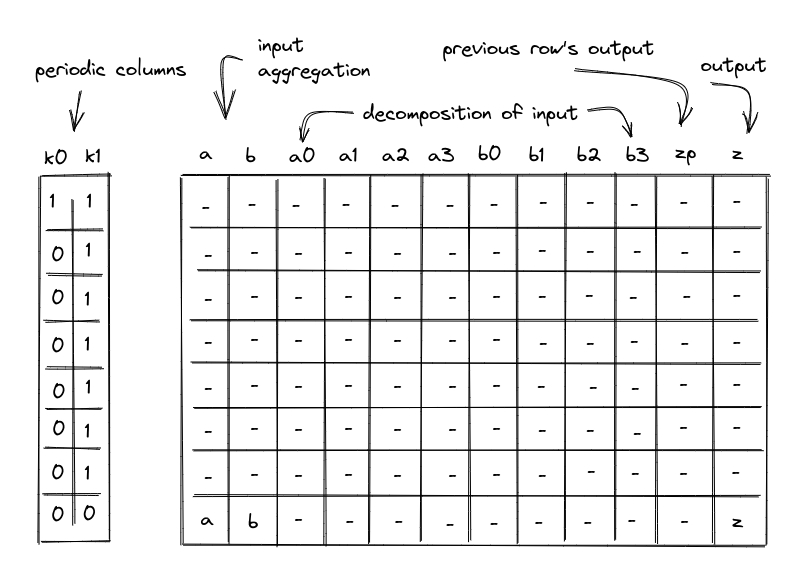

# Bitwise Chiplet

In this note we describe how to compute bitwise AND, OR, and XOR operations on 32-bit values and the constraints required for proving correct execution.

Assume that $a$ and $b$ are field elements in a 64-bit prime field. Assume also that $a$ and $b$ are known to contain values smaller than $2^{32}$. We want to compute $a \oplus b \rightarrow z$, where $\oplus$ is either bitwise AND, OR, or XOR, and $z$ is a field element containing the result of the corresponding bitwise operation.

First, observe that we can compute AND, OR, and XOR relations for **single bit values** as follows:

$$
and(a, b) = a \cdot b
$$

$$
or(a, b) = a + b - a \cdot b
$$

$$
xor(a, b) = a + b - 2 \cdot a \cdot b
$$

To compute bitwise operations for multi-bit values, we will decompose the values into individual bits, apply the operations to single bits, and then aggregate the bitwsie results into the final result.

To perform this operation we will use a table with 11 columns, and computing a single AND, OR, or XOR operation will require 8 table rows. We will also rely on two periodic columns as shown below.

In the above, the columns have the following meanings:

- Periodic columns $k_0$ and $k_1$. These columns contain values needed to switch various constraint on or off. $k_0$ contains a repeating sequence of a single one, followed by seven zeros. $k_1$ contains a repeating sequence of seven ones, followed by a single zero.
- Input columns $a$ and $b$. On the first row of each 8-row cycle, the prover will set values in these columns to the upper 4 bits of the values to which a bitwise operation is to be applied. For all subsequent rows, we will append the next-most-significant 4-bit limb to each value. Thus, by the final row columns $a$ and $b$ will contain the full input values for the bitwise operation.
- Columns $a_0$, $a_1$, $a_2$, $a_3$, $b_0$, $b_1$, $b_2$, $b_3$ will contain lower 4 bits of their corresponding values.
- Output column $z_p$. This column represents the value of column $z$ for the prior row. For the first row, it is set to $0$.
- Output column $z$. This column will be used to aggregate the results of bitwise operations performed over columns $a_0$, $a_1$, $a_2$, $a_3$, $b_0$, $b_1$, $b_2$, $b_3$. By the time we get to the last row in each 8-row cycle, this column will contain the final result.

## Example

Let's illustrate the above table on a concrete example. For simplicity, we'll use 16-bit values, and thus, we'll only need 4 rows to complete the operation (rather than 8 for 32-bit values). Let's say $a = 41851$ (`b1010_0011_0111_1011`) and $b = 40426$ (`b1001_1101_1110_1010`), then $and(a, b) = 33130$ (`b1000_0001_0110_1010`). The table for this computation looks like so:

|   a   |   b   | x0  | x1  | x2  | x3  | y0  | y1  | y2  | y3  |   zp   |   z   |
| :---: | :---: | :-: | :-: | :-: | :-: | :-: | :-: | :-: | :-: | :----: | :---: | 
|  10   |   9   |  0  |  1  |  0  |  1  |  1  |  0  |  0  |  1  |   0    |   8   |
|  163  |  157  |  1  |  1  |  0  |  0  |  1  |  0  |  1  |  1  |   8    |  129  |
| 2615  | 2526  |  1  |  1  |  1  |  0  |  0  |  1  |  1  |  1  |  129   | 2070  |
| 41851 | 40426 |  1  |  1  |  0  |  1  |  0  |  1  |  0  |  1  |  2070  | 33130 |

Here, in the first row, we set each of the $a$ and $b$ columns to the value of their most-significant 4-bit limb. The bit columns ($a_0 .. a_3$ and $b_0 .. b_3$) in the first row contain the lower 4 bits of their corresponding values (`b1010` and `b1001`). Column $z$ contains the result of bitwise AND for the upper 4 bits (`b1000`), while column $z_p$ contains that result for the prior row.

With every subsequent row, we inject the next-most-significant 4 bits of each value into the bit columns, increase the $a$ and $b$ columns accordingly, and aggregate the result of bitwise AND into the $z$ column, adding it to $2^4$ times the value of $z$ in the previous row. We set column $z_p$ to be the value of $z$ in the prior row. By the time we get to the last row, the $z$ column contains the result of the bitwise AND, while columns $a$ and $b$ contain their original values.

## Constraints

AIR constraints needed to ensure the correctness of the above table are described below.

### Selectors

The Bitwise chiplet supports three operations with the following operation selectors:

- `U32AND`: $s_0 = 0$, $s_1 = 0$
- `U32OR`: $s_0 = 0$, $s_1 = 1$
- `U32XOR`: $s_0 = 1$, $s_1 = 0$

The constraints must require that the selectors be binary and stay the same throughout the cycle:

> $$
s_0^2 - s_0 = 0 \text{ | degree} = 2
$$

> $$
s_1^2 - s_1 = 0 \text{ | degree} = 2
$$

> $$
k_1 \cdot (s_0' - s_0) = 0 \text{ | degree} = 2
$$

> $$
k_1 \cdot (s_1' - s_1) = 0 \text{ | degree} = 2
$$

### Input decomposition

We need to make sure that inputs $a$ and $b$ are decomposed correctly into their individual bits. To do this, first, we need to make sure that columns $a_0$, $a_1$, $a_2$, $a_3$, $b_0$, $b_1$, $b_2$, $b_3$, can contain only binary values ($0$ or $1$). This can be accomplished with the following constraints (for $i$ ranging between $0$ and $3$):

> $$
a_i^2 - a_i = 0 \text{ | degree} = 2
$$

> $$
b_i^2 - b_i = 0 \text{ | degree} = 2
$$

Then, we need to make sure that on the first row of every 8-row cycle, the values in the columns $a$ and $b$ are exactly equal to the aggregation of binary values contained in the individual bit columns $a_i$, and $b_i$. This can be enforced with the following constraints:

> $$
k_0 \cdot \left(a - \sum_{i=0}^3(2^i \cdot a_i)\right) = 0 \text{ | degree} = 2
$$

> $$
k_0 \cdot \left(b - \sum_{i=0}^3(2^i \cdot b_i)\right) = 0 \text{ | degree} = 2
$$

The above constraints enforce that when $k_0 = 1$, $a = \sum_{i=0}^3(2^i \cdot a_i)$ and $b = \sum_{i=0}^3(2^i \cdot b_i)$.

Lastly, we need to make sure that for all rows in an 8-row cycle except for the last one, the values in $a$ and $b$ columns are increased by the values contained in the individual bit columns $a_i$ and $b_i$. Denoting $a$ as the value of column $a$ in the current row, and $a'$ as the value of column $a$ in the next row, we can enforce these conditions as follows:

> $$
k_1 \cdot \left(a' - \left(a \cdot 16 + \sum_{i=0}^3(2^i \cdot a'_i)\right)\right) = 0 \text{ | degree} = 2
$$

> $$
k_1 \cdot \left(b' - \left(b \cdot 16 + \sum_{i=0}^3(2^i \cdot b'_i)\right)\right) = 0 \text{ | degree} = 2
$$

The above constraints enforce that when $k_1 = 1$ , $a' = 16 \cdot a + \sum_{i=0}^3(2^i \cdot a'_i)$ and $b' = 16 \cdot b + \sum_{i=0}^3(2^i \cdot b'_i)$.

### Output aggregation

To ensure correct aggregation of operations over individual bits, first we need to ensure that in the first row, the aggregated output value of the previous row should be 0.
> $$
k_0 \cdot z_p = 0 \text{ | degree} = 2
$$

Next, we need to ensure that for each row except the last, the aggregated output value must equal the previous aggregated output value in the next row.
> $$
k_1 \cdot \left(z - z'_p\right) = 0 \text{ | degree} = 2
$$

Lastly, we need to ensure that for all rows the value in the $z$ column is computed by multiplying the previous output value (from the $z_p$ column in the current row) by 16 and then adding it to the bitwise operation applied to the row's set of bits of $a$ and $b$. The entire constraint must also be multiplied by the operation selector flag to ensure it is only applied for the appropriate operation.

For `U32AND`, this is enforced with the following constraint:

> $$
(1 - s_0) \cdot (1 - s_1) \cdot \left(z -(z_p \cdot 16 + \sum_{i=0}^3(2^i \cdot a_i \cdot b_i))\right) = 0 \text{ | degree} = 4
$$

For `U32XOR`, this is enforced with the following constraint:

> $$
s_0 \cdot (1 - s_1) \cdot \left(z -(z_p \cdot 16 + \sum_{i=0}^3(2^i \cdot (a_i + b_i - 2 \cdot a_i \cdot b_i)))\right) = 0 \text{ | degree} = 4
$$

## Bitwise chiplet bus constraints

To simplify the notation for describing bitwise constraints on the chiplet bus, we'll first define variable $u$, which represents how $a$, $b$, and $z$ in the execution trace are reduced to a single value. Denoting the random values received from the verifier as $\alpha_0, \alpha_1$, etc., this can be achieved as follows.

$$
u = \alpha_1 \cdot a + \alpha_2 \cdot b + \alpha_3 \cdot z
$$

To request a bitwise operation, the prover will provide the values of $a$, $b$, and $z$ non-deterministically to the [stack](../stack/u32_ops.md#u32and) (the component that makes bitwise requests). The lookup can then be performed by dividing $\left(\alpha_0 + u\right)$ out of the bus column:

$$
b'_{chip} \cdot \left(\alpha_0 + u\right) = b_{chip}
$$

To provide the results of bitwise operations to the chiplets bus, we want to include values of $a$, $b$ and $z$ at the last row of the cycle.

First, we'll define another intermediate variable $v_i$. It will include $u$ into the product when $k_1 = 0$. ($u_i$ represents the value of $u$ for row $i$ of the trace.)

$$
v_i = (1-k_1) \cdot u_i
$$

Then, setting $m = 1 - k_1$, we can compute the permutation product from the bitwise chiplet as follows:

$$
\prod_{i=0}^n ((\alpha_0 + v_i) \cdot m_i + 1 - m_i)
$$

The above ensures that when $1 - k_1 = 0$ (which is true for all rows in the 8-row cycle except for the last one), the product does not change. Otherwise, $(\alpha_0 + v_i)$ gets included into the product.

The constraints for the two sides of the bus communication are combined as follows:

> $$
b'_{chip} \cdot \left(\alpha_0 + u_i\right) = b_{chip} \cdot ((\alpha_0 + v_i) \cdot m_i + 1 - m_i) \text{ | degree} = 4
$$

## Reducing the number of rows

It is possible to reduce the number of rows in the table from 8 to 4 by performing bitwise operations on 2-bit values (rather than on single bits). This would require some changes to the constraints, most important of which are listed below.

### Limit column values to 2 bits

We'll need to make sure that $a_0 .. a_3$ and $b_0 .. b_3$ columns contain 2-bit values. This can be accomplished with the following constraints:

$$
a_i \cdot (a_i - 1) \cdot (a_i - 2) \cdot (a_i - 3) = 0
$$

$$
b_i \cdot (b_i - 1) \cdot (b_i - 2) \cdot (b_i - 3) = 0
$$

### Bitwise operations on 2-bit limbs

Instead of simple formulas for single-bit bitwise operations, we'll need to compute results of bitwsie operations over 2-bit values using a sum of degree 6 polynomials.

For example, assuming $a$ and $b$ are 2-bit values, their bitwise AND can be computed as a sum of the following polynomials:

$$
\frac{1}{4} \cdot a \cdot (a - 2) \cdot (a - 3) \cdot b \cdot (b - 2) \cdot (b - 3)
$$

$$
\frac{1}{12} \cdot a \cdot (a - 2) \cdot (a - 3) \cdot b \cdot (b - 1) \cdot (b - 2)
$$

$$
\frac{1}{2} \cdot a \cdot (a - 1) \cdot (a - 3) \cdot b \cdot (b - 1) \cdot (b - 3)
$$

$$
-\frac{1}{6} \cdot a \cdot (a - 1) \cdot (a - 3) \cdot b \cdot (b - 1) \cdot (b - 2)
$$

$$
\frac{1}{12} \cdot a \cdot (a - 1) \cdot (a - 2) \cdot b \cdot (b - 2) \cdot (b - 3)
$$

$$
-\frac{1}{6} \cdot a \cdot (a - 1) \cdot (a - 2) \cdot b \cdot (b - 1) \cdot (b - 3)
$$

$$
\frac{1}{12} \cdot a \cdot (a - 1) \cdot (a - 2) \cdot b \cdot (b - 1) \cdot (b - 2)
$$

We can compute 2-bit results for OR and XOR operations in a similar manner. The general idea here is that we need to list polynomials which evaluate to $1$ for a given set of input values, and then multiply each polynomial by an expected result of a bitwise operation.

For example, to compute a bitwise OR of $3$ and $3$, we first need to come up with a polynomial which evaluates to $1$ for $a = 3$ and $b = 3$, and to $0$ for all other inputs. This polynomial is:

$$
\frac{1}{36} \cdot a \cdot (a - 1) \cdot (a - 2) \cdot b \cdot (b - 1) \cdot (b - 2)
$$

And then, since $or(3, 3) = 3$, we need to multiply this polynomial by $3$, obtaining:

$$
\frac{1}{12} \cdot a \cdot (a - 1) \cdot (a - 2) \cdot b \cdot (b - 1) \cdot (b - 2)
$$

We then repeat this process for all $a$ and $b$ where $or(a, b) \ne 0$ to obtain all required polynomials.
