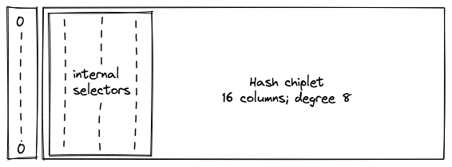

# Chiplets

The Chiplets module reduces the number of columns required by the execution trace by stacking the execution traces of 3 chiplets that are expected to generate significantly fewer rows than the other VM processors (the decoder, stack, and range checker).

## Chiplet components

The chiplets are:

- [Hash Chiplet](./hasher.md) (17 columns; degree 8)
- [Bitwise Chiplet](./bitwise.md) (14 columns; degree 6)
- [Memory Chiplet](./memory.md) (14 columns; degree 6)

Each chiplet is identified by a set of selector columns which identify its segment in the Chiplets module and cause its constraints to be selectively applied.

During the finalization of the overall execution trace, each chiplet's trace and selector columns are appended to the Chiplets module's trace one after another, such that when one chiplet trace ends the trace of the next chiplet starts in the subsequent row.

Additionally, a padding segment must be added to the Chiplets module's trace so that the number of rows in the table always matches the overall trace length of the other VM processors, regardless of the length of the chiplet traces. The padding will simply contain zeroes.

## Design Requirements

- The minimum width of the Chiplets is 18 columns, which will fit the Hash chiplet and 1 selector column to select it.
- The maximum constraint degree for the VM is 9.

### Hasher

- The hasher's constraints are already degree 8, so we are restricted to a 1-degree selector flag.
- The hasher requires 17 columns, so its selector flag must require a single column to keep our Chiplets trace to the minimum.
- Each hash operation in the hash chiplet is performed in an 8-row cycle that must begin at a row number equal to $0\mod8$, so the hash chiplet's trace must begin on a row number equal to $0\mod8$.
- As described in the Challenge section below, the degree-2 row address transition constraint must not be applied to the last row.

### Bitwise

- The constraints for the bitwise chiplet have degree 6, so its selector flag cannot exceed degree 3.
- The bitwise chiplet requires 12 columns, so it can have at most 6 selector columns.
- Each bitwise operation in the bitwise chiplet is performed in an 8-row cycle that must begin at a row number equal to $0\mod8$, so the bitwise chiplet's trace must begin on a row number equal to $0\mod8$.

Note: If the bitwise chiplet is [refactored](https://github.com/maticnetwork/miden/issues/120) to process only one bitwise operation, rather than three, then its internal selector flags could be removed. In this case, the constraint degree would be reduced to 4 and the number of columns would be reduced to 11.

### Memory

- The constraints for the memory chiplet have degree 6, so its selector flag cannot exceed degree 3.
- The memory chiplet requires 14 columns, so it can have at most 4 selector columns.
- As described in the Challenge section below, the transition constraints (degree 6) must not be applied to the last row.

## Chiplets order

For simplicity, all of the "cyclic" chiplets which operate in multi-row cycles and require starting at particular row increments should come before any non-cyclic chiplets, and these should be ordered from longest-cycle to shortest-cycle. This will allow us to avoid any additional alignment padding between chiplets.

To fulfill the requirements above, we'll start by placing the Hasher at the top of the Chiplets trace with a single selector column beside it where $s_0 = 0$ selects the Hasher. The third requirement for the hasher can easily be resolved with a virtual flag excluding the last row, since the row address constraint is only degree 2.

Next, we would like to include the other cyclic chiplet: Bitwise.

That would leave the Memory chiplet to go last. However, if we use a selector column for each of 3 chiplets and also put the Memory chiplet at the end, then the selectors will cause us to exceed the maximum degree for the Memory chiplet's constraints.

Finally, we come to the Memory chiplet, where we still need to deal with the "last row problem" (described below). The three selector flags for the Memory section mean that the constraint degree is already at the maximum of 9, which gives us 2 options:

1. Put the memory chiplet at the end of the Chiplets trace.
2. Modify the transition constraint format.

For now, we'll place the Memory chiplet last after the padding to keep the implementation simple.

## Chiplets module constraints

The Chiplets module needs to enforce constraints on the 3 selector columns that are used to specify the various chiplets to ensure they are binary. The constraints themselves are selectively applied, since two of the columns do not act as selectors for the entire trace. We can enforce this with the following constraints:

$$s_0^2 - s_0 = 0$$
$$s_0 \cdot (s_1^2 - s_1) = 0$$
$$s_0 \cdot s_1 \cdot (s_2^2 - s_2) = 0$$

### Bitwise chiplet

We have three bitwise operation in bitwise chiplet. The selectors for each operation are as follows:

- `U32AND`: $s_0 = 0$, $s_1 = 0$
- `U32OR`: $s_0 = 0$, $s_1 = 1$
- `U32XOR`: $s_0 = 1$, $s_1 = 0$

The constraints must require that the selectors be binary and stay the same throughout the cycle:
$$s_0^2 - s_0 = 0$$
$$s_1^2 - s_1 = 0$$
$$s_{0,i}' -s_{0,i} = 0\  \forall\ i \in \{0, 1, ..., 6\}$$
$$s_{1,i}' -s_{1,i} = 0\  \forall\ i \in \{0, 1, ..., 6\}$$

## Challenge: the last row problem

Handling transition constraints in the chiplets module is problematic when applying them based on the an individual chiplet's set of "selector flags" would cause the first row of the following chiplet's trace to be constrained to a value which is incorrect for the new chiplet.

Let's consider a simple example:

- Let Chiplet A and Chiplet B be two chiplets whose execution traces are stacked such that they share the same columns and the trace rows for B start immediately after the trace rows for A end.
- Let $s_0$ be a selector column. When $s_0 = 0$, we apply the constraints for our Chiplet A. When $s_0 = 1$ we apply the constraints for Chiplet B.
- Let $a$ be a column whose value should start at 0 in the first row of a chiplet's trace and be incremented by 1 with each new row within the chiplet's trace.

In the normal case where the entire length of a set of trace columns is devoted to a single chiplet, we can use the following constraint for column $a$:

$$not(s_0) * (a' - (a + 1)) = 0$$

However, once we begin stacking chiplets within the same set of columns, we run into an issue where the final enforcement of this transition constraint causes the value of column $a$ in the first row of the subsequent chiplet to be an incorrect value.

For example, if Chiplet A has 4 rows in its trace, then in the 5th row of the stacked trace, the execution trace of Chiplet B will start, and the value of $a$ should be reset to 0.

| $s_0$ | $a$                       |
| ----- | ------------------------- |
| 0     | 0                         |
| 0     | 1                         |
| 0     | 2                         |
| 0     | 3                         |
| 1     | CONFLICT: must be 4 and 0 |

CONFLICT: our transition constraint from Chiplet A will require that this be 4, but Chiplet B will require that it be 0.

### Affected chiplet constraints

- [Hasher](./hasher.md) - the row address constraint (degree 1):
  $$r' - r - 1 = 0$$
- [Memory](./memory.md) - all transition constraints, in particular this degree 6 constraint:
  $$(1−n_0)⋅(n_1^2−n_1)=0$$

### Possible solutions

#### Virtual flag to identify the last row of a chiplet:

We could use a virtual flag to prevent these transition constraints from being applied to the final row. However, this will increase the degree of constraints by one, so it can only be used in cases where the degree of the chiplet's constraints plus the degree of the selector flags is <= 8 (since 9 is the maximum constraint degree).

#### Additional column:

Add an extra column to the execution trace of the affected chiplet. Set the value to 1 for the last row and 0 otherwise. Update the chiplet's constraints to avoid affecting the degree.

#### Put the affected chiplet last

An affected chiplet can be put at the bottom of the Chiplets trace where we won't care about the final transition being enforced.

#### Modified constraint format:

Define the chiplet's transition constraint selector flag to never enforce against the last row.

- Let Chiplet A, Chiplet B, and Chiplet C be three chiplets whose execution traces are stacked such that they share the same columns, the trace rows for B start immediately after the trace rows for A end, and the trace rows for C start immediately after the end of the trace rows for B.
- Let $s_0$ and $s_1$ be selector columns. When $s_0 = 0$, we apply the constraints for Chiplet A. When $s_0 = 1$ and $s_1 = 0$ we apply the constraints for Chiplet B. When $s_0 = 1$ and $s_1$ = 1 we apply the constraints for Chiplet C.

Multiplying Chiplet A's constraints by $not(s_0')$ instead of by $not(s_0)$ will cause them to stop being enforced after the second-to-last row. For Chiplet B, this flag would look like $s_0 * not(s_1')$.

This resolves our last-row issue, but it introduces a problem with the first row of a chiplet's trace.

- If this construction is used for the first chiplet in the Chiplets module, then the very first row won't be constrained properly unless a validity constraint is defined for that specific row.
- When used for subsequent processors, the following scenario is possible:

  | row # | $s_0$ | $s_1$        | the rest of the trace segment               |
  | ----- | ----- | ------------ | ------------------------------------------- |
  | i     | 0     | Chiplet A... | Chiplet A...                                |
  | i + 1 | 1     | 1            | Chiplet B transition constraints applied... |
  | i + 2 | 1     | 0            | All Chiplet B constraints applied...        |

**PROBLEM:** Note that in row `i + 1` the selector flags actually match Chiplet C, which would result in the following mismatch:

1. The transition constraints for Chiplet B would be applied
2. Any single-row validity constraints (such as a restriction to binary values) would be applied for Chiplet C

To solve these issues for the general case, we can take the following approach to constraints:

1. Define different flags for "validity constraints" (enforced on a single row) and transition constraints (enforced between rows). The flag for validity constraints will simply be the combination of selector columns for the chiplet (e.g. $s_0 * not(s_1)$ for Chiplet B), while the flag for the transition constraints will be the one described above.
2. Add constraints to the entire Chiplets module's trace to enforce that when these columns are acting as selectors they can’t change from 1 -> 0 (only from 0 -> 1). This would mean a couple extra constraints but they're fairly low degree, and we would avoid having any extra degrees in the selector flag.

#### Make the selector columns update "one cycle early":

An idea from Bobbin that hasn't been discussed or investigated in depth yet.
