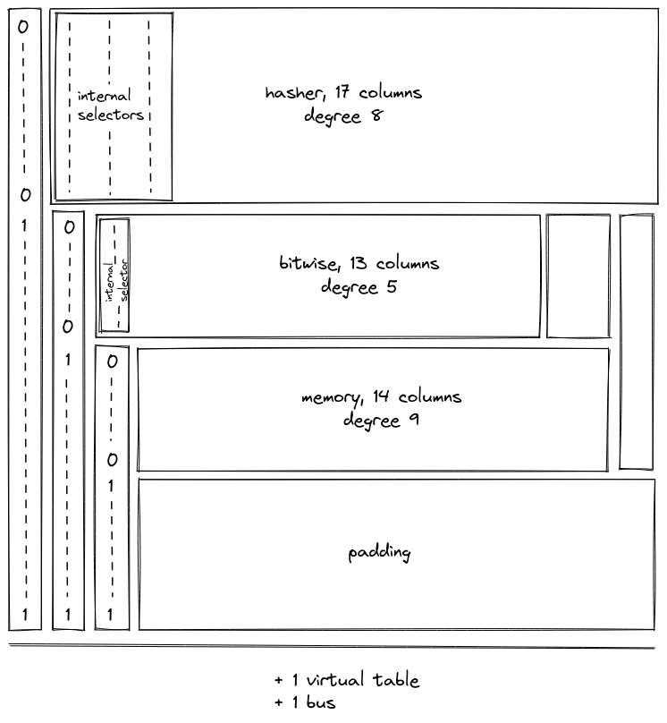

# Chiplets

The Chiplets module contains specialized components dedicated to accelerating complex computations. Each chiplet specializes in executing a specific type of computation and is responsible for proving both the correctness of its computations and its own internal consistency.

Currently, Miden VM relies on 3 chiplets:

- The [Hash Chiplet](./hasher.md) (also referred to as the Hasher), used to compute Rescue Prime Optimized hashes both for sequential hashing and for Merkle tree hashing.
- The [Bitwise Chiplet](./bitwise.md), used to compute bitwise operations (e.g., `AND`, `XOR`) over 32-bit integers.
- The [Memory Chiplet](./memory.md), used to support random-access memory in the VM.

Each chiplet executes its computations separately from the rest of the VM and proves the internal correctness of its execution trace in a unique way that is specific to the operation(s) it supports. These methods are described by each chiplet’s documentation.

## Chiplet bus

The chiplets must be explicitly connected to the rest of the VM in order for it to use their operations. This connection must prove that all specialized operations which a given VM component claimed to offload to one of the chiplets were in fact executed by the correct chiplet with the same set of inputs and outputs as those used by the offloading component.

This is achieved via a [bus](../multiset.md#communication-buses) called $b_{chip}$ where a request can be sent to any chiplet and a corresponding response will be sent back by that chiplet.

The bus is implemented as a single [running product column](../multiset.md) where:

- Each request is “sent” by computing an operation-specific lookup value from an [operation-specific label](#operation-labels), the operation inputs, and the operation outputs, and then dividing it out of the $b_{chip}$ running product column.
- Each chiplet response is “sent” by computing the same operation-specific lookup value from the label, inputs, and outputs, and then multiplying it into the $b_{chip}$ running product column.

Thus, if the requests and responses match, then the bus column $b_{chip}$ will start and end with the value $1$. This condition is enforced by boundary constraints on the $b_{chip}$ column.

Note that the order of the requests and responses does not matter, as long as they are all included in $b_{chip}$. In fact, requests and responses for the same operation will generally occur at different cycles.

### Chiplet bus constraints

The chiplet bus constraints are defined by the components that use it to communicate.

Lookup requests are sent to the chiplets bus by the following components:

- The stack sends requests for [bitwise](../stack/u32_ops.md#u32and), [memory](../stack/io_ops.md#memory-access-operations), and [cryptographic hash operations](../stack/crypto_ops.md).
- The decoder sends requests for [hash operations](../decoder/main.md#program-block-hashing) for program block hashing.

Responses are provided by the [hash](./hasher.md#hash-chiplet-bus-constraints), [bitwise](./bitwise.md#bitwise-chiplet-bus-constraints), and [memory](./memory.md#memory-row-value) chiplets.

## Chiplets module trace

The execution trace of the Chiplets module is generated by stacking the execution traces of each of its chiplet components. Because each chiplet is expected to generate significantly fewer trace rows than the other VM components (i.e., the decoder, stack, and range checker), stacking them enables the same functionality without adding as many columns to the execution trace.

Each chiplet is identified within the Chiplets module by one or more chiplet selector columns which cause its constraints to be selectively applied.

The result is an execution trace of 18 trace columns, which allows space for the widest chiplet component (the Hasher) and a column to select for it.

During the finalization of the overall execution trace, the chiplets' traces (including internal selectors) are appended to the trace of the Chiplets module one after another, as pictured. Thus, when one chiplet's trace ends, the trace of the next chiplet starts in the subsequent row.

Additionally, a padding segment is added to the end of the Chiplets module's trace so that the number of rows in the table always matches the overall trace length of the other VM processors, regardless of the length of the chiplet traces. The padding will simply contain zeroes.

### Chiplets order

The order in which the chiplets are stacked is determined by the requirements of each chiplet, including the width of its execution trace and the degree of its constraints.

For simplicity, all of the "cyclic" chiplets which operate in multi-row cycles and require starting at particular row increments should come before any non-cyclic chiplets, and these should be ordered from longest-cycle to shortest-cycle. This avoids any additional alignment padding between chiplets.

After that, chiplets are ordered by degree of constraints so that higher-degree chiplets get lower-degree chiplet selector flags.

The resulting order is as follows:

| Chiplet         | Cycle Length | Internal Degree | Chiplet Selector Degree | Total Degree | Columns | Chiplet Selector Flag |
| --------------- | :----------: | :-------------: | :---------------------: | :----------: | :-----: | --------------------- |
| Hash chiplet    |      8       |        8        |            1            |       9      |   17    | $\{0\}$               |
| Bitwise chiplet |      8       |        3        |            2            |       5      |   13    | $\{1, 0\}$            |
| Memory          |      -       |        6        |            3            |       9      |   12    | $\{1, 1, 0\}$         |
| Padding         |      -       |        -        |            -            |       -      |   -     | $\{1, 1, 1\}$         |

### Additional requirements for stacking execution traces

Stacking the chiplets introduces one new complexity. Each chiplet proves its own correctness with its own set of internal transition constraints, many of which are enforced between each row in its trace and the next row. As a result, when the chiplets are stacked, transition constraints applied to the final row of one chiplet will cause a conflict with the first row of the following chiplet.

This is true for any transition constraints which are applied at every row and selected by a `Chiplet Selector Flag` for the current row. (Therefore cyclic transition constraints controlled by periodic columns do not cause an issue.)

This requires the following adjustments for each chiplet.

**In the hash chiplet:** the [row address constraint](hasher.md#row-address-constraint) causes a conflict that is resolved by using a virtual flag to exclude the last row. This increases the degree of the row address constraint to 2.

**In the bitwise chiplet:** there is no conflict, and therefore no change, since all constraints are periodic.

**In the memory chiplet:** all transition constraints cause a conflict. To adjust for this, the selector flag for the memory chiplet is designed to exclude its last row. Thus, memory constraints will not be applied when transitioning from the last row of the memory chiplet to the subsequent row. This is achieved without any additional increase in the degree of constraints by using $s'_2$ as a selector instead of $s_2$ as seen [below](#chiplet-constraints).

## Operation labels

Each operation supported by the chiplets is given a unique identifier to ensure that the requests and responses sent to $b_{chip}$ are indeed processed by the intended chiplet for that operation and that chiplets which support more than one operation execute the correct one.

The labels are composed from the flag values of the chiplet selector(s) and internal operation selectors (if applicable). The unique label of the operation is computed as the binary aggregation of the combined selectors plus $1$, note that the combined flag is represented in big-endian, so the bit representation below is reverted.

| Operation              | Chiplet Selector Flag | Internal Selector Flag | Combined Flag    | Label |
| ---------------------- | --------------------- | :--------------------: | ---------------- | :---: |
| `HASHER_LINER_HASH`    |        $\{0\}$        |     $\{1, 0, 0\}$      | $\{0, 1, 0, 0\}$ |   3   |
| `HASHER_MP_VERIFY`     |        $\{0\}$        |     $\{1, 0, 1\}$      | $\{0, 1, 0, 1\}$ |  11   |
| `HASHER_MR_UPDATE_OLD` |        $\{0\}$        |     $\{1, 1, 0\}$      | $\{0, 1, 1, 0\}$ |   7   |
| `HASHER_MR_UPDATE_NEW` |        $\{0\}$        |     $\{1, 1, 1\}$      | $\{0, 1, 1, 1\}$ |  15   |
| `HASHER_RETURN_HASH`   |        $\{0\}$        |     $\{0, 0, 0\}$      | $\{0, 0, 0, 0\}$ |   1   |
| `HASHER_RETURN_STATE`  |        $\{0\}$        |     $\{0, 0, 1\}$      | $\{0, 0, 0, 1\}$ |   9   |
| `BITWISE_AND`          |      $\{1, 0\}$       |       $\{0\}$          | $\{1, 0, 0\}$    |   2   |
| `BITWISE_XOR`          |      $\{1, 0\}$       |       $\{1\}$          | $\{1, 0, 1\}$    |   6   |
| `MEMORY_READ`          |     $\{1, 1, 0\}$     |       $\{1\}$          | $\{1, 1, 0, 1\}$ |   12  |
| `MEMORY_WRITE`         |     $\{1, 1, 0\}$     |       $\{0\}$          | $\{1, 1, 0, 0\}$ |   4   |

## Chiplets module constraints

### Chiplet constraints

Each chiplet's internal constraints are defined in the documentation for the individual chiplets. To ensure that constraints are only ever selected for one chiplet at a time, the module's selector columns $s_0, s_1, s_2$ are combined into flags. Each chiplet's internal constraints are multiplied by its chiplet selector flag, and the degree of each constraint is correspondingly increased.

This gives the following sets of constraints:

> $$
(1 - s_0) \cdot c_{hash} = 0 \text{ | degree} = 1 + \deg(c_{hash})
$$

> $$
s_0 \cdot (1 - s_1) \cdot c_{bitwise} = 0 \text{ | degree} = 2 + \deg(c_{bitwise})
$$

> $$
s_0 \cdot s_1 \cdot (1 - s'_2) \cdot c_{memory} = 0 \text{ | degree} = 3 + \deg(c_{memory})
$$

In the above:
- $c_{hash}, c_{bitwise}, c_{memory}$ each represent an internal constraint from the indicated chiplet.
- $\deg(c)$ indicates the degree of the specified constraint.
- flags are applied in a like manner for all internal constraints in each respective chiplet.
- the selector for the memory chiplet excludes the last row of the chiplet (as discussed [above](#additional-requirements-for-stacking-execution-traces)).

### Chiplet selector constraints

We also need to ensure that the chiplet selector columns are set correctly. Although there are three columns for chiplet selectors, the stacked trace design means that they do not all act as selectors for the entire trace. Thus, selector constraints should only be applied to selector columns when they are acting as selectors.

- $s_0$ acts as a selector for the entire trace.
- $s_1$ acts as a selector column when $s_0 = 1$.
- $s_2$ acts as a selector column when $s_0 = 1$ and $s_1 = 1$.

Two conditions must be enforced for columns acting as chiplet selectors.

1. When acting as a selector, the value in the selector column must be binary.
2. When acting as a selector, the value in the selector column may only change from $0 \rightarrow 1$.

The following constraints ensure that selector values are binary.

> $$
s_0^2 - s_0 = 0 \text{ | degree} = 2 \\
s_0 \cdot (s_1^2 - s_1) = 0 \text{ | degree} = 3 \\
s_0 \cdot s_1 \cdot (s_2^2 - s_2) = 0 \text{ | degree} = 4
$$

The following constraints ensure that the chiplets are stacked correctly by restricting selector values so they can only change from $0 \rightarrow 1$.

> $$
s_0 \cdot (s_0 - s'_0) = 0 \text{ | degree} = 2 \\
s_0 \cdot s_1 \cdot (s_1 - s'_1) \text{ | degree} = 3 \\
s_0 \cdot s_1 \cdot s_2 \cdot (s_2 - s'_2) \text{ | degree} = 4 \\
$$

In other words, the above constraints enforce that if a selector is $0$ in the current row, then it must be either $0$ or $1$ in the next row; if it is $1$ in the current row, it must be $1$ in the next row.
