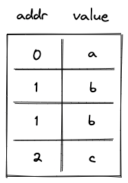
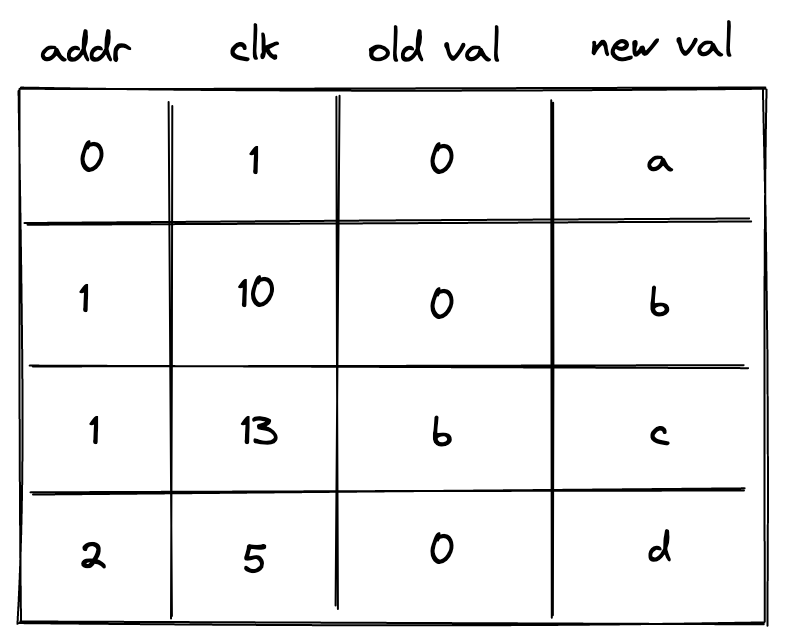
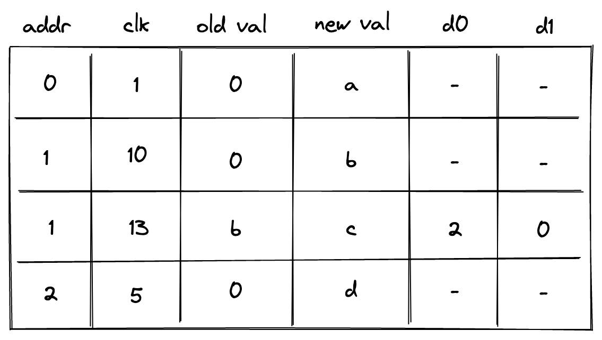
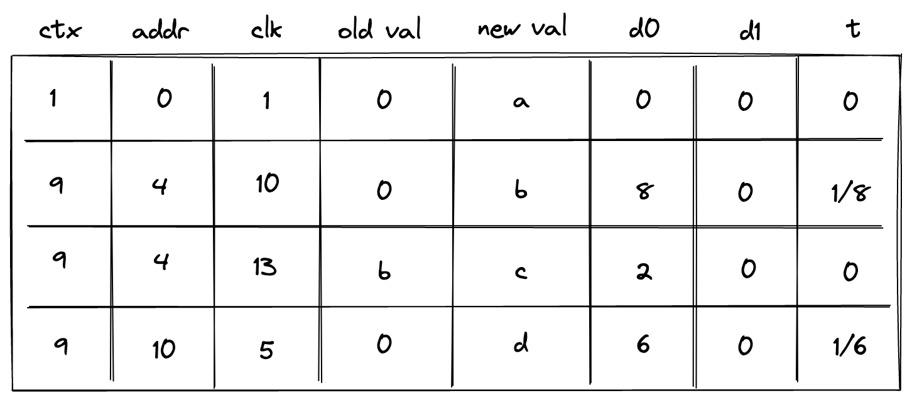
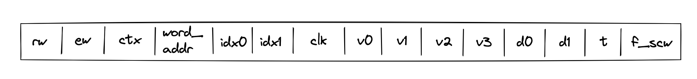

# Memory Chiplet

Miden VM supports linear read-write random access memory. This memory is word-addressable, meaning, four values are located at each address, and we can read and write values to/from memory in batches of four. Each value is a field element in a $64$-bit prime field with modulus $2^{64} - 2^{32} + 1$. Memory address can be any field element.

In this note we describe the rational for selecting the above design and describe AIR constraints needed to support it.

The design makes extensive use of $16$-bit range checks. An efficient way of implementing such range checks is described [here](../range.md).

## Alternative designs

The simplest (and most efficient) alternative to the above design is contiguous write-once memory. To support such memory, we need to allocate just two trace columns as illustrated below.

In the above, `addr` column holds memory address, and `value` column holds the field element representing the value stored at this address. Notice that some rows in this table are duplicated. This is because we need one row per memory access (either read or write operation). In the example above, value $b$ was first stored at memory address $1$, and then read from this address.

The AIR constraints for this design are very simple. First, we need to ensure that values in the `addr` column either remain the same or are incremented by $1$ as we move from one row to the next. This can be achieved with the following constraint:

$$
(a' - a) \cdot (a' - a - 1) = 0
$$

where $a$ is the value in `addr` column in the current row, and $a'$ is the value in this column in the next row.

Second, we need to make sure that if the value in the `addr` column didn't change, the value in the `value` column also remained the same (i.e., a value stored in a given address can only be set once). This can be achieved with the following constraint:

$$
(v' - v) \cdot (a' - a - 1) = 0
$$

where $v$ is the value in `value` column at the current row, and $v'$ is the value in this column in the next row.

In addition to the above constraints we would also need to impose constraints needed for permutation checks, but we omit these constraints here because they are needed for all designs described in this note.

As mentioned above, this approach is very efficient: each memory access requires just $2$ trace cells.

### Read-write memory

Write-once memory is tricky to work with, and many developers may need to climb a steep learning curve before they become comfortable working in this model. Thus, ideally, we'd want to support read-write memory. To do this, we need to introduce additional columns as illustrated below.

In the above, we added `clk` column, which keeps track of the clock cycle at which memory access happened. We also need to differentiate between memory reads and writes. To do this, we now use two columns to keep track of the value: `old val` contains the value stored at the address before the operation, and `new val` contains the value after the operation. Thus, if `old val` and `new val` are the same, it was a read operation. If they are different, it was a write operation.

The AIR constraints needed to support the above structure are as follows.

We still need to make sure memory addresses are contiguous:

$$
(a' - a) \cdot (a' - a - 1) = 0
$$

Whenever memory address changes, we want to make sure that `old val` is set to $0$ (i.e., our memory is always initialized to $0$). This can be done with the following constraint:

$$
(a' - a) \cdot v_{old}' = 0
$$

On the other hand, if memory address doesn't change, we want to make sure that `new val` in the current row is the same as `old val` in the next row. This can be done with the following constraint:

$$
(1 + a - a') \cdot (v_{new} - v_{old}') = 0
$$

Lastly, we need to make sure that for the same address values in `clk` column are always increasing. One way to do this is to perform a $16$-bit range check on the value of $(i' - i - 1)$, where $i$ is the reference to `clk` column. However, this would mean that memory operations involving the same address must happen within $65536$ VM cycles from each other. This limitation would be difficult to enforce statically. To remove this limitation, we need to add two more columns as shown below:

In the above column `d0` contains the lower $16$ bits of $(i' - i - 1)$ while `d1` contains the upper $16$ bits. The constraint needed to enforces this is as follows:

$$
(1 + a - a') \cdot ((i' - i - 1) - (2^{16} \cdot d_1' + d_0')) = 0
$$

Additionally, we need to apply $16$-bit range checks to columns `d0` and `d1`.

Overall, the cost of reading or writing a single element is now $6$ trace cells and $2$ $16$-bit range-checks.

### Non-contiguous memory

Requiring that memory addresses are contiguous may also be a difficult limitation to impose statically. To remove this limitation, we need to introduce one more column as shown below:

In the above, the prover sets the value in the new column `t` to $0$ when the address doesn't change, and to $1 / (a' - a)$ otherwise. To simplify constraint description, we'll define variable $n$ computed as follows:

$$
n = (a' - a) \cdot t'
$$

Then, to make sure the prover sets the value of $t$ correctly, we'll impose the following constraints:

$$
n^2 - n = 0 \\
(1 - n) \cdot  (a' - a) = 0
$$

The above constraints ensure that $n=1$ whenever the address changes, and $n=0$ otherwise. We can then define the following constraints to make sure values in columns `d0` and `d1` contain either the delta between addresses or between clock cycles.

| Condition | Constraint                                      | Comments                                                                                                                                   |
| --------- | ----------------------------------------------- | ------------------------------------------------------------------------------------------------------------------------------------------ |
| $n=1$     | $(a' - a) - (2^{16} \cdot d_1' + d_0') = 0$     | When the address changes, columns `d0` and `d1` at the next row should contain the delta between the old and the new address.              |
| $n=0$     | $(i' - i - 1) - (2^{16} \cdot d_1' + d_0') = 0$ | When the address remains the same, columns `d0` and `d1` at the next row should contain the delta between the old and the new clock cycle. |

We can combine the above constraints as follows:

$$
\left(n \cdot (a' - a) + (1 - n) \cdot (i' - i - 1)\right) - (2^{16} \cdot d_1' + d_0') = 0
$$

The above constraint, in combination with $16$-bit range checks against columns `d0` and `d1` ensure that values in `addr` and `clk` columns always increase monotonically, and also that column `addr` may contain duplicates, while values in `clk` column must be unique for a given address.

### Context separation

In many situations it may be desirable to assign memories to different context. For example, when making a cross-contract calls, memories of the caller and the callee should be separate. That is, caller should not be able to access the memory of the callee and vice-versa.

To accommodate this feature, we need to add one more column as illustrated below.

This new column `ctx` should behave similarly to the address column: values in it should increase monotonically, and there could be breaks between them. We also need to change how the prover populates column `t`:

- If the context changes, `t` should be set to the inverse $(c' - c)$, where $c$ is a reference to column `ctx`.
- If the context remains the same but the address changes, column `t` should be set to the inverse of $(a' - a)$.
- Otherwise, column `t` should be set to $0$.

To simplify description of constraints, we'll define two variables $n_0$ and $n_1$ as follows:

$$
n_0 = (c' - c) \cdot t' \\
n_1 = (a' - a) \cdot t'
$$

Thus, $n_0 = 1$ when the context changes, and $0$ otherwise. Also, $(1 - n_0) \cdot n_1 = 1$ when context remains the same and address changes, and $0$ otherwise.

To make sure the prover sets the value of column `t` correctly, we'll need to impose the following constraints:

$$
n_0^2 - n_0 = 0 \\
(1 - n_0) \cdot  (c' - c) = 0 \\
(1 - n_0) \cdot (n_1^2 - n_1) = 0 \\
(1 - n_0) \cdot (1 - n_1) \cdot (a' - a) = 0
$$

We can then define the following constraints to make sure values in columns `d0` and `d1` contain the delta between contexts, between addresses, or between clock cycles.

| Condition            | Constraint                                      | Comments                                                                                                                                                         |
| -------------------- | ----------------------------------------------- | ---------------------------------------------------------------------------------------------------------------------------------------------------------------- |
| $n_0=1$              | $(c' - c) - (2^{16} \cdot d_1' + d_0') = 0$     | When the context changes, columns `d0` and `d1` at the next row should contain the delta between the old and the new contexts.                                   |
| $n_0=0$   $n_1=1$ | $(a' - a) - (2^{16} \cdot d_1' + d_0') = 0$     | When the context remains the same but the address changes, columns `d0` and `d1` at the next row should contain the delta between the old and the new addresses. |
| $n_0=0$   $n_1=0$ | $(i' - i - 1) - (2^{16} \cdot d_1' + d_0') = 0$ | When both the context and the address remain the same, columns `d0` and `d1` at the next row should contain the delta between the old and the new clock cycle.   |

We can combine the above constraints as follows:

$$
\left(n_0 \cdot (c' - c) + (1 - n_0) \cdot \left(n_1 \cdot (a - a') + (1 - n_1) \cdot (i' - i - 1) \right) \right) - (2^{16} \cdot d_1' + d_0') = 0
$$

The above constraint, in combination with $16$-bit range checks against columns `d0` and `d1` ensure that values in `ctx`, `addr`, and `clk` columns always increase monotonically, and also that columns `ctx` and `addr` may contain duplicates, while the values in column `clk` must be unique for a given combination of `ctx` and `addr`.

Notice that the above constraint has degree $5$.

## Miden approach

While the approach described above works, it comes at significant cost. Reading or writing a single value requires $8$ trace cells and $2$ $16$-bit range checks. Assuming a single range check requires roughly $2$ trace cells, the total number of trace cells needed grows to $12$. This is about $6$x worse the simple contiguous write-once memory described earlier.

Miden VM frequently needs to deal with batches of $4$ field elements, which we call _words_. For example, the output of Rescue Prime Optimized hash function is a single word. A single 256-bit integer value can be stored as two words (where each element contains one $32$-bit value). Thus, we can optimize for this common use case by making the memory _word-addressable_. That is $4$ field elements are located at each memory address, and we can read and write elements to/from memory in batches of four.

The layout of Miden VM memory table is shown below:

where:

- `s0` is a selector column which is set to $1$ for read operations and $0$ for write operations.
- `s1` is a selector oclumn which is set to $1$ when previously accessed memory is being read and $0$ otherwise. In other words, it is set to $1$ only when the context and address are the same as they were in the previous row and the `s0` operation selector is set to $1$ (indicating a read).
- `ctx` contains context ID. Values in this column must increase monotonically but there can be gaps between two consecutive values of up to $2^{32}$. Also, two consecutive values can be the same. In AIR constraint description below, we refer to this column as $c$.
- `addr` contains memory address. Values in this column must increase monotonically for a given context but there can be gaps between two consecutive values of up to $2^{32}$. Also, two consecutive values can be the same. In AIR constraint description below, we refer to this column as $a$.
- `clk` contains clock cycle at which the memory operation happened. Values in this column must increase monotonically for a given context and memory address but there can be gaps between two consecutive values of up to $2^{32}$. In AIR constraint description below, we refer to this column as $i$.
- `v0, v1, v2, v3` columns contain field elements stored at a given context/address/clock cycle after the memory operation.
- Columns `d0` and `d1` contain lower and upper $16$ bits of the delta between two consecutive context IDs, addresses, or clock cycles. Specifically:
  - When the context changes, these columns contain $(c' - c)$.
  - When the context remains the same but the address changes, these columns contain $(a' - a)$.
  - When both the context and the address remain the same, these columns contain $(i' - i - 1)$.
- Column `t` contains the inverse of the delta between two consecutive context IDs, addresses, or clock cycles. Specifically:
  - When the context changes, this column contains the inverse of $(c' - c)$.
  - When the context remains the same but the address changes, this column contains the inverse of $(a' - a)$.
  - When both the context and the address remain the same, this column contains the inverse of $(i' - i - 1)$.

For every memory access operation (i.e., read or write), a new row is added to the memory table. For read operations, `s0` is set to $1$. If neither `ctx` nor `addr` have changed, then `s1` is set to $1$ and the `v` columns are set to equal the values from the previous row. If `ctx` or `addr` have changed, then `s1` is set to $0$ and the `v` columns are initialized to $0$. For write operations, the values may be different, and both selector columns `s0` and `s1` are set to $0$.

The amortized cost of reading or writing a single value is between $4$ and $5$ trace cells (this accounts for the trace cells needed for $16$-bit range checks). Thus, from performance standpoint, this approach is roughly $2.5$x worse than the simple contiguous write-once memory described earlier. However, our view is that this trade-off is worth it given that this approach provides read-write memory, context separation, and eliminates the contiguous memory requirement.

### AIR constraints

To simplify description of constraints, we'll define two variables $n_0$ and $n_1$ as follows:

$$
n_0 = \Delta c \cdot t' \\
n_1 = \Delta a \cdot t'
$$

Where $\Delta c = c' - c$ and $\Delta a = a' - a$.

To make sure the prover sets the value of column `t` correctly, we'll need to impose the following constraints:

>$$
n_0^2 - n_0 = 0 \text{ | degree} = 4
$$

>$$
(1 - n_0) \cdot  \Delta c = 0 \text{ | degree} = 3
$$

>$$
(1 - n_0) \cdot (n_1^2 - n_1) = 0 \text{ | degree} = 6
$$

>$$
(1 - n_0) \cdot (1 - n_1) \cdot \Delta a = 0 \text{ | degree} = 5
$$

The above constraints guarantee that when context changes, $n_0 = 1$. When context remains the same but address changes, $(1 - n_0) \cdot n_1 = 1$. And when neither the context nor the address change, $(1 - n_0) \cdot (1 - n_1) = 1$.

To enforce the values of the selector columns, we first require that they both contain only binary values.

>$$
s_0^2 - s_0 = 0 \text{ | degree} = 2
$$

>$$
s_1^2 - s_1 = 0 \text{ | degree} = 2
$$

Then we require that $s_1$ is always set to $1$ during read operations when the context and address did not change and to $0$ in all other cases.

>$$
(1 - n_0) \cdot (1 - n_1) \cdot s'_0 \cdot (1 - s'_1) = 0 \text{ | degree} = 6
$$

>$$
(n_0 + (1 - n_0) \cdot n_1  + (1 - s'_0)) \cdot s'_1 = 0 \text{ | degree} = 5
$$

The first constraint enforces that `s_1` is $1$ when the operation is a read and `ctx` and `addr` are both unchanged. The second constraint enforces that when either the context changed, the address changed, or the operation is a write, then `s_1` is set to $0$.

To enforce the values of context ID, address, and clock cycle grow monotonically as described in the previous section, we define the following constraint.

>$$
\left(n_0 \cdot \Delta c + (1 - n_0) \cdot (n_1 \cdot \Delta a + (1 - n_1) \cdot \Delta i) \right) - (2^{16} \cdot d_1' + d_0') = 0 \text{ | degree} = 5
$$

Where $\Delta i = i' - i - 1$.

In addition to this constraint, we also need to make sure that values in registers $d_0$ and $d_1$ are less than $2^{16}$, and this can be done with permutation-based range checks.

Next, we need to make sure that values at a given memory address are always initialized to $0$. This can be done with the following constraint:

>$$
s_0 \cdot (1 - s_1) \cdot v_i = 0 \text{ for } i \in \{0, 1, 2, 3\} \text{ | degree} = 3
$$

Thus, when the operation is a read and either the context changes or the address changes, values in the $v_i$ columns are guaranteed to be zeros.

Lastly, we need to make sure that for the same context/address combination, the $v_i$ columns of the current row are equal to the corresponding $v_i$ columns of the next row. This can be done with the following constraints:

>$$
s_1 \cdot (v_i' - v_i) = 0 \text{ for } i \in \{0, 1, 2, 3\} \text{ | degree} = 2
$$

#### Memory row value
Communication between the memory chiplet and the stack is accomplished via the chiplet bus $b_{chip}$. To respond to memory access requests from the stack, we need to divide the current value in $b_{chip}$ by the value representing a row in the memory table. This value can be computed as follows:

$$
v_{mem} = \alpha_0 + \alpha_1 \cdot op_{mem} + \alpha_2 \cdot c + \alpha_3 \cdot a + \alpha_4 \cdot i + \sum_{j=0}^3(\alpha_{j + 5} \cdot v_j)
$$

Where, $op_{mem}$ is the unique [operation label](./main.md#operation-labels) of the memory access operation.

To ensure that values of memory table rows are included into the chiplet bus, we impose the following constraint:

>$$
b_{chip}' = b_{chip} \cdot v_{mem} \text{ | degree} = 2
$$

On the stack side, for every memory access request, a corresponding value is divided out of the $b_{chip}$ column. Specifics of how this is done are described [here](../stack/io_ops.md#memory-access-operations).
