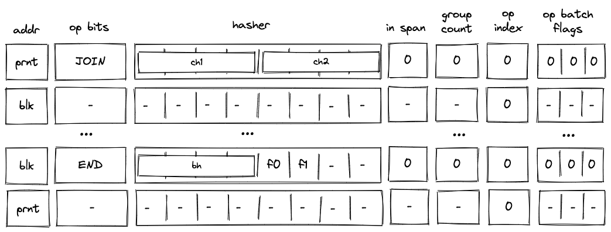
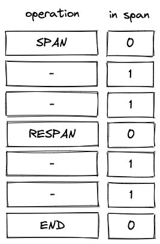
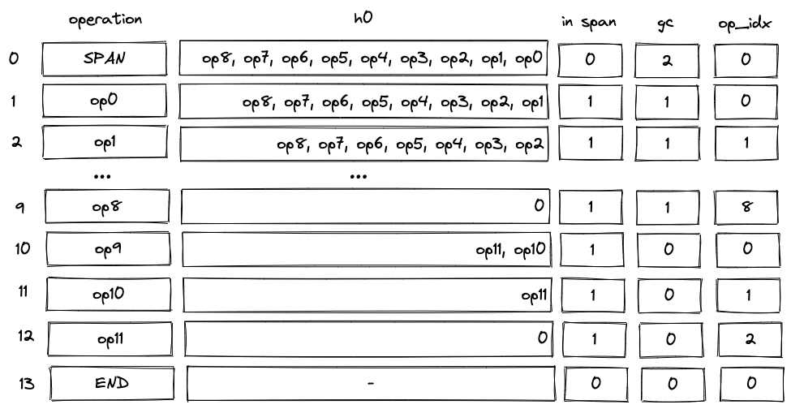

# Miden VM decoder AIR constraints

In this section we describe AIR constraints for Miden VM program decoder. These constraints enforce that the execution trace generated by the prover when executing a particular program complies with the rules described in the [previous section](./main.md).

To refer to decoder execution trace columns, we use the names shown on the diagram below (these are the same names as in the previous section). Additionally, we denote the register containing the value at the top of the stack as $s_0$.

We assume that the VM exposes a flag per operation which is set to $1$ when the operation is executed, and to $0$ otherwise. The notation for such flags is $f_{opname}$. For example, when the VM executes a `PUSH` operation, flag $f_{push} = 1$. All flags are mutually exclusive - i.e., when one flag is set to $1$ all other flags are set to $0$. The flags are computed based on values in `op_bits` columns.

AIR constraints for the decoder involve operations listed in the table below. For each operation we also provide the degree of the corresponding flag and the effect that the operation has on the operand stack (however, in this section we do not cover the constraints needed to enforce the correct transition of the operand stack).

| Operation | Flag          | Degree | Effect on stack                                                                                  |
| --------- | :-----------: | :----: | ------------------------------------------------------------------------------------------------ |
| `JOIN`    | $f_{join}$    | 5      | Stack remains unchanged.                                                                         |
| `SPLIT`   | $f_{split}$   | 5      | Top stack element is dropped.                                                                    |
| `LOOP`    | $f_{loop}$    | 5      | Top stack element is dropped.                                                                    |
| `REPEAT`  | $f_{repeat}$  | 4      | Top stack element is dropped.                                                                    |
| `SPAN`    | $f_{span}$    | 5      | Stack remains unchanged.                                                                         |
| `RESPAN`  | $f_{respan}$  | 4      | Stack remains unchanged.                                                                         |
| `DYN`     | $f_{dyn}$     | 5      | Stack remains unchanged.                                                                         |
| `CALL`    | $f_{call}$    | 4      | Stack remains unchanged.                                                                         |
| `SYSCALL` | $f_{syscall}$ | 4      | Stack remains unchanged.                                                                         |
| `END`     | $f_{end}$     | 4      | When exiting a loop block, top stack element is dropped; otherwise, the stack remains unchanged. |
| `HALT`    | $f_{halt}$    | 4      | Stack remains unchanged.                                                                         |
| `PUSH`    | $f_{push}$    | 5      | An immediate value is pushed onto the stack.                                                     |
| `EMIT`    | $f_{emit}$    | 5      | Stack remains unchanged.                                                                         |

We also use the [control flow flag](../stack/op_constraints.md#control-flow-flag) $f_{ctrl}$ exposed by the VM, which is set when any one of the above control flow operations is being executed. It has degree $5$.

As described [previously](./main.md#program-decoding), the general idea of the decoder is that the prover provides the program to the VM by populating some of cells in the trace non-deterministically. Values in these are then used to update virtual tables (represented via multiset checks) such as block hash table, block stack table etc. Transition constraints are used to ensure that the tables are updates correctly, and we also apply boundary constraints to enforce the correct initial and final states of these tables. One of these boundary constraints binds the execution trace to the hash of the program being executed. Thus, if the virtual tables were updated correctly and boundary constraints hold, we can be convinced that the prover executed the claimed program on the VM.

In the sections below, we describe constraints according to their logical grouping. However, we start out with a set of general constraints which are applicable to multiple parts of the decoder.

## General constraints

When `SPLIT` or `LOOP` operation is executed, the top of the operand stack must contain a binary value:

> $$
(f_{split} + f_{loop}) \cdot (s_0^2 - s_0) = 0 \text{ | degree} = 7
$$

When a `DYN` operation is executed, the hasher registers must all be set to $0$:

> $$
f_{dyn} \cdot (1 - h_i) = 0 \text { for } i \in [0, 8) \text{ | degree} = 6
$$

When `REPEAT` operation is executed, the value at the top of the operand stack must be $1$:

> $$
f_{repeat} \cdot (1 - s_0) = 0 \text{ | degree} = 5
$$

Also, when `REPEAT` operation is executed, the value in $h_4$ column (the `is_loop_body` flag), must be set to $1$. This ensures that `REPEAT` operation can be executed only inside a loop:

> $$
f_{repeat} \cdot (1 - h_4) = 0 \text{ | degree} = 5
$$

When `RESPAN` operation is executed, we need to make sure that the block ID is incremented by $8$:

> $$
f_{respan} \cdot (a' - a - 8) = 0 \text{ | degree} = 5
$$

When `END` operation is executed and we are exiting a *loop* block (i.e., `is_loop`, value which is stored in $h_5$, is $1$), the value at the top of the operand stack must be $0$:

> $$
f_{end} \cdot h_5 \cdot s_0 = 0 \text{ | degree} = 6
$$

Also, when `END` operation is executed and the next operation is `REPEAT`, values in $h_0, ..., h_4$ (the hash of the current block and the `is_loop_body` flag) must be copied to the next row:

> $$
f_{end} \cdot f_{repeat}' \cdot (h_i' - h_i) = 0 \text { for } i \in [0, 5) \text{ | degree} = 9
$$

A `HALT` instruction can be followed only by another `HALT` instruction:

> $$
f_{halt} \cdot (1 - f_{halt}') = 0 \text{ | degree} = 8
$$

When a `HALT` operation is executed, block address column must be $0$:

> $$
f_{halt} \cdot a = 0 \text{ | degree} = 5
$$

Values in `op_bits` columns must be binary (i.e., either $1$ or $0$):

> $$
b_i^2 - b_i = 0 \text{ for } i \in [0, 7) \text{ | degree} = 2
$$

When the value in `in_span` column is set to $1$, control flow operations cannot be executed on the VM, but when `in_span` flag is $0$, only control flow operations can be executed on the VM:

> $$
1 - sp - f_{ctrl} = 0 \text{ | degree} = 5
$$

## Block hash computation constraints
As described [previously](./main.md#program-block-hashing), when the VM starts executing a new block, it also initiates computation of the block's hash. There are two separate methodologies for computing block hashes.

For *join*, *split*, and *loop* blocks, the hash is computed directly from the hashes of the block's children. The prover provides these child hashes non-deterministically by populating registers $h_0,..., h_7$. For *dyn*, the hasher registers are populated with zeros, so the resulting hash is a constant value. The hasher is initialized using the hash chiplet, and we use the address of the hasher as the block's ID. The result of the hash is available $7$ rows down in the hasher table (i.e., at row with index equal to block ID plus $7$). We read the result from the hasher table at the time the `END` operation is executed for a given block.

For *span* blocks, the hash is computed by absorbing a linear sequence of instructions (organized into operation groups and batches) into the hasher and then returning the result. The prover provides operation batches non-deterministically by populating registers $h_0, ..., h_7$. Similarly to other blocks, the hasher is initialized using the hash chiplet at the start of the block, and we use the address of the hasher as the ID of the first operation batch in the block. As we absorb additional operation batches into the hasher (by executing `RESPAN` operation), the batch address is incremented by $8$. This moves the "pointer" into the hasher table $8$ rows down with every new batch. We read the result from the hasher table at the time the `END` operation is executed for a given block.

### Chiplets bus constraints

The decoder communicates with the hash chiplet via the [chiplets bus](../chiplets/main.md#chiplets-bus). This works by dividing values of the multiset check column $b_{chip}$ by the values of operations providing inputs to or reading outputs from the hash chiplet. A constraint to enforce this would look as $b_{chip}' \cdot u = b_{chip}$, where $u$ is the value which defines the operation.

In constructing value of $u$ for decoder AIR constraints, we will use the following labels (see [here](../chiplets/hasher.md#multiset-check-constraints) for an explanation of how values for these labels are computed):

* $m_{bp}$ this label specifies that we are starting a new hash computation.
* $m_{abp}$ this label specifies that we are absorbing the next sequence of $8$ elements into an ongoing hash computation.
* $m_{hout}$ this label specifies that we are reading the result of a hash computation.

To simplify constraint description, we define the following variables:

$$
h_{init} = \alpha_0 + \alpha_1 \cdot m_{bp} + \alpha_2 \cdot a' + \sum_{i=0}^7(\alpha_{i + 8} \cdot h_i)
$$

In the above, $h_{init}$ can be thought of as initiating a hasher with address $a'$ and absorbing $8$ elements from the hasher state ($h_0, ..., h_7$) into it. Control blocks are always padded to fill the hasher rate and as such the $\alpha_4$ (first capacity register) term is set to $0$.

$$
h_{abp} = \alpha_0 + \alpha_1 \cdot m_{abp} + \alpha_2 \cdot a' + \sum_{i=0}^7(\alpha_{i + 8} \cdot h_i)
$$

It should be noted that $a$ refers to a column in the decoder, as depicted. The addresses in this column are set using the address from the hasher chiplet for the corresponding hash initialization / absorption / return. In the case of $h_{abp}$ the value of the address in column $a$ in the current row of the decoder is set to equal the value of the address of the row in the hasher chiplet where the previous absorption (or initialization) occurred. $a'$ is the address of the next row of the decoder, which is set to equal the address in the hasher chiplet where the absorption referred to by the $h_{abp}$ label is happening.

$$
h_{res} = \alpha_0 + \alpha_1 \cdot m_{hout} + \alpha_2 \cdot (a + 7) + \sum_{i=0}^3(\alpha_{i + 8} \cdot h_i)
$$

In the above, $a$ represents the address value in the decoder which corresponds to the hasher chiplet address at which the hasher was initialized (or the last absorption took place).  As such, $a + 7$ corresponds to the hasher chiplet address at which the result is returned.

$$
f_{ctrli} = f_{join} + f_{split} + f_{loop} + f_{call} \text{ | degree} = 5
$$

In the above, $f_{ctrli}$ is set to $1$ when a control flow operation that signifies the initialization of a control block is being executed on the VM (only those control blocks that don't do any concurrent requests to the chiplets but).  Otherwise, it is set to $0$. An exception is made for the `DYN`, `DYNCALL`, and `SYSCALL` operations, since although they initialize a control block, they also run another concurrent bus request, and so are handled separately. 

$$
d = \sum_{b=0}^6(b_i \cdot 2^i)
$$

In the above, $d$ represents the opcode value of the opcode being executed on the virtual machine. It is calculated via a bitwise combination of the op bits. We leverage the opcode value to achieve domain separation when hashing control blocks. This is done by populating the second capacity register of the hasher with the value $d$ via the $\alpha_5$ term when initializing the hasher.

Using the above variables, we define operation values as described below.

When a control block initializer operation (`JOIN`, `SPLIT`, `LOOP`, `CALL`) is executed, a new hasher is initialized and the contents of $h_0, ..., h_7$ are absorbed into the hasher. As mentioned above, the opcode value $d$ is populated in the second capacity register via the $\alpha_5$ term.

$$
u_{ctrli} = f_{ctrli} \cdot (h_{init} + \alpha_5 \cdot d) \text{ | degree} = 6
$$

As mentioned previously, the value sent by the `SYSCALL` operation is defined separately, since in addition to communicating with the hash chiplet it must also send a kernel procedure access request to the kernel ROM chiplet. This value of this kernel procedure request is described by $k_{proc}$.

$$
k_{proc} = \alpha_6 + \alpha_7 \cdot op_{krom} + \sum_{i=0}^3 (\alpha_{i + 8} \cdot h_i)
$$

In the above, $op_{krom}$ is the unique [operation label](./main.md#operation-labels) of the kernel procedure call operation. The values $h_0, h_1, h_2, h_3$ contain the root hash of the procedure being called, which is the procedure that must be requested from the kernel ROM chiplet.

$$
u_{syscall} = f_{syscall} \cdot (h_{init} + \alpha_5 \cdot d) \cdot k_{proc} \text{ | degree} = 7
$$

The above value sends both the hash initialization request and the kernel procedure access request to the chiplets bus when the `SYSCALL` operation is executed.

Similar to `SYSCALL`, `DYN` and `DYNCALL` are handled separately, since in addition to communicating with the hash chiplet they must also issue a memory read operation for the hash of the procedure being called. 

$$
h_{dynordyncall} = \alpha_0 + \alpha_1 \cdot m_{bp} + \alpha_2 \cdot a' 
$$

$$
m_{dynordyncall} = \alpha_0 + \alpha_1 \cdot m_{read} + \alpha_2 \cdot ctx + \alpha_3 \cdot s_0 + \alpha_4 \cdot clk + <[\alpha_5 \dots \alpha_8], h[0 \dots 4]>
$$

$$
u_{dynordyncall} = (f_{dyn} + f_{dyncall}) (h_{dynordyncall} \cdot m_{dynordyncall})
$$

In the above, $h_{dynordyncall}$ can be thought of as $h_{init}$, but where the values used for the hasher decoder trace registers is all 0's. $m_{dynordyncall}$ represents a memory read request from memory address $s_0$ (the top stack element), where the result is placed in the first half of the decoder hasher trace, and where $m_{read}$ is a label that represents a memory read request.

When `SPAN` operation is executed, a new hasher is initialized and contents of $h_0, ..., h_7$ are absorbed into the hasher. The number of operation groups to be hashed is padded to a multiple of the rate width ($8$) and so the $\alpha_4$ is set to 0:

$$
u_{span} = f_{span} \cdot h_{init} \text{ | degree} = 6
$$

When `RESPAN` operation is executed, contents of $h_0, ..., h_7$ (which contain the new operation batch) are absorbed into the hasher:

$$
u_{respan} = f_{respan} \cdot h_{abp} \text{ | degree} = 5
$$

When `END` operation is executed, the hash result is copied into registers $h_0, .., h_3$:

$$
u_{end} = f_{end} \cdot h_{res} \text{ | degree} = 5
$$

Using the above definitions, we can describe the constraint for computing block hashes as follows:

> $$
b_{chip}' \cdot (u_{ctrli} + u_{syscall} + u_{dynordyncall} + u_{span} + u_{respan} + u_{end} + \\
1 - (f_{ctrli} + f_{syscall} + f_{dyn} + f_{dyncall} + f_{span} + f_{respan} + f_{end})) = b_{chip}
$$

We need to add $1$ and subtract the sum of the relevant operation flags to ensure that when none of the flags is set to $1$, the above constraint reduces to $b_{chip}' = b_{chip}$.

The degree of this constraint is $8$.

## Block stack table constraints
As described [previously](./main.md#block-stack-table), block stack table keeps track of program blocks currently executing on the VM. Thus, whenever the VM starts executing a new block, an entry for this block is added to the block stack table. And when execution of a block completes, it is removed from the block stack table.

Adding and removing entries to/from the block stack table is accomplished as follows:
* To add an entry, we multiply the value in column $p_1$ by a value representing a tuple `(blk, prnt, is_loop, ctx_next, fmp_next, b0_next, b1_next, fn_hash_next)`
. A constraint to enforce this would look as $p_1' = p_1 \cdot v$, where $v$ is the value representing the row to be added.
* To remove an entry, we divide the value in column $p_1$ by a value representing a tuple `(blk, prnt, is_loop, ctx_next, fmp_next, b0_next, b1_next, fn_hash_next)`. A constraint to enforce this would look as $p_1' \cdot u = p_1$, where $u$ is the value representing the row to be removed.

> Recall that the columns `ctx_next, fmp_next, b0_next, b1_next, fn_hash_next` are only set on `CALL`, `SYSCALL`, and their corresponding `END` block. Therefore, for simplicity, we will ignore them when documenting all other block types (such that their values are set to `0`).

Before describing the constraints for the block stack table, we first describe how we compute the values to be added and removed from the table for each operation. In the below, for block start operations (`JOIN`, `SPLIT`, `LOOP`, `SPAN`) $a$ refers to the ID of the parent block, and $a'$ refers to the ID of the starting block. For `END` operation, the situation is reversed: $a$ is the ID of the ending block, and $a'$ is the ID of the parent block. For `RESPAN` operation, $a$ refers to the ID of the current operation batch, $a'$ refers to the ID of the next batch, and the parent ID for both batches is set by the prover non-deterministically in register $h_1$.

When `JOIN` operation is executed, row $(a', a, 0)$ is added to the block stack table:

$$
v_{join} = f_{join} \cdot (\alpha_0 + \alpha_1 \cdot a' + \alpha_2 \cdot a) \text{ | degree} = 6
$$

When `SPLIT` operation is executed, row $(a', a, 0)$ is added to the block stack table:

$$
v_{split} = f_{split} \cdot (\alpha_0 + \alpha_1 \cdot a' + \alpha_2 \cdot a) \text{ | degree} = 6
$$

When `LOOP` operation is executed, row $(a', a, 1)$ is added to the block stack table if the value at the top of the operand stack is $1$, and row $(a', a, 0)$ is added to the block stack table if the value at the top of the operand stack is $0$:

$$
v_{loop} = f_{loop} \cdot (\alpha_0 + \alpha_1 \cdot a' + \alpha_2 \cdot a + \alpha_3 \cdot s_0) \text{ | degree} = 6
$$

When `SPAN` operation is executed, row $(a', a, 0)$ is added to the block stack table:

$$
v_{span} = f_{span} \cdot (\alpha_0 + \alpha_1 \cdot a' + \alpha_2 \cdot a) \text{ | degree} = 6
$$

When `RESPAN` operation is executed, row $(a, h_1', 0)$ is removed from the block stack table, and row $(a', h_1', 0)$ is added to the table. The prover sets the value of register $h_1$ at the next row to the ID of the parent block:

$$
u_{respan} = f_{respan} \cdot (\alpha_0 + \alpha_1 \cdot a + \alpha_2 \cdot h_1') \text{ | degree} = 5  \\
v_{respan} = f_{respan} \cdot (\alpha_0 + \alpha_1 \cdot a' + \alpha_2 \cdot h_1') \text{ | degree} = 5
$$

When a `DYN` operation is executed, row $(a', a, 0)$ is added to the block stack table:

$$
v_{dyn} = f_{dyn} \cdot (\alpha_0 + \alpha_1 \cdot a' + \alpha_2 \cdot a) \text{ | degree} = 6
$$

When a `DYNCALL` operation is executed, row $(a', a, 0, ctx, fmp, b_0, b_1, \mathrm{fnhash}[0..3])$ is added to the block stack table:

$$
\begin{align*}
v_{dyncall} &= f_{dyncall} \cdot (\alpha_0 + \alpha_1 \cdot a + \alpha_2 \cdot a' + \alpha_4 \cdot ctx \\
&+ \alpha_5 \cdot fmp + \alpha_6 \cdot b_0 + \alpha_7 \cdot b_1 + <[\alpha_8, \alpha_{11}], \mathrm{fnhash}[0..3]>) \text{ | degree} = 6
\end{align*}
$$

When a `CALL` or `SYSCALL` operation is executed, row $(a', a, 0, ctx, fmp, b_0, b_1, \mathrm{fnhash}[0..3])$ is added to the block stack table:

$$
\begin{align*}
v_{callorsyscall} &= (f_{call} + f_{syscall}) \cdot (\alpha_0 + \alpha_1 \cdot a + \alpha_2 \cdot a' + \alpha_4 \cdot ctx \\
&+ \alpha_5 \cdot fmp + \alpha_6 \cdot b_0 + \alpha_7 \cdot b_1 + <[\alpha_8, \alpha_{11}], \mathrm{fnhash}[0..3]>) \text{ | degree} = 5
\end{align*}
$$

When `END` operation is executed, how we construct the row will depend on whether the `IS_CALL` or `IS_SYSCALL` values are set (stored in registers $h_6$ and $h_7$ respectively). If they are not set, then row $(a, a', h_5)$ is removed from the block span table (where $h_5$ contains the `is_loop` flag); otherwise, row $(a ,a', 0, ctx', fmp', b_0', b_1', \mathrm{fnhash}'[0..3])$.

$$
\begin{align*}
u_{endnocall} &=\alpha_0 + \alpha_1 \cdot a + \alpha_2 \cdot a' \\
u_{endcall} &= u_{endnocall} + \alpha_4 \cdot ctx' + \alpha_5 \cdot fmp' + \alpha_6 \cdot b_0' + \alpha_7 \cdot b_1' + <[\alpha_8, \alpha_{11}], \mathrm{fnhash}'[0..3]>\\
u_{end} &= f_{end} \cdot ((1 - h_6 - h_7) \cdot u_{endnocall} + (h_6 + h_7) \cdot u_{endcall} ) \text{ | degree} = 6
\end{align*}
$$

Using the above definitions, we can describe the constraint for updating the block stack table as follows:

> $$
p_1' \cdot (u_{end} + u_{respan} + 1 - (f_{end} + f_{respan})) = p_1 \cdot \\
(v_{join} + v_{split} + v_{loop} + v_{span} + v_{respan} + v_{dyn} + v_{dyncall} + v_{callorsyscall} + 1 - \\
(f_{join} + f_{split} + f_{loop} + f_{span} + f_{respan} + f_{dyn} + f_{dyncall} + f_{call} + f_{syscall}))
$$

We need to add $1$ and subtract the sum of the relevant operation flags from each side to ensure that when none of the flags is set to $1$, the above constraint reduces to $p_1' = p_1$.

The degree of this constraint is $7$.

In addition to the above transition constraint, we also need to impose boundary constraints against the $p_1$ column to make sure the first and the last values in the column are set to $1$. This enforces that the block stack table starts and ends in an empty state.

## Block hash table constraints
As described [previously](./main.md#block-hash-table), when the VM starts executing a new program block, it adds hashes of the block's children to the block hash table. And when the VM finishes executing a block, it removes the block's hash from the block hash table. This means that the block hash table gets updated when we execute the `JOIN`, `SPLIT`, `LOOP`, `REPEAT`, `DYN`, and `END` operations (executing `SPAN` operation does not affect the block hash table because a *span* block has no children).

Adding and removing entries to/from the block hash table is accomplished as follows:
* To add an entry, we multiply the value in column $p_2$ by a value representing a tuple `(prnt_id, block_hash, is_first_child, is_loop_body)`. A constraint to enforce this would look as $p_2' = p_2 \cdot v$, where $v$ is the value representing the row to be added.
* To remove an entry, we divide the value in column $p_2$ by a value representing a tuple `(prnt_id, block_hash, is_first_child, is_loop_body)`. A constraint to enforce this would look as $p_2' \cdot u = p_2$, where $u$ is the value representing the row to be removed.

To simplify constraint descriptions, we define values representing left and right children of a block as follows:

$$
ch_1 = \alpha_0 + \alpha_1 \cdot a' + \sum_{i=0}^3(\alpha_{i+2} \cdot h_i) \text{ | degree} = 1 \\
ch_2 = \alpha_0 + \alpha_1 \cdot a' + \sum_{i=0}^3(\alpha_{i+2} \cdot h_{i+4}) \text{ | degree} = 1
$$

Graphically, this looks like so:

In a similar manner, we define a value representing the result of hash computation as follows:

$$
bh = \alpha_0 + \alpha_1 \cdot a' + \sum_{i=0}^3(\alpha_{i+2} \cdot h_i) + \alpha_7 \cdot f_{is\_loop\_body} \text{ | degree} = 1
$$

Above, $f_{is\_loop\_body}$ refers to the value in the `IS_LOOP_BODY` column (already constrained to be 0 or 1), located in $h_4$. Also, note that we are not adding a flag indicating whether the block is the first child of a join block (i.e., $\alpha_6$ term is missing). It will be added later on.

Using the above variables, we define row values to be added to and removed from the block hash table as follows.

When `JOIN` operation is executed, hashes of both child nodes are added to the block hash table. We add $\alpha_6$ term to the first child value to differentiate it from the second child (i.e., this sets `is_first_child` to $1$):

$$
v_{join} = f_{join} \cdot (ch_1 + \alpha_6) \cdot ch_2  \text{ | degree} = 7
$$

When `SPLIT` operation is executed and the top of the stack is $1$, hash of the *true* branch is added to the block hash table, but when the top of the stack is $0$, hash of the *false* branch is added to the block hash table:

$$
v_{split} = f_{split} \cdot (s_0 \cdot ch_1 + (1 - s_0) \cdot ch_2)  \text{ | degree} = 7
$$

When `LOOP` operation is executed and the top of the stack is $1$, hash of loop body is added to the block hash table. We add $\alpha_7$ term to indicate that the child is a body of a loop. The below also means that if the top of the stack is $0$, nothing is added to the block hash table as the expression evaluates to $0$:

$$
v_{loop} = f_{loop} \cdot s_0 \cdot (ch_1 + \alpha_7) \text{ | degree} = 7
$$

When `REPEAT` operation is executed, hash of loop body is added to the block hash table. We add $\alpha_7$ term to indicate that the child is a body of a loop:

$$v_{repeat} = f_{repeat} \cdot (ch_1 + \alpha_7) \text{ | } \text{degree} = 5$$

When `DYN`, `DYNCALL`, `CALL` or `SYSCALL` operation is executed, the hash of the child is added to the block hash table. In all cases, this child is found in the first half of the decoder hasher state.

$$
v_{allcalls} = (f_{dyn} + f_{dyncall} + f_{call} + f_{syscall}) \cdot ch_1  \text{ | degree} = 6
$$

When `END` operation is executed, hash of the completed block is removed from the block hash table. However, we also need to differentiate between removing the first and the second child of a *join* block. We do this by looking at the next operation. Specifically, if the next operation is neither `END` nor `REPEAT` nor `HALT`, we know that another block is about to be executed, and thus, we have just finished executing the first child of a *join* block. Thus, if the next operation is neither `END` nor `REPEAT` nor `HALT` we need to set the term for $\alpha_6$ coefficient to $1$ as shown below:

$$
u_{end} = f_{end} \cdot (bh + \alpha_6 \cdot (1 - (f_{end}' + f_{repeat}' + f_{halt}'))) \text{ | } \text{degree} = 8
$$

Using the above definitions, we can describe the constraint for updating the block hash table as follows:

> $$
p_2' \cdot (u_{end} + 1 - f_{end}) = \\
p_2 \cdot (v_{join} + v_{split} + v_{loop} + v_{repeat} + v_{allcalls} + 1 - (f_{join} + f_{split} + f_{loop} + f_{repeat} + f_{dyn} + f_{dyncall} + f_{call} + f_{syscall}))
$$

We need to add $1$ and subtract the sum of the relevant operation flags from each side to ensure that when none of the flags is set to $1$, the above constraint reduces to $p_2' = p_2$.

The degree of this constraint is $9$.

In addition to the above transition constraint, we also need to set the following boundary constraints against the $p_2$ column:
* The first value in the column represents a row for the entire program. Specifically, the row tuple would be `(0, program_hash, 0, 0)`. This row should be removed from the table when the last `END` operation is executed.
* The last value in the column is $1$ - i.e., the block hash table is empty.

## Span block
Span block constraints ensure proper decoding of span blocks. In addition to the block stack table constraints and block hash table constraints described previously, decoding of span blocks requires constraints described below.

### In-span column constraints
The `in_span` column (denoted as $sp$) is used to identify rows which execute non-control flow operations. The values in this column are set as follows:

* Executing a `SPAN` operation sets the value of `in_span` column to $1$.
* The value remains $1$ until the `END` operation is executed.
* If `RESPAN` operation is executed between `SPAN` and `END` operations, in the row at which `RESPAN` operation is executed `in_span` is set to $0$. It is then reset to $1$ in the following row.
* In all other cases, value in the `in_span` column should be $0$.

The picture below illustrates the above rules.

To enforce the above rules we need the following constraints.

When executing `SPAN` or `RESPAN` operation, the next value in $sp$ column must be set to $1$:

> $$
(f_{span} + f_{respan}) \cdot (1 - sp') = 0 \text{ | degree} = 6
$$

When the next operation is `END` or `RESPAN`, the next value in $sp$ column must be set $0$.

> $$
(f_{end}' + f_{respan}') \cdot sp' = 0 \text{ | degree} = 5
$$

In all other cases, the value in $sp$ column must be copied over to the next row:

> $$
(1 - f_{span} - f_{respan} - f_{end}' - f_{respan}') \cdot (sp' - sp) = 0 \text{ | degree} = 6
$$

Additionally, we will need to impose a boundary constraint which specifies that the first value in $sp = 0$. Note, however, that we do not need to impose a constraint ensuring that values in $sp$ are binary - this will follow naturally from the above constraints.

Also, note that the combination of the above constraints makes it impossible to execute `END` or `RESPAN` operations right after `SPAN` or `RESPAN` operations.

### Block address constraints
When we are inside a *span* block, values in block address columns (denoted as $a$) must remain the same. This can be enforced with the following constraint:

> $$
sp \cdot (a' - a) = 0 \text{ | degree} = 2
$$

Notice that this constraint does not apply when we execute any of the control flow operations. For such operations, the prover sets the value of the $a$ column non-deterministically, except for the `RESPAN` operation. For the `RESPAN` operation the value in the $a$ column is incremented by $8$, which is enforced by a constraint described previously.

Notice also that this constraint implies that when the next operation is the `END` operation, the value in the $a$ column must also be copied over to the next row. This is exactly the behavior we want to enforce so that when the `END` operation is executed, the block address is set to the address of the current span batch.

### Group count constraints
The `group_count` column (denoted as $gc$) is used to keep track of the number of operation groups which remains to be executed in a span block.

In the beginning of a span block (i.e., when `SPAN` operation is executed), the prover sets the value of $gc$ non-deterministically. This value is subsequently decremented according to the rules described below. By the time we exit the span block (i.e., when `END` operation is executed), the value in $gc$ must be $0$.

The rules for decrementing values in the $gc$ column are as follows:
* The count cannot be decremented by more than $1$ in a single row.
* When an operation group is fully executed (which happens when $h_0 = 0$ inside a span block), the count is decremented by $1$.
* When `SPAN`, `RESPAN`, `EMIT` or `PUSH` operations are executed, the count is decremented by $1$.

Note that these rules imply that the `EMIT` and `PUSH` operations cannot be the last operation in an operation group (otherwise the count would have to be decremented by $2$).

To simplify the description of the constraints, we will define the following variable:

$$
\Delta gc = gc - gc'
$$

Using this variable, we can describe the constraints against the $gc$ column as follows:

Inside a *span* block, group count can either stay the same or decrease by one:

> $$
sp \cdot \Delta gc \cdot (\Delta gc - 1) = 0 \text{ | degree} = 3
$$

When group count is decremented inside a *span* block, either $h_0$ must be $0$ (we consumed all operations in a group) or we must be executing an operation with an immediate value:

> $$
sp \cdot \Delta gc \cdot (1 - f_{imm})\cdot h_0 = 0 \text{ | degree} = 7
$$

Notice that the above constraint does not preclude $f_{imm} = 1$ and $h_0 = 0$ from being true at the same time. If this happens, op group decoding constraints (described [here](#op-group-decoding-constraints)) will force that the operation following the operation with an immediate value is a `NOOP`.

When executing a `SPAN`, a `RESPAN`, or an operation with an immediate value, group count must be decremented by $1$:

> $$
(f_{span} + f_{respan} + f_{imm}) \cdot (\Delta gc - 1) = 0 \text{ | degree} = 6
$$

If the next operation is either an `END` or a `RESPAN`, group count must remain the same:

> $$
\Delta gc \cdot (f_{end}' + f_{respan}') = 0 \text{ | degree} = 5
$$

When an `END` operation is executed, group count must be $0$:

> $$
f_{end} \cdot gc = 0 \text{ | degree} = 5
$$

### Op group decoding constraints
Inside a *span* block, register $h_0$ is used to keep track of operations to be executed in the current operation group. The value of this register is set by the prover non-deterministically at the time when the prover executes a `SPAN` or a `RESPAN` operation, or when processing of a new operation group within a batch starts. The picture below illustrates this.

In the above:
* The prover sets the value of $h_0$ non-deterministically at row $0$. The value is set to an operation group containing operations `op0` through `op8`.
* As we start executing the group, at every row we "remove" the least significant operation from the group. This can be done by subtracting opcode of the operation from the group, and then dividing the result by $2^7$.
* By row $9$ the group is fully executed. This decrements the group count and set `op_index` to $0$ (constraints against `op_index` column are described in the next section).
* At row $10$ we start executing the next group with operations `op9` through `op11`. In this case, the prover populates $h_0$ with the group having its first operation (`op9`) already removed, and sets the `op_bits` registers to the value encoding `op9`.
* By row $12$ this group is also fully executed.

To simplify the description of the constraints, we define the following variables:

$$
op = \sum_{i=0}^6 (b_i \cdot 2^i) \\
f_{sgc} = sp \cdot sp' \cdot (1 - \Delta gc)
$$

$op$ is just an opcode value implied by the values in `op_bits` registers. $f_{sgc}$ is a flag which is set to $1$ when the group count within a *span* block does not change. We multiply it by $sp'$ to make sure the flag is $0$ when we are about to end decoding of an operation batch. Note that $f_{sgc}$ flag is mutually exclusive with $f_{span}$, $f_{respan}$, and $f_{imm}$ flags as these three operations decrement the group count.

Using these variables, we can describe operation group decoding constraints as follows:

When a `SPAN`, a `RESPAN`, or an operation with an immediate value is executed or when the group count does not change, the value in $h_0$ should be decremented by the value of the opcode in the next row.

> $$
(f_{span} + f_{respan} + f_{imm} + f_{sgc}) \cdot (h_0 - h_0' \cdot 2^7 - op') = 0 \text{ | degree} = 6
$$

Notice that when the group count does change, and we are not executing $f_{span}$, $f_{respan}$, or $f_{imm}$ operations, no constraints are placed against $h_0$, and thus, the prover can populate this register non-deterministically.

When we are in a *span* block and the next operation is `END` or `RESPAN`, the current value in $h_0$ column must be $0$.

> $$
sp \cdot (f_{end}' + f_{respan}') \cdot h_0 = 0 \text{ | degree} = 6
$$

### Op index constraints
The `op_index` column (denoted as $ox$) tracks index of an operation within its operation group. It is used to ensure that the number of operations executed per group never exceeds $9$. The index is zero-based, and thus, the possible set of values for $ox$ is between $0$ and $8$ (both inclusive).

To simplify the description of the constraints, we will define the following variables:

$$
ng = \Delta gc - f_{imm} \\
\Delta ox = ox' - ox
$$

The value of $ng$ is set to $1$ when we are about to start executing a new operation group (i.e., group count is decremented but we did not execute an operation with an immediate value). Using these variables, we can describe the constraints against the $ox$ column as follows.

When executing `SPAN` or `RESPAN` operations the next value of `op_index` must be set to $0$:

> $$
(f_{span} + f_{respan}) \cdot ox' = 0 \text{ | degree} = 6
$$

When starting a new operation group inside a *span* block, the next value of `op_index` must be set to $0$. Note that we multiply by $sp$ to exclude the cases when the group count is decremented because of `SPAN` or `RESPAN` operations:

> $$
sp \cdot ng \cdot ox' = 0 \text{ | degree} = 6
$$

When inside a *span* block but not starting a new operation group, `op_index` must be incremented by $1$. Note that we multiply by $sp'$ to exclude the cases when we are about to exit processing of an operation batch (i.e., the next operation is either `END` or `RESPAN`):

> $$
sp \cdot sp' \cdot (1 - ng) \cdot (\Delta ox - 1) = 0 \text{ | degree} = 7
$$

Values of `op_index` must be in the range $[0, 8]$.

> $$
\prod_{i=0}^{8}(ox - i) = 0 \text{ | degree} = 9
$$

### Op batch flags constraints
Operation batch flag columns (denoted $bc_0$, $bc_1$, and $bc_2$) are used to specify how many operation groups are present in an operation batch. This is relevant for the last batch in a span block (or the first batch if there is only one batch in a block) as all other batches should be completely full (i.e., contain 8 operation groups).

These columns are used to define the following 4 flags:

* $f_{g8} = bc_0$: there are 8 operation groups in the batch.
* $f_{g4} = (1 - bc_0) \cdot bc_1 \cdot bc_2$:  there are 4 operation groups in the batch.
* $f_{g2} = (1 - bc_0) \cdot (1 - bc_1) \cdot bc_2$: there are 2 operation groups in the batch.
* $f_{g1} = (1 - bc_0) \cdot bc_1 \cdot (1 - bc_2)$: there is only 1 operation groups in the batch.

Notice that the degree of $f_{g8}$ is $1$, while the degree of the remaining flags is $3$.

These flags can be set to $1$ only when we are executing `SPAN` or `RESPAN` operations as this is when the VM starts processing new operation batches. Also, for a given flag we need to ensure that only the specified number of operations groups are present in a batch. This can be done with the following constraints.

All batch flags must be binary:

> $$
bc_i^2 - bc_i = 0 \text{ for } i \in [0, 3) \text{ | degree} = 2
$$

When `SPAN` or `RESPAN` operations is executed, one of the batch flags must be set to $1$.

> $$
(f_{span} + f_{respan}) - (f_{g1} + f_{g2} + f_{g4} + f_{g8}) = 0 \text{ | degree} = 5
$$

When neither `SPAN` nor `RESPAN` is executed, all batch flags must be set to $0$.

$$
(1 - (f_{span} + f_{respan})) \cdot (bc_0 + bc_1 + bc_2) = 0 \text{ | degree} = 6
$$

When we have at most 4 groups in a batch, registers $h_4, ..., h_7$ should be set to $0$'s.

> $$
(f_{g1} + f_{g2} + f_{g4}) \cdot h_i = 0 \text{ for } i \in [4, 8) \text{ | degree} = 4
$$

When we have at most 2 groups in a batch, registers $h_2$ and $h_3$ should also be set to $0$'s.

> $$
(f_{g1} + f_{g2}) \cdot h_i = 0 \text{ for } i \in 2, 3 \text{ | degree} = 4
$$

When we have at most 1 groups in a batch, register $h_1$ should also be set to $0$.

> $$
f_{g1} \cdot h_1 = 0 \text{ | degree} = 4
$$

### Op group table constraints
Op group table is used to ensure that all operation groups in a given batch are consumed before a new batch is started (i.e., via a `RESPAN` operation) or the execution of a *span* block is complete (i.e., via an `END` operation). The op group table is updated according to the following rules:

* When a new operation batch is started, we add groups from this batch to the table. To add a group to the table, we multiply the value in column $p_3$ by a value representing a tuple `(batch_id, group_pos, group)`. A constraint to enforce this would look as $p_3' = p_3 \cdot v$, where $v$ is the value representing the row to be added. Depending on the batch, we may need to add multiple groups to the table (i.e., $p_3' = p_3 \cdot v_1 \cdot v_2 \cdot v_3 ...$). Flags $f_{g1}$, $f_{g2}$, $f_{g4}$, and $f_{g8}$ are used to define how many groups to add.
* When a new operation group starts executing or when an immediate value is consumed, we remove the corresponding group from the table. To do this, we divide the value in column $p_3$ by a value representing a tuple `(batch_id, group_pos, group)`. A constraint to enforce this would look as $p_3' \cdot u = p_3$, where $u$ is the value representing the row to be removed.

To simplify constraint descriptions, we first define variables representing the rows to be added to and removed from the op group table.

When a `SPAN` or a `RESPAN` operation is executed, we compute the values of the rows to be added to the op group table as follows:

$$
v_i = \alpha_0 + \alpha_1 \cdot a' + \alpha_2 \cdot (gc - i) + \alpha_3 \cdot h_{i} \text{ | degree} = 1
$$

Where $i \in [1, 8)$. Thus, $v_1$ defines row value for group in $h_1$, $v_2$ defines row value for group $h_2$ etc. Note that batch address column comes from the next row of the block address column ($a'$).

We compute the value of the row to be removed from the op group table as follows:

$$
u = \alpha_0 + \alpha_1 \cdot a + \alpha_2 \cdot gc + \alpha_3 \cdot ((h_0' \cdot 2^7 + op') \cdot (1 - f_{imm}) + s_0' \cdot f_{push} + h_2 \cdot f_{emit}) \text{ | degree} = 6
$$

In the above, the value of the group is computed as $(h_0' \cdot 2^7 + op') \cdot (1 - f_{push}) + s_0' \cdot f_{push} + h_2 \cdot f_{emit}$. This basically says that when we execute a `PUSH` or `EMIT` operation we need to remove the immediate value from the table. For `PUSH`, this value is at the top of the stack (column $s_0$) in the next row; for `EMIT`, it is found in $h_2$. However, when we are executing neither a `PUSH` nor `EMIT` operation, the value to be removed is an op group value which is a combination of values in $h_0$ and `op_bits` columns (also in the next row). Note also that value for batch address comes from the current value in the block address column ($a$), and the group position comes from the current value of the group count column ($gc$).

We also define a flag which is set to $1$ when a group needs to be removed from the op group table.

$$
f_{dg} = sp \cdot \Delta gc \text{ | degree} = 2
$$

The above says that we remove groups from the op group table whenever group count is decremented. We multiply by $sp$ to exclude the cases when the group count is decremented due to `SPAN` or `RESPAN` operations.

Using the above variables together with flags $f_{g2}$, $f_{g4}$, $f_{g8}$ defined in the previous section, we describe the constraint for updating op group table as follows (note that we do not use $f_{g1}$ flag as when a batch consists of a single group, nothing is added to the op group table):

> $$
p_3' \cdot (f_{dg} \cdot u + 1 - f_{dg}) = p_3 \cdot (f_{g2} \cdot v_1 + f_{g4} \cdot \prod_{i=1}^3 v_i + f_{g8} \cdot (\prod_{i=1}^7 v_i) + 1 - (f_{span} + f_{respan}))
$$

The above constraint specifies that:
* When `SPAN` or `RESPAN` operations are executed, we add between $1$ and $7$ groups to the op group table; else, leave $p3$ untouched.
* When group count is decremented inside a *span* block, we remove a group from the op group table; else, leave $p3'$ untouched.

The degree of this constraint is $9$.

In addition to the above transition constraint, we also need to impose boundary constraints against the $p_3$ column to make sure the first and the last value in the column is set to $1$. This enforces that the op group table table starts and ends in an empty state.
