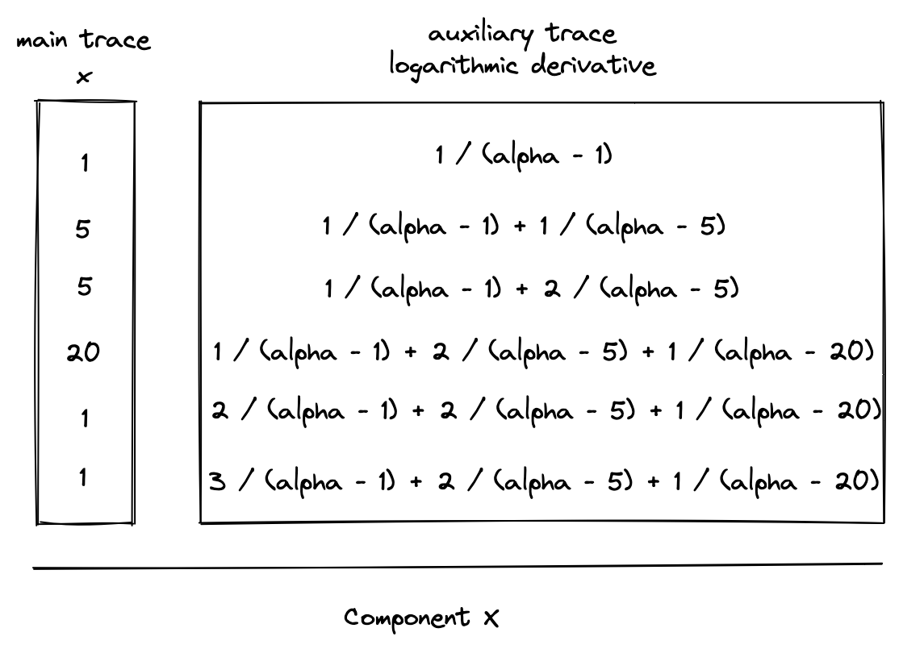

# LogUp: multivariate lookups with logarithmic derivatives

The description of LogUp can be found [here](https://eprint.iacr.org/2022/1530.pdf). In MidenVM, LogUp is used to implement efficient [communication buses](./main.md#communication-buses-in-miden-vm).

Using the LogUp construction instead of a simple [multiset check](./multiset.md) with running products reduces the computational effort for the prover and the verifier. Given two columns $a$ and $b$ in the main trace where $a$ contains duplicates and $b$ does not (i.e. $b$ is part of the lookup table), LogUp allows us to compute two logarithmic derivatives and check their equality.

$$
\sum_{i=0}^{l} \frac{1}{(\alpha - a_i)} = \sum_{i=0}^{n} \frac{m_i}{(\alpha - b_i)}
$$

In the above:
- $l$ is the number of values in $a$, which must be smaller than the size of the field. (The prime field used for Miden VM has modulus $p = 2^{64} - 2^{32} + 1$, so $l < p$ must be true.)
- $n$ is the number of values in $b$, which must be smaller than the size of the field. ($n < p$, for Miden VM)
- $m_i$ is the multiplicity of $b_i$, which is expected to match the number of times the value $b_i$ is duplicated in column $a$. It must be smaller than the size of the set of lookup values. ($m_i < n$)
- $\alpha$ is a random value that is sent to the prover by the verifier after the prover commits to the execution trace of the program.

Thus, instead of needing to compute running products, we are able to assert correct lookups by computing running sums.

## Usage in Miden VM

The generalized trace columns and constraints for this construction are as follows, where component $X$ is some component in the trace and lookup table $T$ contains the values $v$ which need to be looked up from $X$ and how many times they are looked up (the multiplicity $m$).

### Constraints

The diagrams above show running sum columns for computing the logarithmic derivatives for both $X$ and $T$. As an optimization, we can combine these values into a single auxiliary column in the extension field that contains the running sum of values from both logarithmic derivatives. We'll refer to this column as a _communication bus_ $b$, since it communicates the lookup request from the component $X$ to the lookup table $T$.

This can be expressed as follows:

> $$
b' = b + \frac{m}{(\alpha - v)} - \frac{1}{(\alpha - x)}
$$

Since constraints must be expressed without division, the actual constraint which is enforced will be the following:

> $$
b' \cdot (\alpha - v) \cdot (\alpha - x) = b \cdot (\alpha - x) \cdot (\alpha - v) + m \cdot (\alpha - x) - (\alpha - v) \text{ | degree} = 3
$$

In general, we will write constraints within these docs using the previous form, since it's clearer and more readable.

Additionally, boundary constraints must be enforced against $b$ to ensure that its initial and final values are $1$. This will enforce that the logarithmic derivatives for $X$ and $T$ were equal.

### Extending the construction to multiple components

The functionality of the bus can easily be extended to receive lookup requests from multiple components. For example, to additionally support requests from column $y$, the bus constraint would be modified to the following:

> $$
b' = b + \frac{m}{(\alpha - v)} - \frac{1}{(\alpha - x)} - \frac{1}{(\alpha - y)} \text{ | degree} = 4
$$

Since the maximum constraint degree in Miden VM is 9, the lookup table $T$ could accommodate requests from at most 7 trace columns in the same trace row via this construction.

### Extending the construction with flags

Boolean flags can also be used to determine when requests from various components are sent to the bus. For example, let $f_x$ be 1 when a request should be sent from $x$ and 0 otherwise, and let $f_y$ be similarly defined for column $y$. We can use the following constraint to turn requests on or off:

> $$
b' = b + \frac{m}{(\alpha - v)} - \frac{f_x}{(\alpha - x)} - \frac{f_y}{(\alpha - y)} \text{ | degree} = 4
$$

If any of these flags have degree greater than 2 then this will increase the overall degree of the constraint and reduce the number of lookup requests that can be accommodated by the bus per row.
