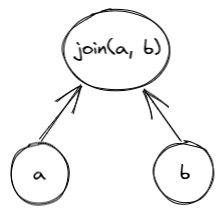
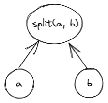
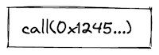
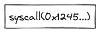
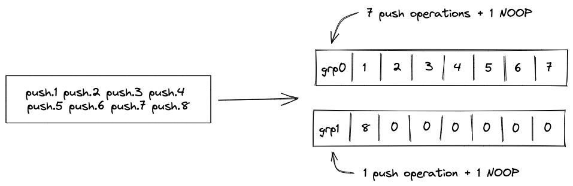

# Programs in Miden VM
Miden VM consumes programs in a form of a Merkelized Abstract Syntax Tree (MAST). This tree is a binary tree where each node is a *code block*. The VM starts execution at the root of the tree, and attempts to recursively execute each required block according to its semantics. If the execution of a code block fails, the VM halts at that point and no further blocks are executed. A set of currently available blocks and their execution semantics are described below.

## Code blocks

### Join block
A **join** block is used to describe sequential execution. When the VM encounters a *join* block, it executes its left child first, and then executes its right child.



A *join* block must always have two children, and thus, cannot be a leaf node in the tree.

### Split block
A **split** block is used to describe conditional execution. When the VM encounters a *split* block, it checks the top of the stack. If the top of the stack is $1$, it executes the left child, if the top of the stack is $0$, it executes the right child. If the top of the stack is neither $0$ nor $1$, the execution fails.



A *split* block must always have two children, and thus, cannot be a leaf node in the tree.

### Loop block
A **loop** block is used to describe condition-based iterative execution. When the VM encounters a *loop* block, it checks the top of the stack. If the top of the stack is $1$, it executes the loop body, if the top of the stack is $0$, the block is not executed. If the top of the stack is neither $0$ nor $1$, the execution fails.

After the body of the loop is executed, the VM checks the top of the stack again. If the top of the stack is $1$, the body is executed again, if the top of the stack is $0$, the loop is exited. If the top of the stack is neither $0$ nor $1$, the execution fails.


A *loop* block must always have one child, and thus, cannot be a leaf node in the tree.

### Call block

A **call** block is used to describe a function call which is executed in a [user context](../user_docs/assembly/execution_contexts.md). When the VM encounters a *call* block, it creates a new user context, then executes a program which hashes to the target specified by the *call* block in the new context. Thus, in order to execute a *call* block, the VM must be aware of a program with the specified hash. Otherwise, the execution fails. At the end of the *call* block, execution returns to the previous context.


When executing a *call* block, the VM does the following:
1. Checks if a *syscall* is already being executed and fails if so.
2. Sets the depth of the stack to 16.
3. Upon return, checks that the depth of the stack is 16. If so, the original stack depth is restored. Otherwise, an error occurs.



A *call* block does not have any children. Thus, it must be leaf node in the tree.

### Syscall block

A **syscall** block is used to describe a function call which is executed in the [root context](../user_docs/assembly/execution_contexts.md). When the VM encounters a *syscall* block, it returns to the root context, then executes a program which hashes to the target specified by the *syscall* block. Thus, in order to execute a *syscall* block, the VM must be aware of a program with the specified hash, and that program must belong to the kernel against which the code is compiled. Otherwise, the execution fails. At the end of the *syscall* block, execution returns to the previous context.

When executing a *syscall* block, the VM does the following:
1. Checks if a *syscall* is already being executed and fails if so.
2. Sets the depth of the stack to 16.
3. Upon return, checks that the depth of the stack is 16. If so, the original stack depth is restored. Otherwise, an error occurs.



A *syscall* block does not have any children. Thus, it must be leaf node in the tree.

### Span block
A **span** block is used to describe a linear sequence of operations. When the VM encounters a *span* block, it breaks the sequence of operations into batches and groups according to the following rules:
* A group is represented by a single field element. Thus, assuming a single operation can be encoded using 7 bits, and assuming we are using a 64-bit field, a single group may encode up to 9 operations or a single immediate value.
* A batch is a set of groups which can be absorbed by a hash function used by the VM in a single permutation. For example, assuming the hash function can absorb up to 8 field elements in a single permutation, a single batch may contain up to 8 groups.
* There is no limit on the number of batches contained within a single span.

Thus, for example, executing 8 pushes in a row will result in two operation batches as illustrated in the picture below:



* The first batch will contain 8 groups, with the first group containing 7 `PUSH` opcodes and 1 `NOOP`, and the remaining 7 groups containing immediate values for each of the push operations. The reason for the `NOOP` is explained later in this section.
* The second batch will contain 2 groups, with the first group containing 1 `PUSH` opcode and 1 `NOOP`, and the second group containing the immediate value for the last push operation.


If a sequence of operations does not have any operations which carry immediate values, up to 72 operations can fit into a single batch.

From the user's perspective, all operations are executed in order, however, the VM may insert occasional `NOOP`s to ensure proper alignment of all operations in the sequence. Currently, the alignment requirements are as follows:
* An operation carrying an immediate value cannot be the last operation in a group. Thus, for example, if a `PUSH` operation is the last operation in a group, the VM will insert a `NOOP` after it.

A *span* block does not have any children, and thus, must be leaf node in the tree.

## Program example
Consider the following program, where $a_0, ..., a_i$, $b_0, ..., b_j$ etc. represent individual operations:

```
a_0, ..., a_i
if.true
    b_0, ..., b_j
else
    c_0, ..., c_k
    while.true
        d_0, ..., d_n
    end
    e_0, ..., e_m
end
f_0, ..., f_l
```

A MAST for this program would look as follows:


Execution of this program would proceed as follows:

1. The VM will start execution at the root of the program which is block $B_5$.
2. Since, $B_5$ is a *join block*, the VM will attempt to execute block $B_4$ first, and only after that execute block $f$.
3. Block $B_4$ is also a *join block*, and thus, the VM will execute block $a$ by executing operations $a_0, ..., a_i$ in sequence, and then execute block $B_3$.
4. Block $B_3$ is a *split block*, and thus, the VM will pop the value off the top of the stack. If the popped value is $1$, operations from block $b$ will be executed in sequence. If the popped value is $0$, then the VM will attempt to execute block $B_2$.
5. $B_2$ is a *join block*, thus, the VM will try to execute block $B_1$ first, and then execute operations from block $e$.
6. Block $B_1$ is also a *join_block*, and thus, the VM will first execute all operations in block $c$, and then will attempt to execute block $B_0$.
7. Block $B_0$ is a loop block, thus, the VM will pop the value off the top of the stack. If the pooped value is $1$, the VM will execute the body of the loop defined by block $d$. If the popped value is $0$, the VM will not execute block $d$ and instead will move up the tree executing first block $e$, then $f$.
8. If the VM does enter the loop, then after operation $d_n$ is executed, the VM will pop the value off the top of the stack again. If the popped value is $1$, the VM will execute block $d$ again, and again until the top of the stack becomes $0$. Once the top of the stack becomes $0$, the VM will exit the loop and will move up the tree executing first block $e$, then $f$.

## Program hash computation
Every Miden VM program can be reduced to a unique hash value. Specifically, it is infeasible to find two Miden VM programs with distinct semantics which hash to the same value. Padding a program with `NOOP`s does not change a program's execution semantics, and thus, programs which differ only in the number and/or placement of `NOOP`s may hash to the same value, although in most cases padding with `NOOP` should not affect program hash.

To prevent program hash collisions we implement domain separation across the variants of control blocks. We define the domain value to be the opcode of the operation that initializes the control block.

Below we denote $hash$ to be an arithmetization-friendly hash function with $4$-element output and capable of absorbing $8$ elements in a single permutation. The hash domain is specified as the subscript of the hash function and its value is used to populate the second capacity register upon initialization of control block hashing - $hash_{domain}(a, b)$.

* The hash of a **join** block is computed as $hash_{join}(a, b)$, where $a$ and $b$ are hashes of the code block being joined.
* The hash of a **split** block is computed as $hash_{split}(a, b)$, where $a$ is a hash of a code block corresponding to the *true* branch of execution, and $b$ is a hash of a code block corresponding to the *false branch* of execution.
* The hash of a **loop** block is computed as $hash_{loop}(a, 0)$, where $a$ is a hash of a code block corresponding to the loop body.
* The hash of a **call** block is computed as $hash_{call}(a, 0)$, where $a$ is a hash of a program of which the VM is aware.
* The hash of a **syscall** block is computed as $hash_{syscall}(a, 0)$, where $a$ is a hash of a program belonging to the kernel against which the code was compiled.
* The hash of a **span** block is computed as $hash(a_1, ..., a_k)$, where $a_i$ is the $i$th batch of operations in the *span* block. Each batch of operations is defined as containing $8$ field elements, and thus, hashing a $k$-batch *span* block requires $k$ absorption steps.
    * In cases when the number of operations is insufficient to fill the last batch entirely, `NOOPs` are appended to the end of the last batch to ensure that the number of operations in the batch is always equal to $8$.
