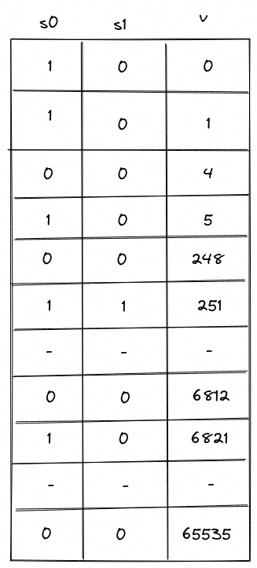

# Range Checker

Miden VM relies very heavily on 16-bit range-checks (checking if a value of a field element is between $0$ and $2^{16}$). For example, most of the [u32 operations](./stack/u32_ops.md) need to perform between two and four 16-bit range-checks per operation. Similarly, operations involving memory (e.g. load and store) require two 16-bit range-checks per operation.

Thus, it is very important for the VM to be able to perform a large number of 16-bit range checks very efficiently. In this note we describe how this can be achieved using the [LogUp](./lookups/logup.md) lookup argument.

## 8-bit range checks

First, let's define a construction for the simplest possible 8-bit range-check. This can be done with a single column as illustrated below.

For this to work as a range-check we need to enforce a few constraints on this column:

- The value in the first row must be $0$.
- The value in the last row must be $255$.
- As we move from one row to the next, we can either keep the value the same or increment it by $1$.

Denoting $v$ as the value of column $v$ in the current row, and $v'$ as the value of column $v$ in the next row, we can enforce the last condition as follows:

$$
(v' - v) \cdot (v' - v - 1) = 0
$$

Together, these constraints guarantee that all values in column $v$ are between $0$ and $255$ (inclusive).

We can then make use of the LogUp lookup argument by adding another column $b$ which will keep a running sum that is the logarithmic derivative of the product of values in the $v$ column. The transition constraint for $b$ would look as follows:

$$
b' = b + \frac{1}{(\alpha - v)}
$$

Since constraints cannot include divisions, the constraint would actually be expressed as the following degree 2 constraint:

$$
b' \cdot (\alpha - v) = b \cdot (\alpha - v) + 1
$$

Using these two columns we can check if some other column in the execution trace is a permutation of values in $v$. Let's call this other column $x$. We can compute the logarithmic derivative for $x$ as a running sum in the same way as we compute it for $v$. Then, we can check that the last value in $b$ is the same as the final value for the running sum of $x$.

While this approach works, it has a couple of limitations:

- First, column $v$ must contain all values between $0$ and $255$. Thus, if column $x$ does not contain one of these values, we need to artificially add this value to $x$ somehow (i.e., we need to pad $x$ with extra values).
- Second, assuming $n$ is the length of execution trace, we can range-check at most $n$ values. Thus, if we wanted to range-check more than $n$ values, we'd need to introduce another column similar to $v$.

We can get rid of both requirements by including the _multiplicity_ of the value $v$ into the calculation of the logarithmic derivative for LogUp, which will allow us to specify exactly how many times each value needs to be range-checked.

### A better construction

Let's add one more column $m$ to our table to keep track of how many times each value should be range-checked.

The transition constraint for $b$ is now as follows:

$$
b' = b + \frac{m}{(\alpha - v)}
$$

This addresses the limitations we had as follows:
1. We no longer need to pad the column we want to range-check with extra values because we can skip the values we don't care about by setting the multiplicity to $0$.
2. We can range check as many unique values as there are rows in the trace, and there is essentially no limit to how many times each of these values can be range-checked. (The only restriction on the multiplicity value is that it must be less than the size of the set of lookup values. Therefore, for long traces where $n > 2^{16}$, $m < 2^{16}$ must hold, and for short traces $m < n$ must be true.)

Additionally, the constraint degree has not increased versus the naive approach, and the only additional cost is a single trace column.

## 16-bit range checks

To support 16-bit range checks, let's try to extend the idea of the 8-bit table. Our 16-bit table would look like so (the only difference is that column $v$ now has to end with value $65535$):

While this works, it is rather wasteful. In the worst case, we'd need to enumerate over 65K values, most of which we may not actually need. It would be nice if we could "skip over" the values that we don't want. One way to do this could be to add bridge rows between two values to be range checked and add constraints to enforce the consistency of the gap between these bridge rows.

If we allow gaps between two consecutive rows to only be 0 or powers of 2, we could enforce a constraint:

$$
\Delta v \cdot (\Delta v - 1)  \cdot (\Delta v - 2)  \cdot (\Delta v - 4)  \cdot (\Delta v - 8)  \cdot (\Delta v - 16)  \cdot (\Delta v - 32)  \cdot (\Delta v - 64)  \cdot (\Delta v - 128) = 0
$$

This constraint has a degree 9. This construction allows the minimum trace length to be 1024.

We could go even further and allow the gaps between two consecutive rows to only be 0 or powers of 3. In this case we would enforce the constraint:

$$
\Delta v \cdot (\Delta v - 1)  \cdot (\Delta v - 3)  \cdot (\Delta v - 9)  \cdot (\Delta v - 27)  \cdot (\Delta v - 81)  \cdot (\Delta v - 243)  \cdot (\Delta v - 729)  \cdot (\Delta v - 2187) = 0
$$

This allows us to reduce the minimum trace length to 64.

To find out the number of bridge rows to be added in between two values to be range checked, we represent the gap between them as a linear combination of powers of 3, ie,

$$
(r' - r) = \sum_{i=0}^{7} x_i \cdot 3^i
$$

Then for each $x_i$ except the first, we add a bridge row at a gap of $3^i$.

## Miden approach

This construction is implemented in Miden with the following requirements, capabilities and constraints.

### Requirements

- 2 columns of the main trace: $m, v$, where $v$ contains the value being range-checked and $m$ is the number of times the value is checked (its multiplicity).
- 1 [bus](./lookups/main.md#communication-buses-in-miden-vm) $b_{range}$ to ensure that the range checks performed in the range checker match those requested by other VM components (the [stack](./stack/u32_ops.md#range-checks) and the [memory chiplet](./chiplets/memory.md)).

### Capabilities

The construction gives us the following capabilities:
- For long traces (when $n > 2^{16}$), we can do an essentially unlimited number of arbitrary 16-bit range-checks.
- For short traces ($2^5 < n \le 2^{16}$), we can range-check slightly fewer than $n$ unique values, but there is essentially no practical limit to the total number of range checks.

### Execution trace

The range checker's execution trace looks as follows:

The columns have the following meanings:
- $m$ is the multiplicity column that indicates the number of times the value in that row should be range checked (included into the computation of the logarithmic derivative).
- $v$ contains the values to be range checked.
  - These values go from $0$ to $65535$. Values must either stay the same or increase by powers of 3 less than or equal to $3^7$.
  - The final 2 rows of the 16-bit section of the trace must both equal $65535$. The extra value of $65535$ is required in order to [pad the trace](./lookups/main.md#length-of-auxiliary-columns-for-lookup-arguments) so the [$b_{range}$](#communication-bus) bus column can be computed correctly.

### Execution trace constraints

First, we need to constrain that the consecutive values in the range checker are either the same or differ by powers of 3 that are less than or equal to $3^7$.

> $$
\Delta v \cdot (\Delta v - 1)  \cdot (\Delta v - 3)  \cdot (\Delta v - 9)  \cdot (\Delta v - 27)  \cdot (\Delta v - 81) \\
\cdot (\Delta v - 243)  \cdot (\Delta v - 729)  \cdot (\Delta v - 2187) = 0 \text{ | degree} = 9
$$

In addition to the transition constraints described above, we also need to enforce the following boundary constraints:

- The value of $v$ in the first row is $0$.
- The value of $v$ in the last row is $65535$.

### Communication bus

$b_{range}$ is the [bus](./lookups/main.md#communication-buses-in-miden-vm) that connects components which require 16-bit range checks to the values in the range checker. The bus constraints are defined by the components that use it to communicate.

Requests are sent to the range checker bus by the following components:
- The Stack sends requests for 16-bit range checks during some [`u32` operations](./stack/u32_ops.md#range-checks).
- The [Memory chiplet](./chiplets/memory.md) sends requests for 16-bit range checks against the values in the $d_0$ and $d_1$ trace columns to enforce internal consistency.

Responses are provided by the range checker using the transition constraint for the LogUp construction described above.

> $$
b'_{range} = b_{range} + \frac{m}{(\alpha - v)} \text{ | degree} = 2
$$

To describe the complete transition constraint for the bus, we'll define the following variables:

- $f_{stack}$: the boolean flag that indicates whether or not a stack operation requiring range checks is occurring. This flag has degree 3.
- $f_{mem}$: the boolean flag that indicates whether or not a memory operation requiring range checks is occurring. This flag has degree 3.
- $s_0, s_1, s_2, s_3$: the values for which range checks are requested from the stack when $f_{stack}$ is set.
- $m_0, m_1$: the values for which range checks are requested from the memory chiplet when $f_{mem}$ is set.

> $$
b'_{range} = b_{range} + \frac{m}{(\alpha - v)} - \frac{f_{stack}}{(\alpha - s_0)} - \frac{f_{stack}}{(\alpha - s_1)} - \frac{f_{stack}}{(\alpha - s_2)} - \frac{f_{stack}}{(\alpha - s_3)} \\ - \frac{f_{mem}}{(\alpha - m_0)} - \frac{f_{mem}}{(\alpha - m_1)} \text{ | degree} = 9
$$

As previously mentioned, constraints cannot include divisions, so the actual constraint which is applied will be the equivalent expression in which all denominators have been multiplied through, which is degree 9.

If $b_{range}$ is initialized to $1$ and the values sent to the bus by other VM components match those that are range-checked in the trace, then at the end of the trace we should end up with $b_{range} = 1$.

Therefore, in addition to the transition constraint described above, we also need to enforce the following boundary constraints:

- The value of $b_{range}$ in the first row $1$.
- The value of $b_{range}$ in the last row $1$.
