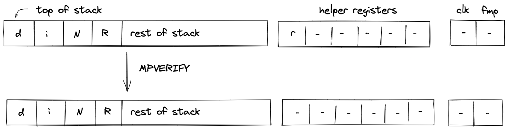
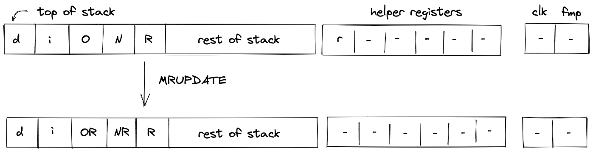

# Cryptographic operations
In this section we describe the AIR constraints for Miden VM cryptographic operations.

Cryptographic operations in Miden VM are performed by the [Hash chiplet](../chiplets/hasher.md). Communication between the stack and the hash chiplet is accomplished via the chiplet bus $b_{chip}$. To make requests to and to read results from the chiplet bus we need to divide its current value by the value representing the request.

Thus, to describe AIR constraints for the cryptographic operations, we need to define how to compute these input and output values within the stack. We do this in the following sections.

## HPERM
The `HPERM` operation applies Rescue Prime Optimized permutation to the top $12$ elements of the stack. The stack is assumed to be arranged so that the $8$ elements of the rate are at the top of the stack. The capacity word follows, with the number of elements to be hashed at the deepest position in stack. The diagram below illustrates this graphically.

In the above, $r$ (located in the helper register $h_0$) is the row address from the hash chiplet set by the prover non-deterministically.

For the `HPERM` operation, we define input and output values as follows:

$$
v_{input} = \alpha_0 + \alpha_1 \cdot op_{linhash} + \alpha_2 \cdot h_0 + \sum_{j=0}^{11} (\alpha_{j+4} \cdot s_{11-i})
$$

$$
v_{output} = \alpha_0 + \alpha_1 \cdot op_{retstate} + \alpha_2 \cdot (h_0 + 7) + \sum_{j=0}^{11} (\alpha_{i+4} \cdot s_{11-i}')
$$

In the above, $op_{linhash}$ and $op_{retstate}$ are the unique [operation labels](../chiplets/main.md#operation-labels) for initiating a linear hash and reading the full state of the hasher respectively. Also note that the term for $\alpha_3$ is missing from the above expressions because for Rescue Prime Optimized permutation computation the index column is expected to be set to $0$.

Using the above values, we can describe the constraint for the chiplet bus column as follows:

>$$
b_{chip}' \cdot v_{input} \cdot v_{output} = b_{chip} \text{ | degree} = 3
$$

The above constraint enforces that the specified input and output rows must be present in the trace of the hash chiplet, and that they must be exactly $7$ rows apart.

The effect of this operation on the rest of the stack is:
* **No change** starting from position $12$.

## MPVERIFY
The `MPVERIFY` operation verifies that a Merkle path from the specified node resolves to the specified root. This operation can be used to prove that the prover knows a path in the specified Merkle tree which starts with the specified node.

Prior to the operation, the stack is expected to be arranged as follows (from the top):
- Value of the node, 4 elements ($V$ in the below image)
- Depth of the path, 1 element ($d$ in the below image)
- Index of the node, 1 element ($i$ in the below image)
- Root of the tree, 4 elements ($R$ in the below image)

The Merkle path itself is expected to be provided by the prover non-deterministically (via the advice provider). If the prover is not able to provide the required path, the operation fails. Otherwise, the state of the stack does not change. The diagram below illustrates this graphically.

In the above, $r$ (located in the helper register $h_0$) is the row address from the hash chiplet set by the prover non-deterministically.

For the `MPVERIFY` operation, we define input and output values as follows:

$$
v_{input} = \alpha_0 + \alpha_1 \cdot op_{mpver} + \alpha_2 \cdot h_0 + \alpha_3 \cdot s_5 + \sum_{j=0}^3 \alpha_{j+8} \cdot s_{3 - j}
$$

$$
v_{output} = \alpha_0 + \alpha_1 \cdot op_{rethash} + \alpha_2 \cdot (h_0 + 8 \cdot s_4 - 1) + \sum_{j=0}^3\alpha_{j + 8} \cdot s_{9 - j}
$$

In the above, $op_{mpver}$ and $op_{rethash}$ are the unique [operation labels](../chiplets/main.md#operation-labels) for initiating a Merkle path verification computation and reading the hash result respectively. The sum expression for inputs computes the value of the leaf node, while the sum expression for the output computes the value of the tree root.

Using the above values, we can describe the constraint for the chiplet bus column as follows:

>$$
b_{chip}' \cdot v_{input} \cdot v_{output} = b_{chip} \text{ | degree} = 3
$$

The above constraint enforces that the specified input and output rows must be present in the trace of the hash chiplet, and that they must be exactly $8 \cdot d - 1$ rows apart, where $d$ is the depth of the node.

The effect of this operation on the rest of the stack is:
* **No change** starting from position $0$.

## MRUPDATE
The `MRUPDATE` operation computes a new root of a Merkle tree where a node at the specified position is updated to the specified value.

The stack is expected to be arranged as follows (from the top):
- old value of the node, 4 element ($V$ in the below image)
- depth of the node, 1 element ($d$ in the below image)
- index of the node, 1 element ($i$ in the below image)
- current root of the tree, 4 elements ($R$ in the below image)
- new value of the node, 4 element ($NV$ in the below image)

The Merkle path for the node is expected to be provided by the prover non-deterministically (via merkle sets). At the end of the operation, the old node value is replaced with the new root value computed based on the provided path. Everything else on the stack remains the same. The diagram below illustrates this graphically.

In the above, $r$ (located in the helper register $h_0$) is the row address from the hash chiplet set by the prover non-deterministically.

For the `MRUPDATE` operation, we define input and output values as follows:

$$
v_{inputold} = \alpha_0 + \alpha_1 \cdot op_{mruold} + \alpha_2 \cdot h_0 + \alpha_3 \cdot s_5 + \sum_{j=0}^3\alpha_{j + 8} \cdot s_{3 - j}
$$

$$
v_{outputold} = \alpha_0 + \alpha_1 \cdot op_{rethash} + \alpha_2 \cdot (h_0 + 8 \cdot s_4 - 1) + \sum_{j=0}^3\alpha_{j + 8} \cdot s_{9 - j}
$$

$$
v_{inputnew} = \alpha_0 + \alpha_1 \cdot op_{mrunew} + \alpha_2 \cdot (h_0 + 8 \cdot s_4) + \alpha_3 \cdot s_5 + \sum_{j=0}^3\alpha_{j + 8} \cdot s_{13 - j}
$$

$$
v_{outputnew} = \alpha_0 + \alpha_1 \cdot op_{rethash} + \alpha_2 \cdot (h_0 + 2 \cdot 8 \cdot s_4 - 1) + \sum_{j=0}^3\alpha_{j + 8} \cdot s_{3 - j}'
$$

In the above, the first two expressions correspond to inputs and outputs for verifying the Merkle path between the old node value and the old tree root, while the last two expressions correspond to inputs and outputs for verifying the Merkle path between the new node value and the new tree root. The hash chiplet ensures the same set of sibling nodes are uses in both of these computations.

The $op_{mruold}$, $op_{mrunew}$, and $op_{rethash}$ are the unique [operation labels](../chiplets/main.md#operation-labels) used by the above computations.

> $$
b_{chip}' \cdot v_{inputold} \cdot v_{outputold} \cdot v_{inputnew} \cdot v_{outputnew} = b_{chip} \text{ | degree} = 5
$$

The above constraint enforces that the specified input and output rows for both, the old and the new node/root combinations, must be present in the trace of the hash chiplet, and that they must be exactly $8 \cdot d - 1$ rows apart, where $d$ is the depth of the node. It also ensures that the computation for the old node/root combination is immediately followed by the computation for the new node/root combination.

The effect of this operation on the rest of the stack is:
* **No change** for positions starting from $4$.

## FRIE2F4
The `FRIE2F4` operation performs FRI layer folding by a factor of 4 for FRI protocol executed in a degree 2 extension of the base field. It also performs several computations needed for checking correctness of the folding from the previous layer as well as simplifying folding of the next FRI layer.

The stack for the operation is expected to be arranged as follows:
- The first $8$ stack elements contain $4$ query points to be folded. Each point is represented by two field elements because points to be folded are in the extension field. We denote these points as $q_0 = (v_0, v_1)$, $q_1 = (v_2, v_3)$, $q_2 = (v_4, v_5)$, $q_3 = (v_6, v_7)$.
- The next element $f\_pos$ is the query position in the folded domain. It can be computed as $pos \mod n$, where $pos$ is the position in the source domain, and $n$ is size of the folded domain.
- The next element $d\_seg$ is a value indicating domain segment from which the position in the original domain was folded. It can be computed as $\lfloor \frac{pos}{n} \rfloor$. Since the size of the source domain is always $4$ times bigger than the size of the folded domain, possible domain segment values can be $0$, $1$, $2$, or $3$.
- The next element $poe$ is a power of initial domain generator which aid in a computation of the domain point $x$.
- The next two elements contain the result of the previous layer folding - a single element in the extension field denoted as $pe = (pe_0, pe_1)$.
- The next two elements specify a random verifier challenge $\alpha$ for the current layer defined as $\alpha = (a_0, a_1)$.
- The last element on the top of the stack ($cptr$) is expected to be a memory address of the layer currently being folded.

The diagram below illustrates stack transition for `FRIE2F4` operation.

At the high-level, the operation does the following:
- Computes the domain value $x$ based on values of $poe$ and $d\_seg$.
- Using $x$ and $\alpha$, folds the query values $q_0, ..., q_3$ into a single value $r$.
- Compares the previously folded value $pe$ to the appropriate value of $q_0, ..., q_3$ to verify that the folding of the previous layer was done correctly.
- Computes the new value of $poe$ as $poe' = poe^4$ (this is done in two steps to keep the constraint degree low).
- Increments the layer address pointer by $2$.
- Shifts the stack by $1$ to the left. This moves an element from the stack overflow table into the last position on the stack top.

To keep the degree of the constraints low, a number of intermediate values are used. Specifically, the operation relies on all $6$ helper registers, and also uses the first $10$ elements of the stack at the next state for degree reduction purposes. Thus, once the operation has been executed, the top $10$ elements of the stack can be considered to be "garbage".

> TODO: add detailed constraint descriptions. See discussion [here](https://github.com/0xPolygonMiden/miden-vm/issues/567#issuecomment-1398088792).

The effect on the rest of the stack is:
* **Left shift** starting from position $16$.
