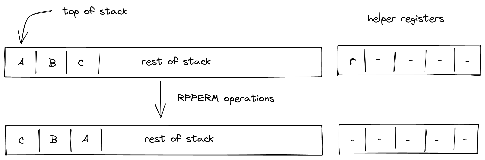
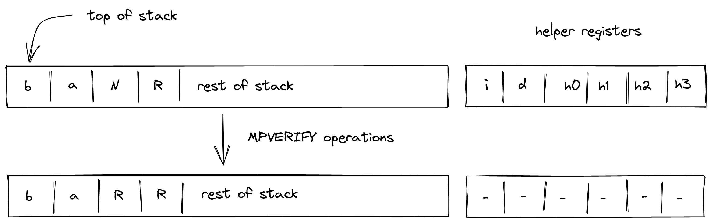
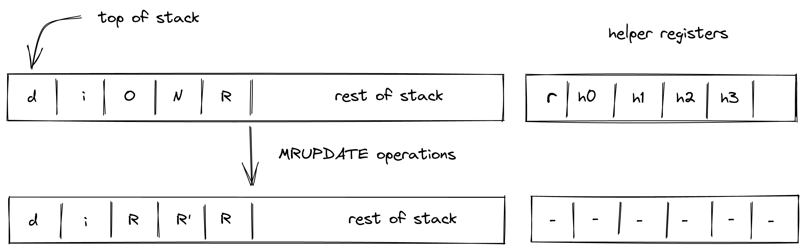

# Cryptographic operations
In this section we describe the AIR constraint for Miden VM cryptographic operations.

## RPPERM

`RPPERM` operation applies rescue prime permutation to the top $12$ elements of the stack. The stack is assumed to be arranged so that the 8 elements of the rate are at the top of the stack. The capacity word follows, with the number of elements to be hashed at the deepest position in stack. The diagram below illustrates this graphically.

To facilitate this operation, we will need to perform a lookup in a table described [here](https://maticnetwork.github.io/miden/design/chiplets/hasher.html). 

To simplify description of the constraints, we define the following variables. Below, we denote random values sent by the verifier after the prover commits to the main execution trace as $\alpha_0$, $\alpha_1$, $\alpha_2$ etc..

$$
m_{linearhash} = 3\\
$$

$$
m_{returnstate} = 9\\
$$

$$
v_i = \sum_{j=0}^{11}\alpha_{j+3} \cdot s_i
$$

$$
v_o = \sum_{j=0}^{11}\alpha_{i+3} \cdot s_i'
$$

$$
v_{input} = \left(\alpha_0 + \alpha_1 \cdot m_{linearhash} + \alpha_2 \cdot r + v_i\right)
$$

$$
v_{output} = \left(\alpha_0 + \alpha_1 \cdot m_{returnstate} + \alpha_2 \cdot (r + 7) +  v_o\right)
$$

In the above:

- $r$ is the row address of the execution trace at which the rescue prime permutation started inside the hasher processor.
- $s_0$..$s_{11}$ are the three words(group of four consecutive elements) in the hasher state.
- $m$ is a _transition label_ which uniquely identifies each operation.
- The $3$ & $9$ in the permutation check are the unique identifier of hasher `LINEAR_HASH` & `RETURN_STATE` operations which have been explained [here](../stack/unique_identifier.md#identifiers).
- $v_{input}$ is a _common header_ which is a combination of unique identifier of `LINEAR_HASH` and row address of the table when the rescue prime permutation started.
- $v_{output}$ is a _common header_ which is a combination of unique identifier of `RETURN_STATE` and row address of the execution trace when the rescue prime permutaton ends.
- $v_i$, is the component of the first element of the path.
- $v_o$, is the component of the output root from the hasher processor.

Using the above values, we can describe constraints for updating column $b_{aux}'$ which is a running product column of auxiliary table as follows:

> $$
b_{aux}' \cdot v_{input} \cdot v_{output} = b_{aux} \text{ | degree } = 3
$$

The `RPPERM` operation will not change the depth of the stack i.e. the stack doesn't shift while transitioning. The maximum degree of the above operation is $3$.

## MPVERIFY

`MPVERIFY` computes a root of a merkle path for a given specified input node. The stack is assumed to be arranged in such a way the top two elements are depth and index respectively followed by node's value and root of the tree. This operation first fetches a merkle path from the advice provider for the specified root and node index and the path is expected to be at a specific depth. Hashes co-processor is then called to compute a new merkle root of this fetched computed path which is saved in the stack by overwriting the node value section in the stack. Rest all the elements in the stack remains untouched. The diagram below illustrates this graphically.

To facilitate this operation, we will need to perform a lookup in a table described [here](https://maticnetwork.github.io/miden/design/chiplets/hasher.html). 

To simplify description of the constraints, we define the following variables. Below, we denote random values sent by the verifier after the prover commits to the main execution trace as $\alpha_0$, $\alpha_1$, $\alpha_2$ etc..

$$
m_{mpverify} = 11\\
$$

$$
m_{returnhash} = 1\\
$$

$$
v_{i} = \alpha_0 + \alpha_1 \cdot m_{mpverify} + \alpha_2 \cdot r + \alpha_3 \cdot i \\
$$

$$
v_{o} = \alpha_0 + \alpha_1 \cdot m_{returnhash} + \alpha_2 \cdot (r + 8 \cdot d - 1)  \\
$$

$$
v_p = \sum_{j=0}^3\alpha_{j + 4} \cdot p_j \\
$$

$$
v_n = \sum_{i=0}^3 \alpha_{i+4} \cdot s_{i+2} \\
$$

$$
v_m = \sum_{i=0}^3 \alpha_{i+3} \cdot s_{i+2}' \\
$$

In the above:

- $r$ is the row address of the execution trace at which the computation of building merkle root started inside the hasher processor.
- $p_0$..$p_3$ is the first word(group of four consecutive elements) of the merkle path fetched from advice provider.
- $m$ is a _transition label_ which uniquely identifies each operation.
- The $11$ & $1$ in the permutation check are the unique identifier of hasher `MP_VERIFY` & `RETURN_HASH` operations which have been explained [here](../stack/unique_identifier.md#identifiers).
- $v_{i}$ is a _common header_ which is a combination of unique identifier of `MP_VERIFY`, row address of execution trace when the computation of building merkle root starts for the node value, and node index.
- $v_{o}$ is a _common header_ which is a combination of unique identifier of `RETURN_HASH` and row address of the trace when the computation ends.
- $v_p$, is the component of the first element of the path or the `sibling` of the input node.
- $v_n$, is the component of the input node.
- $v_m$, is the component of the output root from the hasher processor.

Using the above values, we can describe constraints for updating column $b_{aux}'$ which is a running product column of auxiliary table as follows:

> $$
b_{aux}' \cdot \left(v_{i} + (1-b) \cdot v_{n} + b \cdot v_{p}\right) \cdot \left(v_{m} + v_{o}\right) = b_{aux} \text{ | degree } = 3\\
b = i - i' \cdot 2 \text{ | degree } = 1 \\
b^2 - b = 0  \text{ | degree } = 2\\
$$

where $b$ is the least significant bit of the node index sent to the hasher co-processor which fixes the location of node and the its sibling in the hasher state. $i`$ is one left shift of node index. 

The `MPVERIFY` operation will not change the depth of the stack i.e. the stack doesn't shift while transitioning. The maximum degree of the above operation is $3$.

## MRUPDATE

`MRUPDATE` operation computes a new root of a merkle tree where a leaf at the specified index is updated to the specified value. The stack is assumed to be arranged in such a way the top two elements are depth and index respectively followed by old node value, new node value and the current root of the tree. This operation updates the leaf node at the specified index in the advice provider with the specified root, and get the merkle path of the leaf. This merkle path is then provided to hasher along with old and new node value to get the new root of the tree. The old and new root of the tree are saved in the stack by overwriting old and new node value in the stack respectively. Rest all the elements in the stack remains untouched. The diagram below illustrates this graphically.

To facilitate this operation, we will need to perform a lookup in a table described [here](https://maticnetwork.github.io/miden/design/chiplets/hasher.html). 

To simplify description of the constraints, we define the following variables. Below, we denote random values sent by the verifier after the prover commits to the main execution trace as $\alpha_0$, $\alpha_1$, $\alpha_2$ etc..

$$
m_{mrupdateold} = 7\\
$$

$$
m_{mrupdatenew} = 15\\
$$

$$
m_{returnhash} = 1\\
$$

$$
v_{io} = \alpha_0 + \alpha_1 \cdot m_{mrupdateold} + \alpha_2 \cdot r + \alpha_3 \cdot i \\
$$

$$
v_{oo} = \alpha_0 + \alpha_1 \cdot m_{returnhash} + \alpha_2 \cdot (r + 8 \cdot d - 1)  \\
$$

$$
v_{in} = \alpha_0 + \alpha_1 \cdot m_{mrupdatenew} + \alpha_2 \cdot (r + 8 \cdot d) + \alpha_3 \cdot i \\
$$

$$
v_{on} = \alpha_0 + \alpha_1 \cdot m_{returnhash} + \alpha_2 \cdot (r + 2 \cdot 8 \cdot d - 1)  \\
$$

$$
v_p = \sum_{j=0}^3\alpha_{j + 4} \cdot p_j \\
$$

$$
v_x = \sum_{i=0}^3 \alpha_{i+3} \cdot s_{i+2} \\
$$

$$
v_y = \sum_{i=0}^3 \alpha_{i+3} \cdot s_{i+6} \\
$$

$$
v_o = \sum_{i=0}^3 \alpha_{i+3} \cdot s_{i+2}' \\
$$

$$
v_m = \sum_{i=0}^3 \alpha_{i+3} \cdot s_{i+6}' \\
$$

$$
v_{leafold} = v_{io} + (1-b) \cdot v_x + b \cdot v_p \\
$$

$$
v_{leafnew} = v_{io} + (1-b) \cdot v_y + b \cdot v_p \\
$$

In the above:

- $r$ is the row address of the execution trace at which the computation of building merkle root started in the hasher.
- $d$ is the depth of the node in the merkle tree fetched from the advice provider. 
- $p_0$..$p_3$ is the first word(group of four consecutive elements) of the merkle path fetched from advice provider.
- $m$ is a _transition label_ which uniquely identifies each operation.
- The $7$, $15$ and $1$ in the permutation check are the unique identifier of hasher `MR_UPDATE_OLD`, `MR_UPDATE_NEW` and `RETURN_HASH` operations which have been explained [here](../stack/unique_identifier.md#identifiers).
- $v_{io}$ is a _common header_ which is a combination of unique identifier of `MR_UPDATE_OLD`, row address of the trace when the merkle root building starts for the old node value, and node index.
- $v_{oo}$ is a _common header_ which is a combination of unique identifier of `RETURN_HASH` and row address of the trace when the merkle root building ends for the old node value.
- $v_{in}$ is a _common header_ which is a combination of unique identifier of `MR_UPDATE_NEW`, row address of the trace when the merkle root building starts for the new node value, and node index.
- $v_{on}$ is a _common header_ which is a combination of unique identifier of `RETURN_HASH` and row address row address of the trace when the merkle root building ends for the old node value.
- $v_p$, is the component of the first element of the path or the sibling of the input node.
- $v_x$, is the component of the old input node.
- $v_y$, is the component of the new input node.
- $v_o$, is the component of the output root for the old node value from the hasher processor.
- $v_m$, is the component of the output root for the new node value from the hasher processor.
- $v_{leafold}$, is the leaf based on the value of b when starting a merkle path computation for the old node.
- $v_{leafnew}$, is the leaf based on the value of b when starting a merkle path computation for the new node.

Using the above values, we can describe constraints for updating column $b_{aux}'$ which is a running product column of auxiliary table as follows:

> $$
b_{aux}' \cdot \left( v_{leafold} ) \cdot ( v_{oo} + v_o ) \\
\cdot ( v_{leafnew} ) \cdot ( v_{on} + v_m \right) = b_{aux} \text{ | degree } = 5\\
b = i - i' \cdot 2 \text{ | degree } = 1 \\ 
b^2 - b = 0  \text{ | degree } = 2\\
$$

where $b$ is the least significant bit of the node index sent to the hasher co-processor which fixes the location of node and the its sibling in the hasher state. $i`$ is one left shift of node index. 

The `MRUPDATE` operation will not change the depth of the stack i.e. the stack doesn't shift while transitioning. The maximum degree of the above operation is $5$.