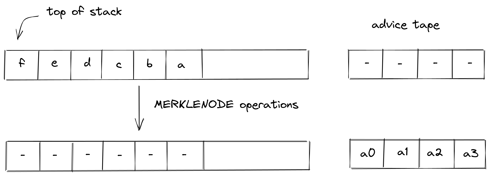

# Decorator Operations:
This section talks about decorator operations used in Miden VM.

## MERKLENODE

`MERKLENODE` operation injects a node at the specified index in a merkle tree with the specified root to the head of the advice tape. The diagram below illustrates this graphically.

$f$ & $e$ are depth & index of the node of the merkle tree whereas $d$, $c$, $b$ & $a$ represents the root of the merkle tree. This operation writes the fetched node into the advice tape with first element pushed first so that it can be fetched last. 

## DIVRESULTU64

`DivResultU64` operation injects the result of u64 division (both the quotient & remainder) to the top of the head of the advice tape. The diagram below illustrates this graphically.

