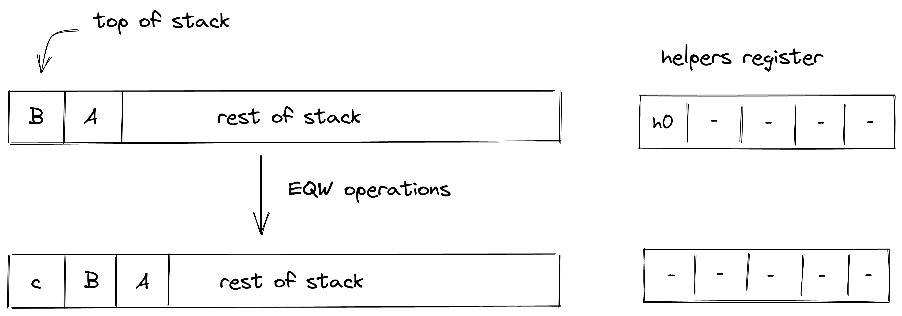

# Field Operations
In this section we describe the AIR constraint for Miden VM field operations. In this note, we assume that all values in the stack are elements in a 64-bit field defined by modulus $2^{64} − 2^{32} + 1$. One of the nice properties of this field is that multiplying two elements in this field with values less than $2^{32}$ does not overflow the field modulus. 

## ADD
Assume $a$ and $b$ are top two elements in the stack. `ADD` operation computes $(a + b) \rightarrow c$ where $c$ is the sum of the field elements $a$ and $b$. The diagram below illustrates this graphically.

The stack transition for this operation must follow the following constraint: 

> $$
s_0' - s_0 - s_1 = 0 \text{ | degree } = 1
$$

The `ADD` operation will shift the stack to the left by one. The maxmum degree of this operation is $1$.

## NEG

Assume $a$ is the top element in the stack. `NEG` operation computes $(-a) \rightarrow c$ where $c$ is the additive inverse of the field element $a$. The diagram below illustrates this graphically.

The stack transition for this operation must follow the following constraint:

> $$
s_0' + s_0 = 0 \text{ | degree } = 1
$$

The `NEG` operation will not change the depth of the stack i.e. the stack doesn't shift while transitioning. The maxmum degree of this operation is $1$.

## MUL

Assume $a$ and $b$ are top two elements in the stack. `MUL` operation computes $(a * b) \rightarrow c$ where $c$ is the product of the field elements $a$ & $b$. The diagram below illustrates this graphically.

The stack transition for this operation must follow the following constraint:

> $$
s_0' - s_0 \cdot s_1 = 0 \text{ | degree } = 2
$$

The `MUL` operation will shift the stack to the left by one. The maximum degree of this operation is $2$.

## INV

Assume $a$ is the top element in the stack. `INV` operation computes $(a^{-1}) \rightarrow c$ where $c$ is the multiplicative inverse of the field element $a$ provided $a \neq 0$. The diagram below illustrates this graphically.

The stack transition for this operation must follow the following constraint:

> $$
s_0'*s_0 - 1 = 0 \text{ | degree } = 2
$$

The `INV` operation will not change the depth of the stack i.e. the stack doesn't shift while transitioning. The maximum degree of this operation is $2$.

## INCR

Assume $a$ is the top element in the stack. `INCR` operation computes $(a+1) \rightarrow c$ where $c$ is the addition of the field element $a$ with $1$. The diagram below illustrates this graphically.

The stack transition for this operation must follow the following constraint:

> $$
s_0' - s_0 - 1 = 0 \text{ | degree } = 1
$$

The `INCR` operation will not change the depth of the stack i.e. the stack doesn't shift while transitioning. The maximum degree of this operation is $1$.

## NOT

Assume $a$ is the top element in the stack. `NOT` operation computes $(\lnot a) \rightarrow c$ where $c$ is the boolean NOT of the field element $a$ provided $a$ is a binary. The diagram below illustrates this graphically.

The stack transition for this operation must follow the following constraint:

> $$
s_0^2 - s_0 = 0 \text{ | degree } = 2\\ 
s_0' + s_0 - 1 = 0 \text{ | degree } = 1
$$

The `NOT` operation will not change the depth of the stack i.e. the stack doesn't shift while transitioning. The maximum degree of this operation is $2$.

## AND

Assume $a$ and $b$ are top two elements in the stack. `AND` operation computes $(a \land b) \rightarrow c$ where $c$ is the boolean AND of the field elements $a$ and $b$ provided both $a$ and $b$ are binary. The diagram below illustrates this graphically.

The stack transition for this operation must follow the following constraint:

> $$
s_0^2 - s_0 = 0 \text{ | degree } = 2\\
s_1^2 - s_1 = 0 \text{ | degree } = 2\\
s_0' - s_0*s_1 = 0 \text{ | degree } = 2
$$

The `AND` operation will shift the stack to the left by one. The maximum degree of this operation is $2$.

## OR

Assume $a$ and $b$ are top two elements in the stack. `OR` operation computes $(a \lor b) \rightarrow c$ where $c$ is the boolean OR of the field elements $a$ and $b$ provided both $a$ and $b$ are binary. The diagram below illustrates this graphically.

The stack transition for this operation must follow the following constraint:

> $$
s_{0}^2 - s_{0} = 0 \text{ | degree } = 2\\
s_{1}^2 - s_{1} = 0 \text{ | degree } = 2\\
s_{0}' - s_{1} - s_{0} - s_{1}*s_{0} = 0 \text{ | degree } = 2
$$

The `OR` operation will shift the stack to the left by one. The maximum degree of this operation is $2$.

## EQ

Assume $a$ and $b$ are top two elements in the stack. `EQ` operation computes $(a == b) \rightarrow c$ where $c$ is $0$ if field elements $a$ and $b$ are not equal and $1$ otherwise. Therefore, $c$ could only be binary post this operation. The diagram below illustrates this graphically.

To facilitate this operation, the prover needs to provide one non-deterministic ‘helper’ values $h_0$ such that:

> $$
s_0' \cdot (s_0 - s_1) = 0 \text{ | degree } = 2\\
s_0' - 1 + (s_0 - s_1) \cdot h_0 = 0 \text{ | degree } = 2
$$

The prover generates $h_0$ as:

> $$
h_0 \leftarrow \begin{cases} 0, & \text{if}\ s_1 = s_0 \\ \dfrac{1}{s_1 - s_0}, & \text{otherwise}\ \end{cases}
$$

The `EQ` operation will shift the stack to the left by one. The maximum degree of this operation is $2$.

## EQZ

Assume $a$ is the top element in the stack.`EQZ` operation computes $(a == 0) \rightarrow c$ where $c$ is $0$ if $a$ is not equal to $0$ and $1$ otherwise. Therefore, $c$ could only be binary post this operation. The diagram below illustrates this graphically.

To facilitate this operation, the prover needs to provide one non-deterministic ‘helper’ values $h_0$ such that:

> $$
s_0' \cdot s_0 = 0 \text{ | degree } = 2\\
s_0' - 1 + s_0 \cdot h_0 = 0 \text{ | degree } = 2
$$

The prover generates $h_0$ as:

> $$
h_0 \leftarrow \begin{cases} 0, & \text{if}\ s_1 == 0 \\ \dfrac{1}{s_1}, & \text{otherwise}\ \end{cases}
$$

The `EQZ` operation will not change the depth of the stack i.e. the stack doesn't shift while transitioning.  The maximum degree of this operation is $2$.

## EQW

Assume $A$ and $B$ are top two words in the stack(a word is made up of 4 field elements).`EQW` operation computes $(A == B) \rightarrow c$ where c is $0$ if word $A$ & $B$ are not equal and $1$ otherwise. Both of the word must be equal on all 4 elements. $c$ is pushed to the top of the stack & could only be binary post this operation. The diagram below illustrates this graphically.

To facilitate this operation, the prover needs to provide one non-deterministic ‘helper’ values $h_0, h_1, h_2, h_3$ such that:

> $$
\sum_{i=0}^3 s_0' \cdot (s_i - s_{i+4}) = 0 \text{ | degree } = 2\\
s_0' - \prod_{i=0}^3 \left(1 - h_i \cdot (s_i - s_{i+4})\right) = 0 \text{ | degree } = 8\\
$$

The prover generates $h_i$ as:

> $$
h_i \leftarrow \begin{cases} 0, & \text{if}\ s_i = s_{i+4} \\ \dfrac{1}{s_i - s_{i+4}}, & \text{otherwise}\ \end{cases}
$$

The `EQW` operation will shift the stack to the right by one. The maximum degree of this operation is $8$.