# Field Operations
In this section we describe the AIR constraints for Miden VM field operations (i.e., arithmetic operations over field elements).

## ADD
Assume $a$ and $b$ are the elements at the top of the stack. The `ADD` operation computes $c \leftarrow (a + b)$. The diagram below illustrates this graphically.

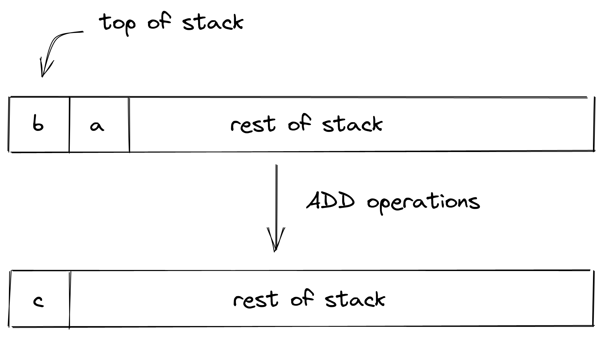

Stack transition for this operation must satisfy the following constraints:

>$$
s_0' - (s_0 + s_1) = 0 \text{ | degree} = 1
$$

The effect on the rest of the stack is:
* **Left shift** starting from position $2$.

## NEG
Assume $a$ is the element at the top of the stack. The `NEG` operation computes $b \leftarrow (-a)$. The diagram below illustrates this graphically.

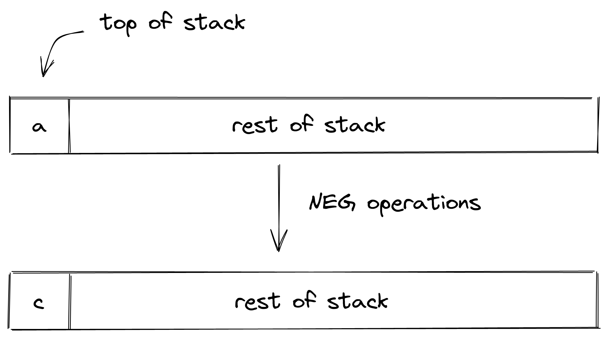

Stack transition for this operation must satisfy the following constraints:

>$$
s_0' + s_0 = 0 \text{ | degree} = 1
$$

The effect on the rest of the stack is:
* **No change** starting from position $1$.

## MUL
Assume $a$ and $b$ are the elements at the top of the stack. The `MUL` operation computes $c \leftarrow (a \cdot b)$. The diagram below illustrates this graphically.

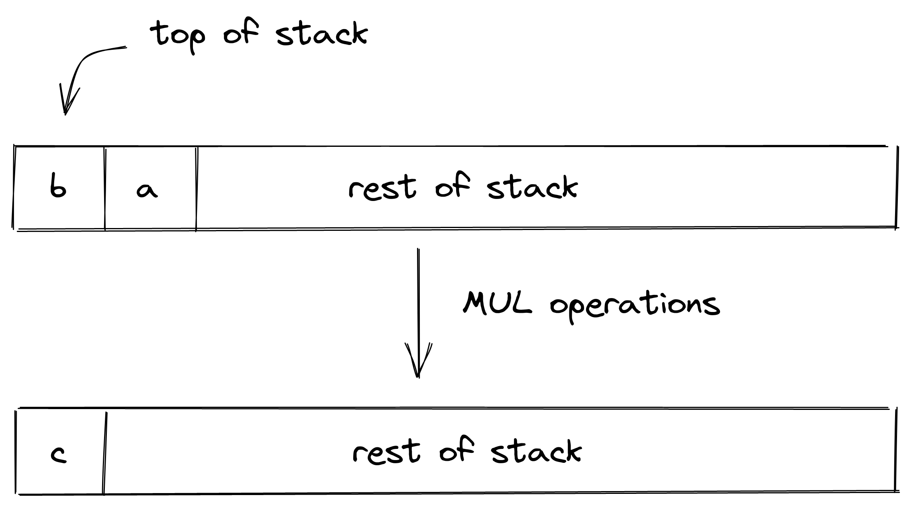

Stack transition for this operation must satisfy the following constraints:

>$$
s_0' - s_0 \cdot s_1 = 0 \text{ | degree} = 2
$$

The effect on the rest of the stack is:
* **Left shift** starting from position $2$.

## INV
Assume $a$ is the element at the top of the stack. The `INV` operation computes $b \leftarrow (a^{-1})$. The diagram below illustrates this graphically.

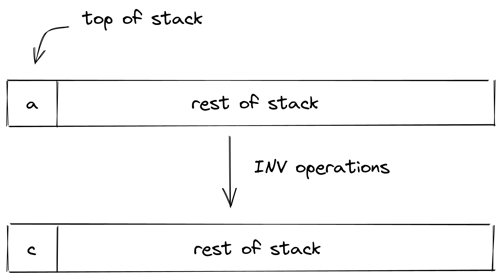

Stack transition for this operation must satisfy the following constraints:

>$$
1 - s_0' \cdot s_0 = 0 \text{ | degree} = 2
$$

Note that the above constraint can be satisfied only if the value in $s_0 \neq 0$.

The effect on the rest of the stack is:
* **No change** starting from position $1$.

## INCR
Assume $a$ is the element at the top of the stack. The `INCR` operation computes $b \leftarrow (a+1)$. The diagram below illustrates this graphically.

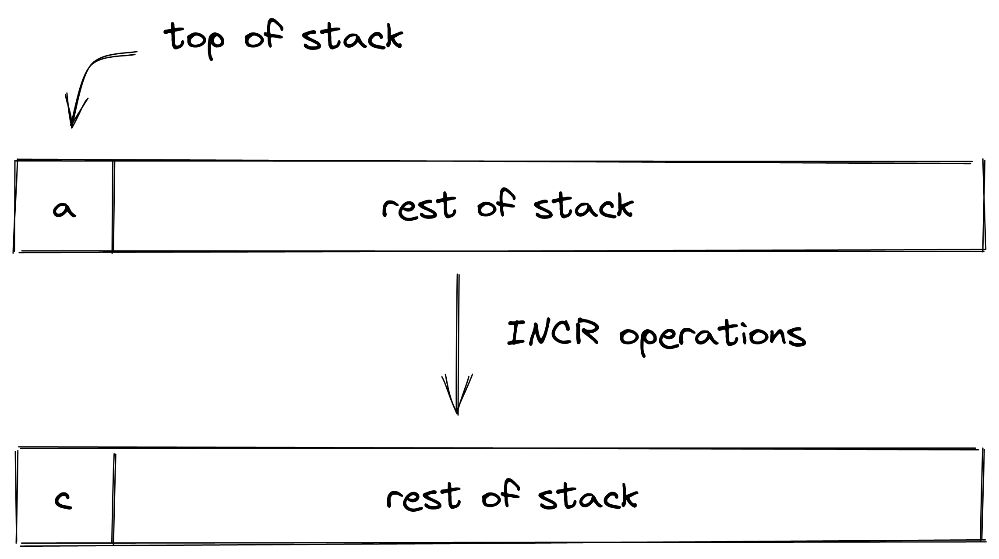

Stack transition for this operation must satisfy the following constraints:

>$$
s_0' - (s_0 + 1) = 0 \text{ | degree} = 1
$$

The effect on the rest of the stack is:
* **No change** starting from position $1$.

## NOT
Assume $a$ is a binary value at the top of the stack. The `NOT` operation computes $b \leftarrow (\lnot a)$. The diagram below illustrates this graphically.

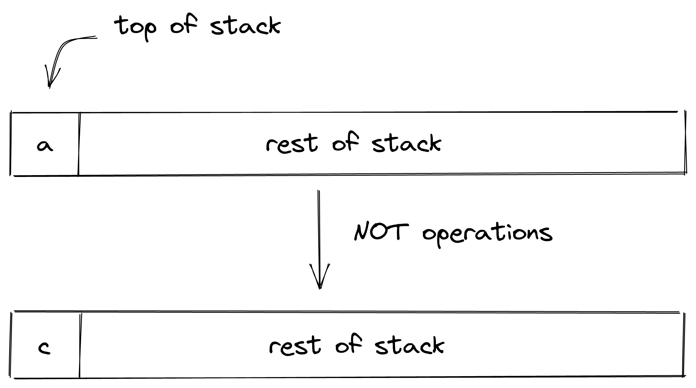

Stack transition for this operation must satisfy the following constraints:

>$$
s_0^2 - s_0 = 0 \text{ | degree} = 2
$$

>$$
s_0' - (1 - s_0) = 0 \text{ | degree} = 1
$$

The first constraint ensures that the value in $s_0$ is binary, and the second constraint ensures the correctness of the boolean `NOT` operation.

The effect on the rest of the stack is:
* **No change** starting from position $1$.

## AND
Assume $a$ and $b$ are binary values at the top of the stack. The `AND` operation computes $c \leftarrow (a \land b)$. The diagram below illustrates this graphically.

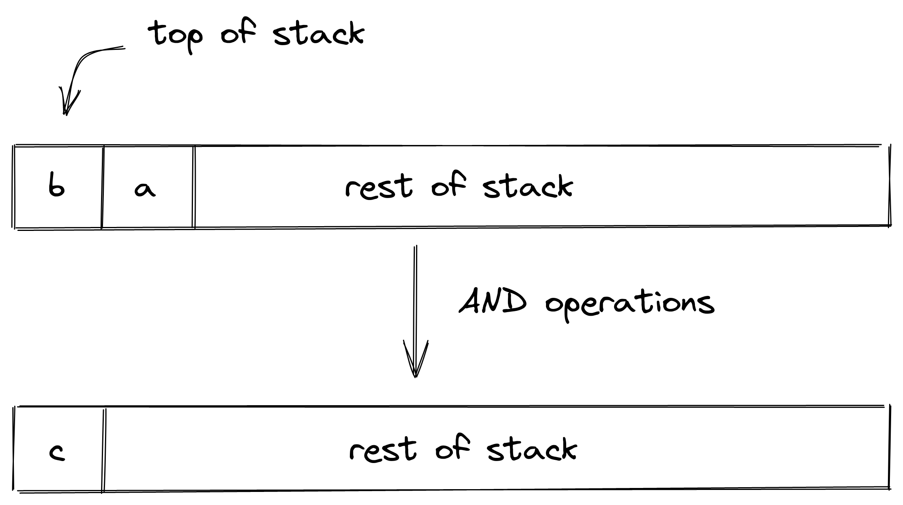

Stack transition for this operation must satisfy the following constraints:

>$$
s_i^2 - s_i = 0 \text{ for } i \in \{0, 1\} \text{ | degree} = 2
$$

>$$
s_0' - s_0 \cdot s_1 = 0 \text{ | degree} = 2
$$

The first two constraints ensure that the value in $s_0$ and $s_1$ are binary, and the third constraint ensures the correctness of the boolean `AND` operation.

The effect on the rest of the stack is:
* **Left shift** starting from position $2$.

## OR
Assume $a$ and $b$ are binary values at the top of the stack. The `OR` operation computes $c \leftarrow (a \lor b)$ The diagram below illustrates this graphically.

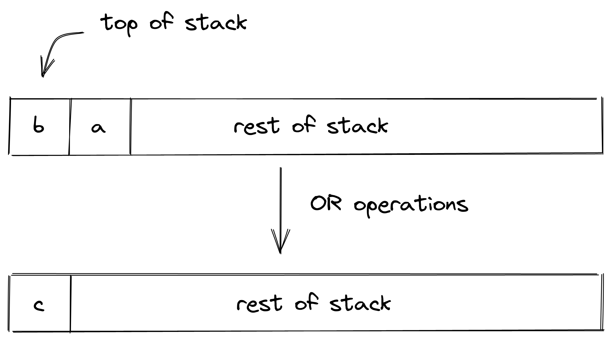

Stack transition for this operation must satisfy the following constraints:

>$$
s_i^2 - s_i = 0 \text{ for } i \in \{0, 1\} \text{ | degree} = 2
$$

>$$
s_{0}' - (s_{1} + s_{0} - s_{1} \cdot s_{0}) = 0 \text{ | degree} = 2
$$

The first two constraints ensure that the value in $s_0$ and $s_1$ are binary, and the third constraint ensures the correctness of the boolean `OR` operation.

The effect on the rest of the stack is:
* **Left shift** starting from position $2$.

## EQ
Assume $a$ and $b$ are the elements at the top of the stack. The `EQ` operation computes $c$ such that $c = 1$ if $a = b$, and $0$ otherwise. The diagram below illustrates this graphically.

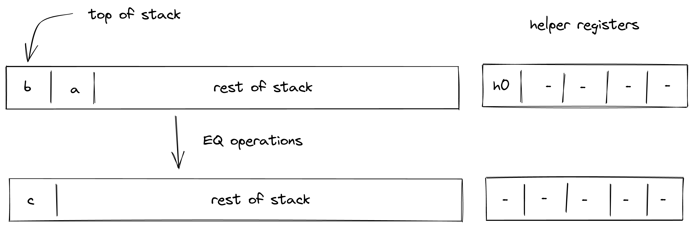

Stack transition for this operation must satisfy the following constraints:

>$$
s_0' \cdot (s_0 - s_1) = 0 \text{ | degree} = 2
$$

>$$
s_0' - (1 - (s_0 - s_1) \cdot h_0) = 0 \text{ | degree} = 2
$$

To satisfy the above constraints, the prover must populate the value of helper register $h_0$ as follows:
* If $s_0 \neq s_1$, set $h_0 = \frac{1}{s_0 - s_1}$.
* Otherwise, set $h_0$ to any value (e.g., $0$).

The effect on the rest of the stack is:
* **Left shift** starting from position $2$.

## EQZ
Assume $a$ is the element at the top of the stack. The `EQZ` operation computes $b$ such that $b = 1$ if $a = 0$, and $0$ otherwise. The diagram below illustrates this graphically.

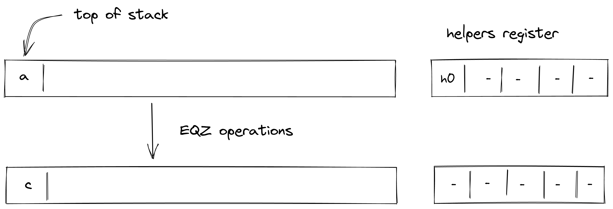

Stack transition for this operation must satisfy the following constraints:

>$$
s_0' \cdot s_0 = 0 \text{ | degree} = 2
$$

>$$
s_0' - (1 - s_0 \cdot h_0) = 0 \text{ | degree} = 2
$$

To satisfy the above constraints, the prover must populate the value of helper register $h_0$ as follows:
* If $s_0 \neq 0$, set $h_0 = \frac{1}{s_0}$.
* Otherwise, set $h_0$ to any value (e.g., $0$).

The effect on the rest of the stack is:
* **No change** starting from position $1$.

## EXPACC
The `EXPACC` operation pops top $4$ elements from the top of the stack, performs a single round of exponent aggregation, and pushes the resulting $4$ values onto the stack. The diagram below illustrates this graphically.

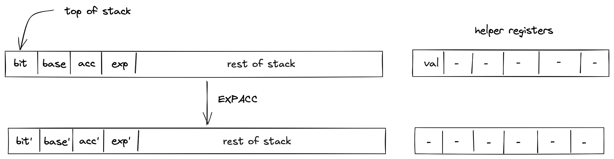

Stack transition for this operation must satisfy the following constraints:

`bit` should be a binary.

>$$
s_0'^{2} - s_0' = 0 \text{ | degree} = 2
$$

The `exp` in the next frame should be the square of the `exp` in the current frame.

>$$
s_1' - s_1^{2} = 0 \text{ | degree} = 2
$$

The value `val` in the helper register is computed correctly using the `bit` and `exp` in next and current frame respectively.

>$$
h_0 - ((s_1 - 1) * s_0' + 1) = 0 \text{ | degree} = 2
$$

The `acc` in the next frame is the product of `val` and `acc` in the current frame.

>$$
s_2' - s_2 * h_0 = 0 \text{ | degree} = 2
$$

`b` in the next frame is the right shift of `b` in the current frame.

>$$
s_3' - (s_3 * 2 + s_0')  = 0 \text{ | degree} = 1
$$

The effect on the rest of the stack is:
* **No change** starting from position $4$.

## EXT2MUL
The `EXT2MUL` operation pops top $4$ values from the top of the stack, performs mulitplication between the two extension field elements, and pushes the resulting $4$ values onto the stack. The diagram below illustrates this graphically.

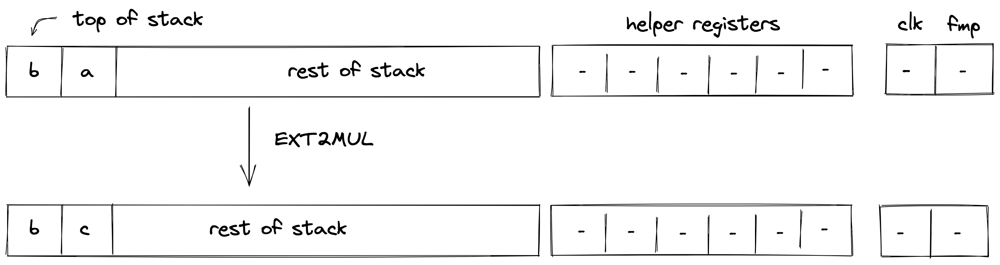

Stack transition for this operation must satisfy the following constraints:

The first stack element should be unchanged in the next frame.

>$$
s_0' - s_0 = 0 \text{ | degree} = 1
$$

The second stack element should be unchanged in the next frame.

>$$
s_1' - s_1 = 0 \text{ | degree} = 1
$$

The third stack element should satisfy the following constraint.

>$$
s_2' - (s_0 + s_1) \cdot (s_2 + s_3) + s_0 \cdot s_2 = 0 \text{ | degree} = 2
$$

The fourth stack element should satisfy the following constraint.

>$$
s_3' - s_1 \cdot s_3 + 2 \cdot s_0 \cdot s_2 = 0 \text{ | degree} = 2
$$

The effect on the rest of the stack is:
* **No change** starting from position $4$.
