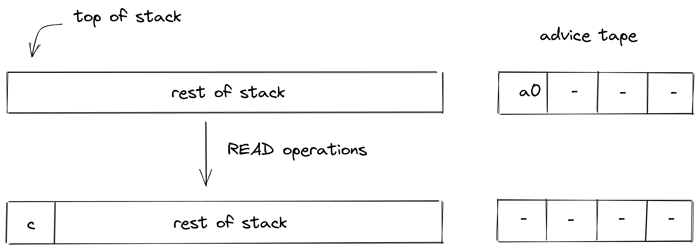
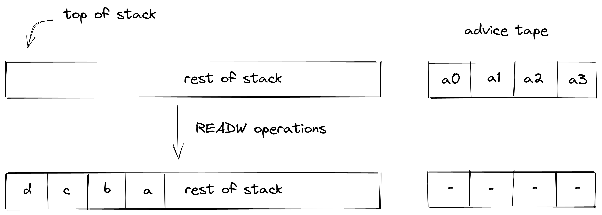
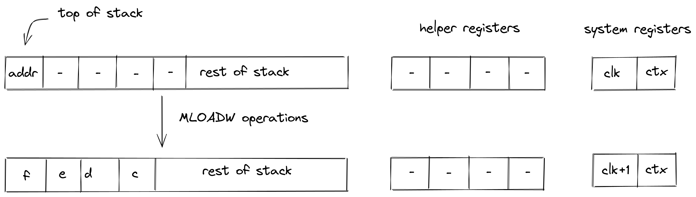
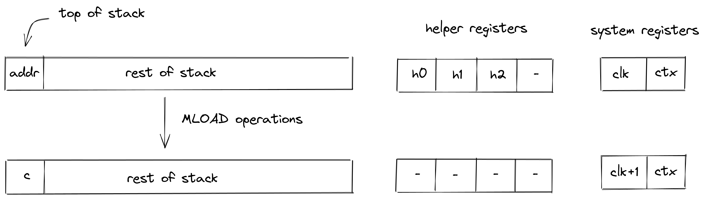
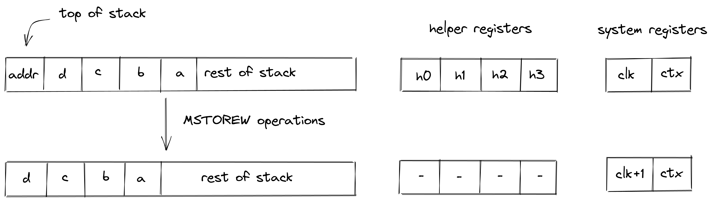
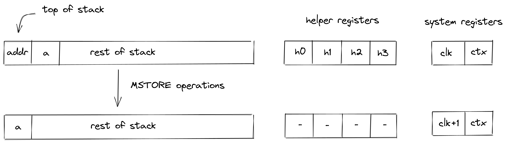

# Input / output operations
In this section we describe the AIR constraint for Miden VM input / output operations. These operations move values between the stack and other components of the VM such as program code (i.e., decoder), memory, and advice provider.

### PUSH
The `PUSH` operation pushes the provided immediate value onto the stack (i.e., sets the value of $s_0$ register). Currently, it is the only operation in Miden VM which carries an immediate value. The semantics of this operation are explained in the [decoder section](../decoder/main.html#handling-immediate-values).

The effect of this operation on the rest of the stack is:
* **Right shift** starting from position $0$.

### SDEPTH
The `SDEPTH` pushes the current depth of the stack (prior to the execution of this operation) onto the stack. The diagram below illustrates this graphically.

Stack transition for this operation must satisfy the following constraints:

>$$
s_0' - b_0 = 0 \text{ | degree } = 1
$$

where $b_0$ is the stack bookkeeping register which keeps track of the current stack depth as described [here](./main.md#stack-representation).

The effect of this operation on the rest of the stack is:
* **Right shift** starting from position $0$.

### READ
The `READ` operation removes the next element from the advice tape and pushes it onto the stack. The diagram below illustrates this graphically.

The `READ` operation does not impose any constraints against the first element of the stack.

The effect of this operation on the rest of the stack is:
* **Right shift** starting from position $0$.

### READW
The `READW` operation removes a word (4 field elements) from the advice tape and puts it onto the stack by overwriting the top $4$ elements of the stack. The diagram below illustrates this graphically.

The `READW` operation does not impose any constraints against the top $4$ elements of the stack.

The effect of this operation on the rest of the stack is:
* **No change** starting from position $4$.

## Memory access operations
Miden VM exposes several operations for reading from and writing to random access memory. Memory in Miden VM is managed by the [Memory chiplet](../chiplets/memory.md).

Communication between the stack and the memory chiplet is accomplished via the chiplet bus $b_{chip}$. To make requests to the chiplet bus we need to divide its current value by the value representing memory access request. The structure of memory access request value is described [here](../chiplets/memory.md#memory-row-value).

To enforce the correctness of memory access, we can use the following constraint:

>$$
b_{chip}' \cdot u_{mem} = b_{chip} \text{ | degree } = 2
$$

In the above, $u_{mem}$ is the value of memory access request. Thus, to describe AIR constraint for memory operations, it is sufficient to describe how $u_{mem}$ is computed. We do this in the following sections.

### MLOADW
The `MLOADW` operation loads a word (4 field elements) from the specified memory address onto the stack. The address is specified by the top stack element. After the operation is executed, the top $4$ stack elements are overwritten with values retrieved from the memory. The diagram below illustrates this graphically.

To simplify description of memory access request value, we first define the following variables:

The value representing state of memory before the operation:

$$
v_{old} = \sum_{i=0}^3\alpha_{i+4} \cdot s_{3-i}'
$$

The value representing state of memory after the operation:

$$
v_{new} = \sum_{i=0}^3\alpha_{i+8} \cdot s_{3-i}'
$$

Note that since this is a _read_ operation, the values come from the same registers, but the $\alpha$ values are different from the values used to compute the old state of memory.

Using the above variables, we define the value representing the memory access request as follows:

$$
u_{mem} = \alpha_0 + \alpha_1 \cdot op_{mem} + \alpha_2 \cdot s_0 + \alpha_3 \cdot clk + v_{old} + v_{new}
$$

In the above:
- $op_{mem}$ is the unique [operation label](../chiplets/main.md#operation-labels) of the memory access operation.
- $s_0$ is the memory address from which the values are to be loaded onto the stack.
- $clk$ is the current clock cycle of the VM.

The effect of this operation on the rest of the stack is:
* **No change** starting from position $4$.

### MLOAD
The `MLOAD` operation is similar to the `MLOADW` operation but instead of loading the full word, we load only the first element of the word at the specified address onto the stack. The diagram below illustrates this graphically.

To simplify description of memory access request value, we first define the following variables:

The value representing state of memory before the operation (values in registers $h_0, h_1, h_2$ are set by the prover nondeterministically):

$$
v_{old} = \alpha_4 \cdot s_0' + \sum_{i=2}^3\alpha_{i+4} \cdot h_i'
$$

The value representing state of memory after the operation:

$$
v_{new} = \alpha_8 \cdot s_0' + \sum_{i=0}^2\alpha_{i+8} \cdot h_i'
$$

Using the above variables, we define the value representing the memory access request as follows:

$$
u_{mem} = \alpha_0 + \alpha_1 \cdot op_{mem} + \alpha_2 \cdot s_0 + \alpha_3 \cdot clk + v_{old} + v_{new}
$$

In the above:
- $op_{mem}$ is the unique [operation label](../chiplets/main.md#operation-labels) of the memory access operation.
- $s_0$ is the memory address from which the value is to be loaded onto the stack.
- $clk$ is the current clock cycle of the VM.

The effect of this operation on the rest of the stack is:
* **No change** starting from position $1$.

### MSTOREW
The `MSTOREW` operation stores a word (4 elements) from the stack into the specified memory address. The address is specified by the top stack element. The stored elements are not removed from the stack. The diagram below illustrates this graphically.

To simplify description of memory access request value, we first define the following variables:

The value representing state of memory before the operation (set by the prover nondeterministically in registers $h_0, ..., h_3$):

$$
v_{old} = \sum_{i=0}^3\alpha_{i+4} \cdot h_i
$$

The value representing state of memory after the operation:

$$
v_{new} = \sum_{i=0}^3\alpha_{i+8} \cdot s_{3-i}'
$$

Using the above variables, we define the value representing the memory access request as follows:

$$
u_{mem} = \alpha_0 + \alpha_1 \cdot op_{mem} + \alpha_2 \cdot s_0 + \alpha_3 \cdot clk + v_{old} + v_{new}
$$

In the above:
- $op_{mem}$ is the unique [operation label](../chiplets/main.md#operation-labels) of the memory access operation.
- $s_0$ is the memory address into which the values from the stack are to be saved.
- $clk$ is the current clock cycle of the VM.

The effect of this operation on the rest of the stack is:
* **Left shift** starting from position $1$.

### MSTORE
The `MSTORE` operation is similar to the `MSTOREW` operation but instead updating the entire word in memory, we update only the first element of the word at the specified memory address. The remaining three elements of the word are not affected. The diagram below illustrates this graphically.

To simplify description of memory access request value, we first define the following variables:

The value representing state of memory before the operation (set by the prover nondeterministically in registers $h_0, ..., h_3$):

$$
v_{old} = \sum_{i=0}^3\alpha_{i+4} \cdot h_i
$$

The value representing state of memory after the operation:

$$
v_{new} = \alpha_4 \cdot s_0' + \sum_{i=1}^3\alpha_{i+8} \cdot h_i'
$$

Using the above variables, we define the value representing the memory access request as follows:

$$
u_{mem} = \alpha_0 + \alpha_1 \cdot op_{mem} + \alpha_2 \cdot s_0 + \alpha_3 \cdot clk + v_{old} + v_{new}
$$

In the above:
- $op_{mem}$ is the unique [operation label](../chiplets/main.md#operation-labels) of the memory access operation.
- $s_0$ is the memory address into which the value from the stack is to be saved.
- $clk$ is the current clock cycle of the VM.

The effect of this operation on the rest of the stack is:
* **Left shift** starting from position $1$.
