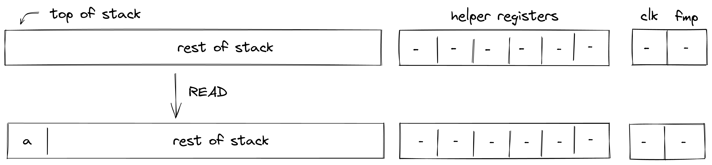
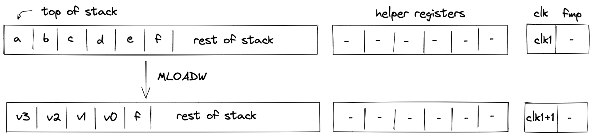
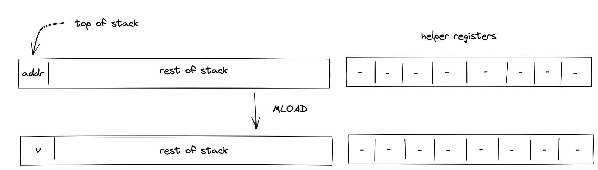
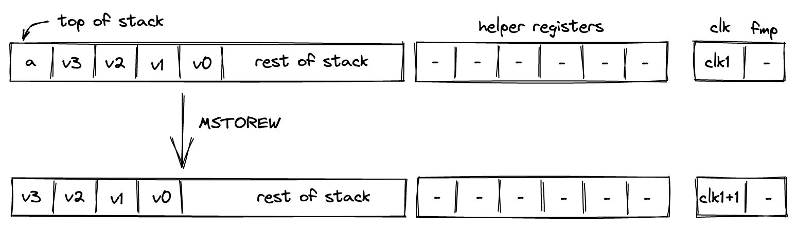
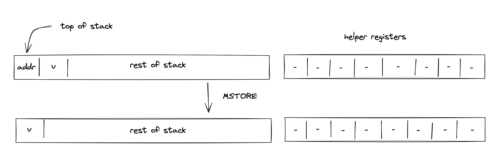

# Input / output operations
In this section we describe the AIR constraints for Miden VM input / output operations. These operations move values between the stack and other components of the VM such as program code (i.e., decoder), memory, and advice provider.

### PUSH
The `PUSH` operation pushes the provided immediate value onto the stack (i.e., sets the value of $s_0$ register). Currently, it is the only operation in Miden VM which carries an immediate value. The semantics of this operation are explained in the [decoder section](../decoder/main.html#handling-immediate-values).

The effect of this operation on the rest of the stack is:
* **Right shift** starting from position $0$.

### SDEPTH
Assume $a$ is the current depth of the stack stored in the stack bookkeeping register $b_0$ (as described [here](./main.md#stack-representation)). The `SDEPTH` pushes $a$ onto the stack. The diagram below illustrates this graphically.

Stack transition for this operation must satisfy the following constraints:

>$$
s_0' - b_0 = 0 \text{ | degree} = 1
$$

The effect of this operation on the rest of the stack is:
* **Right shift** starting from position $0$.

### ADVPOP
Assume $a$ is an element at the top of the advice stack. The `ADVPOP` operation removes $a$ from the advice stack and pushes it onto the operand stack. The diagram below illustrates this graphically.

The `ADVPOP` operation does not impose any constraints against the first element of the operand stack.

The effect of this operation on the rest of the operand stack is:
* **Right shift** starting from position $0$.

### ADVPOPW
Assume $a$, $b$, $c$, and $d$, are the elements at the top of the advice stack (with $a$ being on top). The `ADVPOPW` operation removes these elements from the advice stack and puts them onto the operand stack by overwriting the top $4$ stack elements. The diagram below illustrates this graphically.

The `ADVPOPW` operation does not impose any constraints against the top $4$ elements of the operand stack.

The effect of this operation on the rest of the operand stack is:
* **No change** starting from position $4$.

## Memory access operations
Miden VM exposes several operations for reading from and writing to random access memory. Memory in Miden VM is managed by the [Memory chiplet](../chiplets/memory.md).

Communication between the stack and the memory chiplet is accomplished via the chiplet bus $b_{chip}$. To make requests to the chiplet bus we need to divide its current value by the value representing memory access request. The structure of memory access request value is described [here](../chiplets/memory.md#memory-row-value).

To enforce the correctness of memory access, we can use the following constraint:

>$$
b_{chip}' \cdot u_{mem} = b_{chip} \text{ | degree} = 2
$$

In the above, $u_{mem}$ is the value of memory access request. Thus, to describe AIR constraint for memory operations, it is sufficient to describe how $u_{mem}$ is computed. We do this in the following sections.

### MLOADW
Assume that the word with elements $v_0, v_1, v_2, v_3$ is located in memory at address $a$. The `MLOADW` operation pops an element off the stack, interprets it as a memory address, and replaces the remaining 4 elements at the top of the stack with values located at the specified address. The diagram below illustrates this graphically.

To simplify description of the memory access request value, we first define a variable for the value that represents the state of memory after the operation:

$$
v = \sum_{i=0}^3\alpha_{i+5} \cdot s_{3-i}'
$$

Using the above variable, we define the value representing the memory access request as follows:

$$
u_{mem} = \alpha_0 + \alpha_1 \cdot op_{mem\_read} + \alpha_3 \cdot s_0 + \alpha_4 \cdot clk + v
$$

In the above:
- $op_{mem\_read}$ is the unique [operation label](../chiplets/main.md#operation-labels) of the memory read operation.
- $s_0$ is the memory address from which the values are to be loaded onto the stack.
- $clk$ is the current clock cycle of the VM.

Note that $\alpha_2$ term is skipped because currently memory context value is always $0$.

The effect of this operation on the rest of the stack is:
* **Left shift** starting from position $5$.

### MLOAD
Assume that the word with elements $v_0, v_1, v_2, v_3$ is located in memory at address $a$. The `MLOAD` operation pops an element off the stack, interprets it as a memory address, and pushes the first element of the word located at the specified address to the stack. The diagram below illustrates this graphically.

To simplify description of the memory access request value, we first define a variable for the value that represents the state of memory after the operation:

$$
v = \alpha_5 \cdot s_0' + \sum_{i=1}^3\alpha_{i+5} \cdot h_{3-i}'
$$

*Note: the values in registers $h_0, h_1, h_2$ are set by the prover non-deterministically.*

Using the above variable, we define the value representing the memory access request as follows:

$$
u_{mem} = \alpha_0 + \alpha_1 \cdot op_{mem\_read} + \alpha_3 \cdot s_0 + \alpha_4 \cdot clk + v
$$

In the above:
- $op_{mem\_read}$ is the unique [operation label](../chiplets/main.md#operation-labels) of the memory read operation.
- $s_0$ is the memory address from which the value is to be loaded onto the stack.
- $clk$ is the current clock cycle of the VM.

Note that $\alpha_2$ term is skipped because currently memory context value is always $0$.

The effect of this operation on the rest of the stack is:
* **No change** starting from position $1$.

### MSTOREW
The `MSTOREW` operation pops an element off the stack, interprets it as a memory address, and writes the remaining $4$ elements at the top of the stack into memory at the specified address. The stored elements are not removed from the stack. The diagram below illustrates this graphically.

After the operation the contents of memory at address $a$ would be set to $v_0, v_1, v_2, v_3$.

To simplify description of the memory access request value, we first define a variable for the value that represents the state of memory after the operation:

$$
v = \sum_{i=0}^3\alpha_{i+5} \cdot s_{3-i}'
$$

Using the above variable, we define the value representing the memory access request as follows:

$$
u_{mem} = \alpha_0 + \alpha_1 \cdot op_{mem\_write} + \alpha_3 \cdot s_0 + \alpha_4 \cdot clk + v
$$

In the above:
- $op_{mem\_write}$ is the unique [operation label](../chiplets/main.md#operation-labels) of the memory write operation.
- $s_0$ is the memory address into which the values from the stack are to be saved.
- $clk$ is the current clock cycle of the VM.

Note that $\alpha_2$ term is skipped because currently memory context value is always $0$.

The effect of this operation on the rest of the stack is:
* **Left shift** starting from position $1$.

### MSTORE
The `MSTORE` operation pops an element off the stack, interprets it as a memory address, and writes the remaining element at the top of the stack into the first element of the word located at the specified memory address. The remaining $3$ elements of the word are not affected. The diagram below illustrates this graphically.

After the operation the contents of memory at address $a$ would be set to $b, v_1, v_2, v_3$.

To simplify description of the memory access request value, we first define a variable for the value that represents the state of memory after the operation:

$$
v = \alpha_5 \cdot s_0' + \sum_{i=1}^3\alpha_{i+5} \cdot h_{3-i}'
$$

*Note: the values in registers $h_0, h_1, h_2$ are set by the prover non-deterministically.*

Using the above variable, we define the value representing the memory access request as follows:

$$
u_{mem} = \alpha_0 + \alpha_1 \cdot op_{mem\_write}  + \alpha_3 \cdot s_0 + \alpha_4 \cdot clk + v
$$

In the above:
- $op_{mem\_write} $ is the unique [operation label](../chiplets/main.md#operation-labels) of the memory write operation.
- $s_0$ is the memory address into which the value from the stack is to be saved.
- $clk$ is the current clock cycle of the VM.

Note that $\alpha_2$ term is skipped because currently memory context value is always $0$.

The effect of this operation on the rest of the stack is:
* **Left shift** starting from position $1$.
