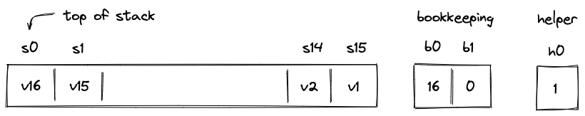
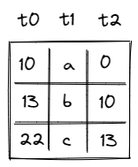
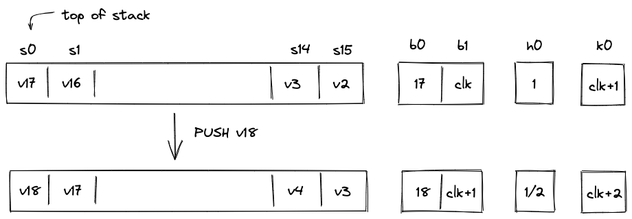
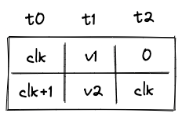
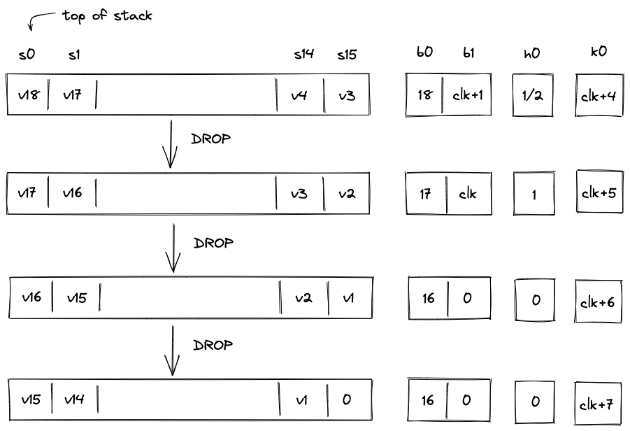

# Operand stack

Miden VM is a stack machine. The stack is a push-down stack of practically unlimited depth (in practical terms, the depth will never exceed $2^{32}$), but only the top $16$ items are directly accessible to the VM. Items on the stack are elements in a prime field defined by modulus $2^{64} - 2^{32} + 1$.

To keep the constraint system for the stack manageable, we impose the following rules:
1. All operations executed on the VM can shift the stack by at most one item. That is, the end result of an operation must be that the stack shrinks by one item, grows by one item, or the number of items on the stack does not change.
2. Stack depth must always be greater than or equal to $16$. At the start of program execution, the stack is initialized with exactly $16$ input values, all of which could be $0$'s.
3. By the end of program execution, exactly $16$ items must remain on the stack (again, all of them could be $0$'s). These items comprise the output of the program.

To ensure that managing stack depth does not impose significant burden, we adopt the following rule:

* When the stack depth is $16$, removing additional items from the stack does not change its depth. To keep the depth at $16$, $0$'s are inserted into the deep end of the stack for each removed item.

## Stack representation
The VM allocates $19$ trace columns for the stack. The layout of the columns is illustrated below.

The meaning of the above columns is as follows:
* $s_0 ... s_{15}$ are the columns representing the top $16$ slots of the stack.
* Column $b_0$ contains the number of items on the stack (i.e., the stack depth). In the above picture, there are 16 items on the stacks, so $b_0 = 16$.
* Column $b_1$ contains an address of a row in the "overflow table" in which we'll store the data that doesn't fit into the top $16$ slots. When $b_1 = 0$, it means that all stack data fits into the top $16$ slots of the stack.
* Helper column $h_0$ is used to ensure that stack depth does not drop below $16$. Values in this column are set by the prover non-deterministically to $\frac{1}{b_0 - 16}$ when $b_0 \neq 16$, and to any other value otherwise.

### Overflow table
To keep track of the data which doesn't fit into the top $16$ stack slots, we'll use an overflow table. This will be a virtual table. Meaning, we won't allocate any trace columns for the table itself, but will rather describe it with a single running product column which will keep track of the rows added and removed from the table. The exact mechanism of how this works will be described a bit later.

The table itself can be thought of as having 3 columns as illustrated below.

The meaning of the columns is as follows:
* Column $t_0$ contains row address. Every address in the table must be unique.
* Column $t_1$ contains the value that overflowed the stack.
* Column $t_2$ contains the address of the row containing the value that overflowed the stack right before the value in the current row. For example, in the picture above, first value $a$ overflowed the stack, then $b$ overflowed the stack, and then value $c$ overflowed the stack. Thus, row with value $b$ points back to the row with value $a$, and row with value $c$ points back to the row with value $b$.

To represent this table, we'll use column $p_1$. This column will keep a running product of rows inserted and deleted from the table. Thus, at any step of the computation $p_1$ will contain a product of all rows currently in the table.

To compute a product of rows, we'll first need to reduce each row to a single value. This will be done as follows. Assume the verifier sends a set of random values $\alpha_0$, $\alpha_1$ etc. to the prover after the prover commits to the execution trace of the program. The prover reduces row $i$ in the table to a single value $r_i$ as:

$$
r_i = \alpha_0 + \alpha_1 \cdot t_{0, i} + \alpha_2 \cdot t_{1, i} + \alpha_3 \cdot t_{2, i}
$$

Then, when row $i$ is added to the table, we'll update the value in the $p_1$ column like so:

$$
p_1' = p_1 \cdot r_i
$$

where, $p_1$ denotes the value of column $p_1$ at the current step and $p_1'$ denotes the value of column $p_1$ at the next step.

Analogously, when row $i$ is removed from the table, we'll update the value in column $p_1$ like so:

$$
p_1' = \frac{p_1}{r_i}
$$

The initial value of $p_1$ is set to $1$. Thus, if by the time Miden VM finishes executing a program the table is empty (we added and then removed exactly the same set of rows), $p_1$ will also be equal to $1$.

There are a couple of other rules we'll need to enforce:
* We can delete a row only after the row has been inserted into the table.
* We can't insert a row with the same address twice into the table (even if the row was inserted and then deleted).

How these are enforced will be described a bit later.

## Right shift
If an operation adds data to the stack, we say that the operation caused a right shift. For example, `PUSH` and `DUP` operations cause a right shift. Graphically, this looks like so:

Here, we pushed value $v_{17}$ onto the stack. All other values on the stack are shifted by one slot to the right and the stack depth increases by $1$. There is not enough space at the top of the stack for all $17$ values, thus, $v_1$ needs to be moved to the overflow table.

To do this, we need to rely on another column: $k_0$. This is a system column which keeps track of the current VM cycle. The value in this column is simply incremented by $1$ with every step.

The row we want to add to the overflow table is defined by tuple $(clk, v1, 0)$, and after it is added, the table would look like so:

The reason we use VM clock cycle as row address is that the clock cycle is guaranteed to be unique, and thus, the same row can not be added to the table twice.

Let's push another item onto the stack:

Again, as we push $v_{18}$ onto the stack, all items on the stack are shifted to the right, and now $v_2$ needs to be moved to the overflow table. The tuple we want to insert into the table now is $(clk+1, v2, clk)$. After the operation, the overflow table will look like so:

Notice that $t_2$ for row which contains value $v_2$ points back to the row with address $clk$.

Overall, during a right shift we do the following:
* Increment stack depth by $1$.
* Shift stack columns $s_0, ..., s_{14}$ right by $1$ slot.
* Add a row to the overflow table described by tuple $(k_0, s_{15}, b_0)$.
* Set the next value of $b_1$ to the current value of $k_0$.

Also, as mentioned previously, the prover sets values in $h_0$ non-deterministically to $\frac{1}{b_0 - 16}$.

## Left shift
If an operation removes an item from the stack, we say that the operation caused a left shift. For example, a `DROP` operation causes a left shift. Assuming the stack is in the state we left it at the end of the previous section, graphically, this looks like so:

Overall, the during the left shift we do the following:

* When stack depth is greater than $16$:
  * Decrement stack depth by $1$.
  * Shift stack columns $s_1, ..., s_{15}$ left by $1$ slot.
  * Remove a row from the overflow table with $t_0$ equal to the current value of $b_1$.
  * Set the next value of $s_{15}$ to the value in $t_1$ of the removed overflow table row.
  * Set the next value of $b_1$ to the value in $t_2$ of the removed overflow table row.
* When the stack depth is equal to $16$:
  * Keep the stack depth the same.
  * Shift stack columns $s_1, ..., s_{15}$ left by $1$ slot.
  * Set the value of $s_{15}$ to $0$.
  * Set the value to $h_0$ to $0$ (or any other value).

If the stack depth becomes (or remains) $16$, the prover can set $h_0$ to any value (e.g., $0$). But if the depth is greater than $16$ the prover sets $h_0$ to $\frac{1}{b_0 - 16}$.

## AIR Constraints
When describing AIR constraints, we adopt the following notation: for column $x$, we denote the value in the current row simply as $x$, and the value in the next row of the column as $x'$. Thus, all transition constraints described in this note work with two consecutive rows of the execution trace.

Also, to simplify constraint descriptions, we'll assume that the VM exposes two binary flag values described below.

| Flag      | Degree | Description |
| --------- | ------ | ----------- |
| $f_{shr}$ | 7      | When this flag is set to $1$, the instruction executing on the VM is performing a "right shift". |
| $f_{shl}$ | 5      | When this flag is set to $1$, the instruction executing on the VM is performing a "left shift". |

These flags are mutually exclusive. That is, if $f_{shl}=1$, then $f_{shr}=0$ and vice versa. However, both flags can be set to $0$ simultaneously. This happens when the executed instruction does not shift the stack.

### Stack overflow flag
Additionally, we'll define a flag to indicate whether the overflow table contains values. This flag will be set to $0$ when the overflow table is empty, and to $1$ otherwise (i.e., when stack depth $>16$). This flag can be computed as follows:

$$
f_{ov} = (b_0 - 16) \cdot h_0 \text{ | degree } = 2
$$

To ensure that this flag is set correctly, we need to impose the following constraint:

>$$
(1 - f_{ov}) \cdot (b_0 - 16) = 0 \text{ | degree } = 3
$$

The above constraint can be satisfied only when either of the following holds:

* $b_0 = 16$, in which case $f_{ov}$ evaluates to $0$, regardless of the value of $h_0$.
* $f_{ov} = 1$, in which case $b_0$ cannot be equal to $16$ (and $h_0$ must be set to $\frac{1}{b_0 - 16}$).

### Stack depth constraints
To make sure stack depth column $b_0$ is updated correctly, we need to impose the following constraints:

| Condition   | Constraint       | Description |
| ----------- | ---------------- | ----------- |
| $f_{shr}=1$ | $b'_0 = b_0 + 1$ | When the stack is shifted to the right, stack depth should be incremented by $1$. |
| $f_{shl}=1$   $f_{ov}=1$ | $b'_0 = b_0 - 1$ | When the stack is shifted to the left and the overflow table is not empty, stack depth should be decremented by $1$. |
| otherwise   | $b'_0 = b_0$     | In all other cases, stack depth should not change. |

We can combine the above constraints into a single expression as follows:

>$$
b'_0 - b_0 + f_{shl} \cdot f_{ov} - f_{shr} = 0 \text{ | degree } = 7
$$

### Overflow table constraints

When the stack is shifted to the right, a tuple $(k_0, s_{15}, b_1)$ should be added to the overflow table. We will denote value of the row to be added to the table as follows:

$$
v = \alpha_0 + \alpha_1 \cdot k_0 + \alpha_2 \cdot s_{15} + \alpha_3 \cdot b_1
$$

When the stack is shifted to the left, a tuple $(b_1, s'_{15}, b'_1)$ should be removed from the overflow table. We will denote value of the row to be removed from the table as follows.

$$
u = \alpha_0 + \alpha_1 \cdot b_1 + \alpha_2 \cdot s'_{15} + \alpha_3 \cdot b'_1
$$

Using the above variables, we can ensure that right and left shifts update the overflow table correctly by enforcing the following constraint:

>$$
p_1' \cdot (u \cdot f_{shl} \cdot f_{ov} + 1 - f_{shl} \cdot f_{ov}) = p_1 \cdot (v \cdot f_{shr} + 1 - f_{shr}) \text{ | degree } = 9
$$

We need to add $1$ and subtract the relevant flags from each side to ensure that when none of the flags is set to 1, the above constraint reduces to $p_1' = p_1$.

Notice that in the case of the left shift, the constraint forces the prover to set the next values of $s_{15}$ and $b_1$ to values $t_1$ and $t_2$ of the row removed from the overflow table.

In case of a right shift, we also need to make sure that the next value of $b_1$ is set to the current value of $k_0$. This can be done with the following constraint:

>$$
f_{shr} \cdot (b'_1 - k_0) = 0 \text{ | degree } = 8
$$

In case of a left shift, when the overflow table is empty, we need to make sure that a $0$ is "shifted in" from the right (i.e., $s_{15}$ is set to $0$). This can be done with the following constraint:

>$$
f_{shl} \cdot (1 - f_{ov}) \cdot s_{15}' = 0 \text{ | degree } = 8
$$

### Stack top constraints
We also need to make sure the values in the columns representing the top $16$ items of the stack are updated correctly. In general, these constraints will be operation-specific (i.e., different operations would affect the top of the stack differently). But we can illustrate the general approach on the example of two operations: `DUP` and `DROP`.

To support these operations, the VM would need to expose operation-specific flags - e.g., $f_{dup}$ and $f_{drop}$. These are binary flags similar in concept to $f_{shl}$ and $f_{shr}$ flags.

`DUP` operation pushes a copy of the top stack item onto the stack. The constraints we need to impose for this operation are as follows:

$$
f_{dup} \cdot (s'_0 - s_0) = 0 \\
f_{dup} \cdot (s'_{i+1} - s_i) = 0 \ \text{ for } i \in \{0, .., 14\}
$$

`DROP` operation removes the top item from the stack and shifts the rest of the stack left by one slot. The constraints we need to impose for this operation are as follows:

$$
f_{drop} \cdot (s'_i - s_{i + 1}) = 0 \ \text{ for } i \in \{0, .., 14\}
$$

Assuming the degree of $f_{dup}$ and $f_{drop}$ is $7$, the above constraints have degree $8$.

### Boundary constraints
In addition to the constraints described above, we also need to enforce the following boundary constraints:
* $b_0 = 16$ at the first and at the last row of execution trace.
* $b_1 = 0$ at the first and at the last row of execution trace.
* $p_1 = 1$ at the first and at the last row of execution trace.