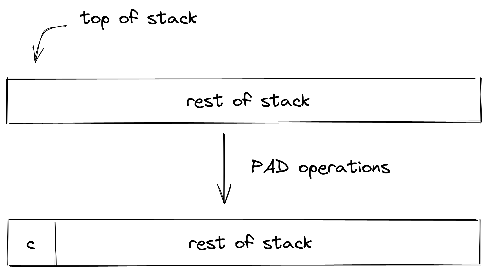
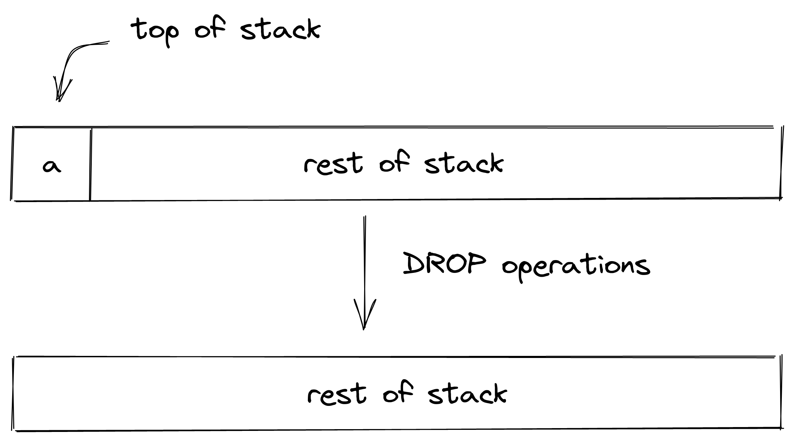
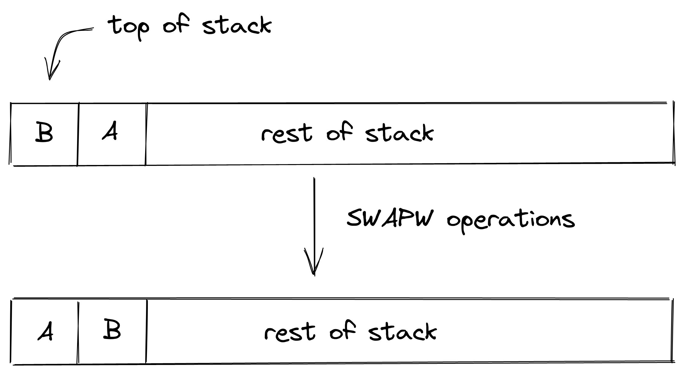
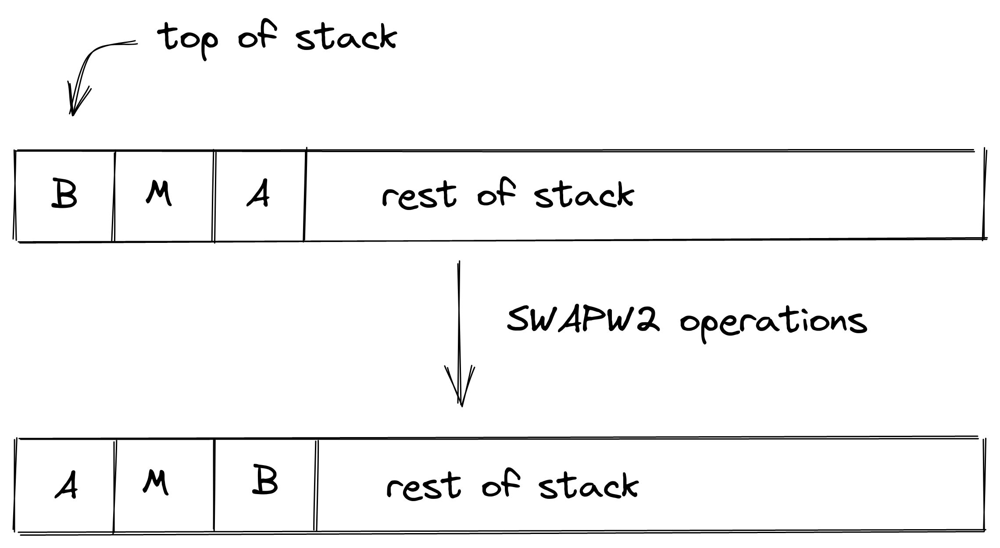
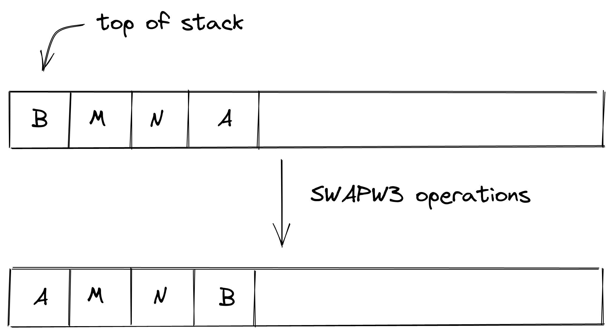
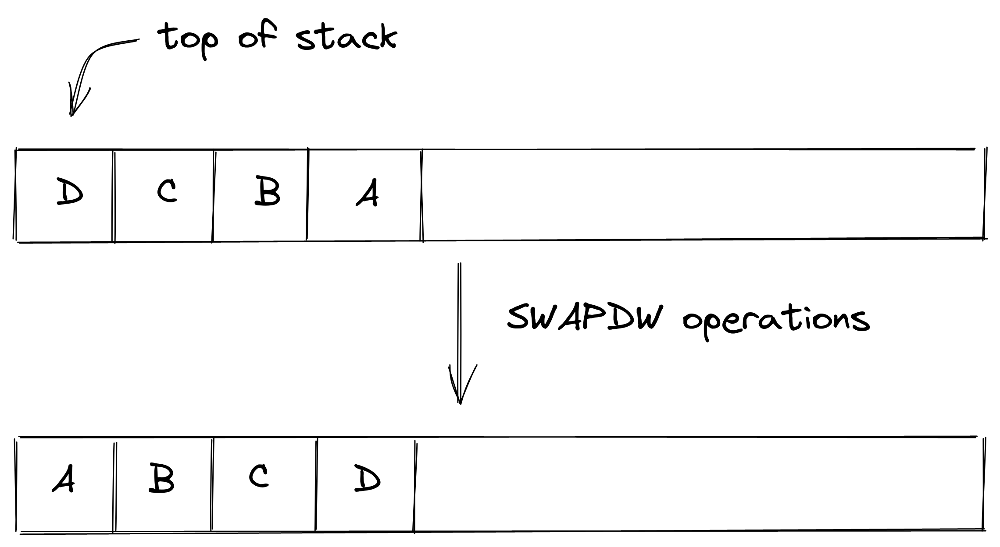
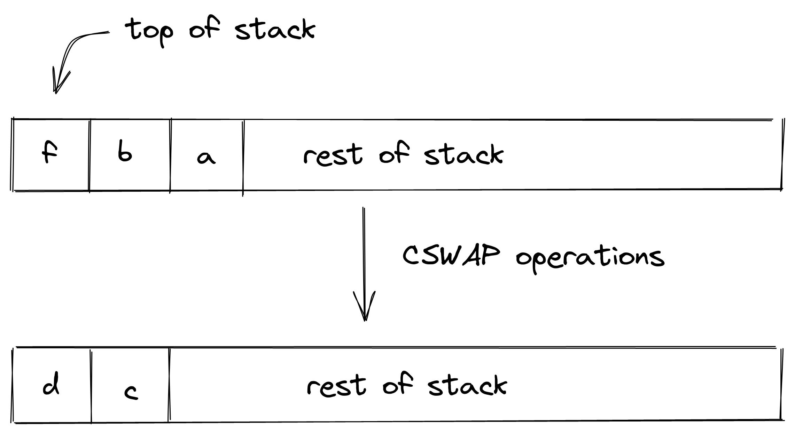
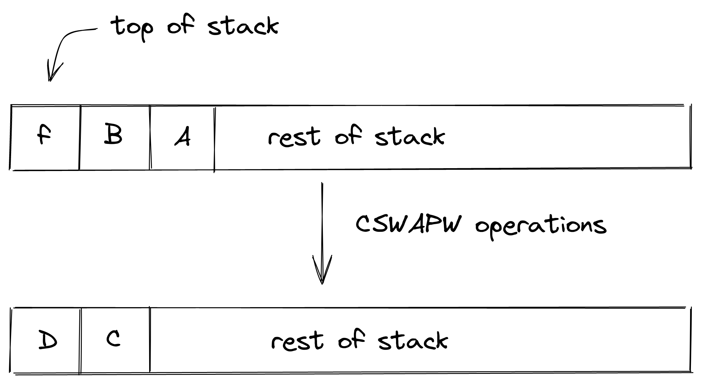

# Stack Manipulation Operations
In this section we describe the AIR constraint for Miden VM stack manipulation operations. 

## PAD

`PAD` introduces a $0$ onto the top element of the stack. The diagram below illustrates this graphically.

The stack transition for this operation must follow the following constraint:

> $$
s_{0}' = 0 \text{ | degree } = 1
$$

The `PAD` operation will shift the stack to the right by one. The maximum degree of this operation is $1$.

## DROP

`DROP` removes the top element of the stack. The diagram below illustrates this graphically.

The `DROP` operation will shift the stack to the left by one. The maximum degree of this operation is $1$.

## DUP(n)

`DUP(n)` introduces a copy of the $n^{th}$ item onto the top element of the stack. Eg. Dup will introduce a copy of the top item onto the stack. Similarly, Dup5 will introduce a copy of the $6^{th}$ item onto the stack. The diagram below illustrates this graphically.

.png)

The stack transition for this operation must follow the following constraint:

> $$
s_{0}' - s_{n} = 0 \text{ | degree } = 1
$$

where $n$ is the depth of the stack from where the element has been copied.

The `DUP(n)` operation will shift the stack to the right by one. The maximum degree of this operation is $1$.

## SWAP

`SWAP` swaps the top two element of the stack. The diagram below illustrates this graphically.

The stack transition for this operation must follow the following constraint:

> $$
s_{0}' - s_{1} = 0 \text{ | degree } = 1\\
s_{1}' - s_{0} = 0 \text{ | degree } = 1
$$

The `SWAP` operation will not change the depth of the stack i.e. the stack doesn't shift while transitioning. The maximum degree of this operation is $1$.

## SWAPW

`SWAPW` swaps stack element 0, 1, 2, and 3 with elements 4, 5, 6, 7. The diagram below illustrates this graphically.

The stack transition for this operation must follow the following constraint:

> $$
s_{i}' - s_{i+4} = 0 \space where \space i \in \{0, 1, 2, 3\} \text{ | degree } = 1\\
s_{i}' - s_{i-4} = 0 \space where \space i \in \{4, 5, 6, 7\} \text{ | degree } = 1
$$

The `SWAPW` operation will not change the depth of the stack i.e. the stack doesn't shift while transitioning. The maximum degree of this operation is $1$.

## SWAPW2

`SWAPW2` swaps stack element 0, 1, 2, and 3 with elements 8, 9, 10, 11. The diagram below illustrates this graphically.

The stack transition for this operation must follow the following constraint:

> $$
s_i' - s_{i+8} = 0 \space where \space i \in \{0, 1, 2, 3\} \text{ | degree } = 1 \\
s_i' - s_{i-8} = 0 \space where \space i \in \{8, 9, 10, 11\} \text{ | degree } = 1\\
$$

The `SWAPW2` operation will not change the depth of the stack i.e. the stack doesn't shift while transitioning. The maximum degree of this operation is $1$.

## SWAPW3

`SWAPW3` swaps stack element 0, 1, 2, and 3 with elements 12, 13, 14, 15. The diagram below illustrates this graphically.

The stack transition for this operation must follow the following constraint:

> $$
s_i' - s_{i+12} = 0 \space where \space i \in \{0, 1, 2, 3\} \text{ | degree } = 1\\
s_i' - s_{i-12} = 0 \space where \space i \in \{12, 13, 14, 15\} \text{ | degree } = 1\\
$$

The `SWAPW3` operation will not change the depth of the stack i.e. the stack doesn't shift while transitioning. The maximum degree of this operation is $1$.

## SWAPDW

`SWAPW` swaps stack elements 0, 1, 2, 3, 4, 5, 6, and 7 with elements 8, 9, 10, 11, 12, 13, 14, and 15. The diagram below illustrates this graphically.

The stack transition for this operation must follow the following constraint:

> $$
s_i' - s_{i+12} = 0 \space where \space i \in \{0..3\}   \text{ | degree } = 1\\
s_i' - s_{i+4}  = 0 \space where \space i \in \{4..7\}   \text{ | degree } = 1\\
s_i' - s_{i-4}  = 0 \space where \space i \in \{8..11\}  \text{ | degree } = 1\\
s_i' - s_{i-12} = 0 \space where \space i \in \{12..15\} \text{ | degree } = 1\\
$$

The `SWAPDW` operation will not change the depth of the stack i.e. the stack doesn't shift while transitioning. The maximum degree of this operation is $1$.

## MOVUP(n)

`MOVUP(n)` moves the $n^{th}$ element to the top of the stack where n is $0-based$ similar to `DUP(n)`. Eg. `MOVUP(2)` will move element at depth $2$ to the top of the stack. All the elements which are at depth less than $n$ will be shifted to the right by one although overall the stack doesn't shift i.e. elements at depth greater than $n$ remains where they are. This operation is valid for $n \in \{2, ..., 8\}$. The diagram below illustrates this graphically.

.png)

The stack transition for this operation must follow the following constraint:

> $$
s_0' - s_n = 0 \text{ | degree } = 1
$$

where $n$ is the depth from where the element has been moved.

The `MOVUP(n)` operation will not change the depth of the stack i.e. the stack doesn't shift while transitioning. The maximum degree of this operation is $1$.

## MOVDN(n)

`MOVDN(n)` moves the top element to the $n^{th}$ position on the stack where n is $0-based$ similar to `MOVDN(n)`. Eg. MOVDN(2) will move the top element to depth $2$ in the stack. All the elements which are at depth less than $n$ will be shifted to the left by one although overall the stack doesn't shift i.e. elements at depth greater than $n$ remains where they are. This operation is valid for $n \in \{2, ..., 8\}$. The diagram below illustrates this graphically.

.png)

The stack transition for this operation must follow the following constraint:

> $$
s_n' - s_0 = 0 \text{ | degree } = 1
$$

where $n$ is the depth to where the top element has been moved.

The `MOVUP(n)` operation will not change the depth of the stack i.e. the stack doesn't shift while transitioning. The maximum degree of this operation is $1$.

## CSWAP

`CSWAP` pops the top element of the stack & if the element is $1$, swaps the top two elements in the stack. If the popped element is $0$, the stack remains unchanged. $d$ & $c$ are $a$ & $b$ respectively if $f$ is $1$, otherwise $b$ & $a$. The diagram below illustrates this graphically.

The stack transition for this operation must follow the following constraint:

> $$
s_{0} \cdot (s_{0}' - s_{2}) + (1-s_{0}) \cdot (s_{0}'-s_{1}) = 0 \text{ | degree } = 2\\
s_{0} \cdot (s_{1}' - s_{1}) + (1-s_{0}) \cdot (s_{1}'-s_{2}) = 0 \text{ | degree } = 2\\
$$

The `CSWAP` operation will shift the stack to the left by one. The maximum degree of this operation is $2$.

## CSWAPW

`CSWAPW` pops the top element of the stack & if the element is $1$, swaps elements $0$, $1$, $2$, $3$ with elements $4$, $5$, $6$, $7$. If the popped element is $0$, the stack remains unchanged. The diagram below illustrates this graphically.

The stack transition for this operation must follow the following constraint:

> $$
s_0 \cdot (s_i' - s_{i+5}) + (1-s_0) \cdot (s_{i}'-s_{i+1}) = 0 \space where \space i \in \{0..3\}  \text{ | degree } = 2\\
s_0 \cdot (s_i' - s_{i-3}) + (1-s_0) \cdot (s_{i}'-s_{i+1}) = 0 \space where \space i \in \{4..7\} \text{ | degree } = 2\\
$$

The `CSWAPW` operation will shift the stack to the left by one. The maximum degree of this operation is $2$.