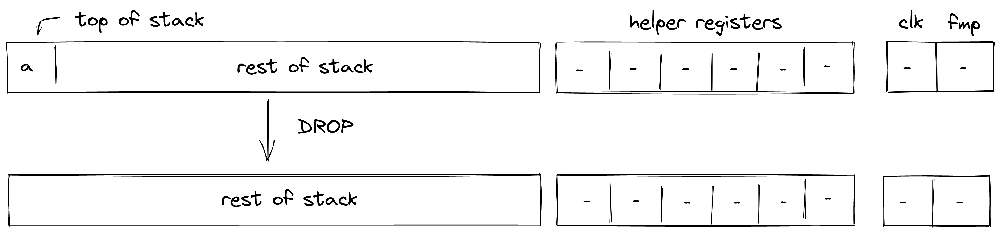
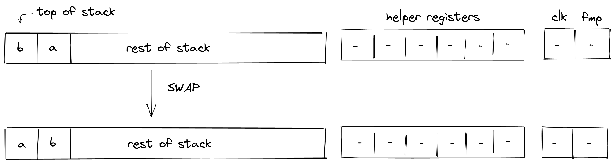
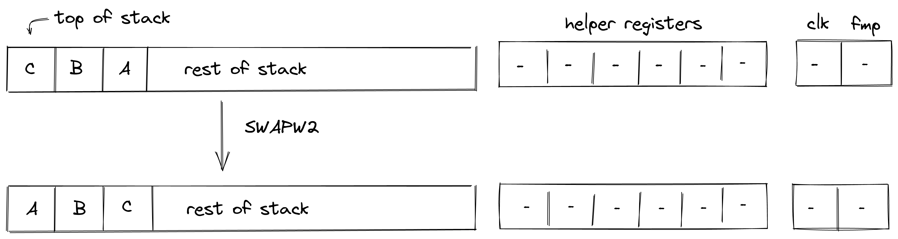
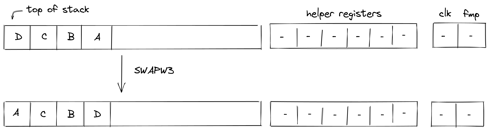
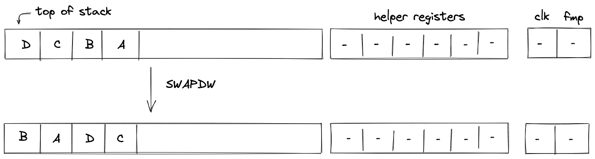

# Stack Manipulation
In this section we describe the AIR constraints for Miden VM stack manipulation operations.

## PAD
The `PAD` operation pushes a $0$ onto the stack. The diagram below illustrates this graphically.

Stack transition for this operation must satisfy the following constraints:

>$$
s_{0}' = 0 \text{ | degree} = 1
$$

The effect of this operation on the rest of the stack is:
* **Right shift** starting from position $0$.

## DROP
The `DROP` operation removes an element from the top of the stack. The diagram below illustrates this graphically.

The `DROP` operation shifts the stack by $1$ element to the left, but does not impose any additional constraints. The degree of left shift constraints is $1$.

The effect of this operation on the rest of the stack is:
* **Left shift** starting from position $1$.

## DUP(n)
The `DUP(n)` operations push a copy of the $n$-th stack element onto the stack. Eg. `DUP` (same as `DUP0`) pushes a copy of the top stack element onto the stack. Similarly, `DUP5` pushes a copy of the $6$-th stack element onto the stack. This operation is valid for $n \in \{0, ..., 7, 9, 11, 13, 15\}$. The diagram below illustrates this graphically.

.png)

Stack transition for this operation must satisfy the following constraints:

>$$
s_{0}' - s_{n} = 0 \text{ for } n \in \{0, ..., 7, 9, 11, 13, 15\} \text{ | degree} = 1
$$

where $n$ is the depth of the stack from where the element has been copied.

The effect of this operation on the rest of the stack is:
* **Right shift** starting from position $0$.

## SWAP
The `SWAP` operations swaps the top two elements of the stack. The diagram below illustrates this graphically.

Stack transition for this operation must satisfy the following constraints:

>$$
s_{0}' - s_{1} = 0 \text{ | degree} = 1
$$

>$$
s_{1}' - s_{0} = 0 \text{ | degree} = 1
$$

The effect of this operation on the rest of the stack is:
* **No change** starting from position $2$.

## SWAPW
The `SWAPW` operation swaps stack elements $0, 1, 2, 3$ with elements $4, 5, 6, 7$. The diagram below illustrates this graphically.

Stack transition for this operation must satisfy the following constraints:

>$$
s_{i}' - s_{i+4} = 0 \text{ for } i \in \{0, 1, 2, 3\} \text{ | degree} = 1
$$

>$$
s_{i + 4}' - s_i = 0 \text{ for } i \in \{0, 1, 2, 3\} \text{ | degree} = 1
$$

The effect of this operation on the rest of the stack is:
* **No change** starting from position $8$.

## SWAPW2
The `SWAPW2` operation swaps stack elements $0, 1, 2, 3$ with elements $8, 9, 10, 11$. The diagram below illustrates this graphically.

Stack transition for this operation must satisfy the following constraints:

>$$
s_i' - s_{i+8} = 0 \text{ for } i \in \{0, 1, 2, 3\} \text{ | degree} = 1
$$

>$$
s_{i + 8}' - s_i = 0 \text{ for } i \in \{0, 1, 2, 3\} \text{ | degree} = 1
$$

The effect of this operation on the rest of the stack is:
* **No change** for elements $4, 5, 6, 7$.
* **No change** starting from position $12$.

## SWAPW3
The `SWAPW3` operation swaps stack elements $0, 1, 2, 3$ with elements $12, 13, 14, 15$. The diagram below illustrates this graphically.

Stack transition for this operation must satisfy the following constraints:

>$$
s_i' - s_{i+12} = 0 \text{ for } i \in \{0, 1, 2, 3\} \text{ | degree} = 1
$$

>$$
s_{i+12}' - s_i = 0 \text{ for } i \in \{0, 1, 2, 3\} \text{ | degree} = 1
$$

The effect of this operation on the rest of the stack is:
* **No change** for elements $4, 5, 6, 7, 8, 9, 10, 11$.
* **No change** starting from position $16$.

## SWAPDW
The `SWAPDW` operation swaps stack elements $\{0, ..., 7\}$ with elements $\{8, ..., 15\}$. The diagram below illustrates this graphically.

Stack transition for this operation must satisfy the following constraints:

>$$
s_i' - s_{i+8} = 0 \text{ for } i \in \{0, ..., 7\}   \text{ | degree} = 1
$$

>$$
s_{i+8}' - s_i = 0 \text{ for } i \in \{0, ..., 7\}   \text{ | degree} = 1
$$

The effect of this operation on the rest of the stack is:
* **No change** starting from position $16$.

## MOVUP(n)
The `MOVUP(n)` operation moves the $n$-th element of the stack to the top of the stack. For example, `MOVUP2` moves element at depth $2$ to the top of the stack. All elements with depth less than $n$ are shifted to the right by one, while elements with depth greater than $n$ remain in place, and the depth of the stack does not change. This operation is valid for $n \in \{2, ..., 8\}$. The diagram below illustrates this graphically.

.png)

Stack transition for this operation must satisfy the following constraints:

>$$
s_0' - s_n = 0 \text{ for } n \in \{2, ..., 8\} \text{ | degree} = 1
$$

where $n$ is the depth of the element which is moved moved to the top of the stack.

The effect of this operation on the rest of the stack is:
* **Right shift** for elements between $0$ and $n-1$.
* **No change** starting from position $n+1$.

## MOVDN(n)
The `MOVDN(n)` operation moves the top element of the stack to the $n$-th position. For example, `MOVDN2` moves the top element of the stack to depth $2$. All the elements with depth less than $n$ are shifted to the left by one, while elements with depth greater than $n$ remain in place, and the depth of the stack does not change. This operation is valid for $n \in \{2, ..., 8\}$. The diagram below illustrates this graphically.

.png)

Stack transition for this operation must satisfy the following constraints:

>$$
s_n' - s_0 = 0 \text{ for } n \in \{2, ..., 8\} \text{ | degree} = 1
$$

where $n$ is the depth to which the top stack element is moved.

The effect of this operation on the rest of the stack is:
* **Right shift** for elements between $0$ and $n-1$.
* **No change** starting from position $n+1$.

## CSWAP
The `CSWAP` operation pops an element off the stack and if the element is $1$, swaps the top two remaining elements. If the popped element is $0$, the rest of the stack remains unchanged. The diagram below illustrates this graphically.

In the above:

$$
d = \begin{cases} a, & \text{if}\ c = 0 \\ b, & \text{if}\ c = 1\ \end{cases} e = \begin{cases} b, & \text{if}\ c = 0 \\ a, & \text{if}\ c = 1\ \end{cases}
$$

Stack transition for this operation must satisfy the following constraints:

>$$
s_0' - s_{0} \cdot s_{2} - (1-s_0) \cdot s_1 = 0 \text{ | degree} = 2
$$

>$$
s_1' - s_0 \cdot s_{1} - (1-s_0) \cdot s_2 = 0 \text{ | degree} = 2
$$

We also need to enforce that the value in $s_0$ is binary. This can be done with the following constraint:

>$$
s_0^2 - s_0 = 0 \text{ | degree} = 2
$$

The effect of this operation on the rest of the stack is:
* **Left shift** starting from position $3$.

## CSWAPW
The `CSWAPW` operation pops an element off the stack and if the element is $1$, swaps elements $1, 2, 3, 4$ with elements $5, 6, 7, 8$. If the popped element is $0$, the rest of the stack remains unchanged. The diagram below illustrates this graphically.

In the above:

$$
D = \begin{cases} A, & \text{if}\ c = 0 \\ B, & \text{if}\ c = 1\ \end{cases} E = \begin{cases} B, & \text{if}\ c = 0 \\ A, & \text{if}\ c = 1\ \end{cases}
$$

Stack transition for this operation must satisfy the following constraints:

>$$
s_i' - s_0 \cdot s_{i+5} - (1-s_0) \cdot s_{i+1} = 0 \text{ for } i \in \{0..3\}  \text{ | degree} = 2
$$

>$$
s_{i+4}' - s_0 \cdot s_{i+1} + (1-s_0) \cdot s_{i+5} = 0 \text{ for } i \in \{0..3\} \text{ | degree} = 2
$$

We also need to enforce that the value in $s_0$ is binary. This can be done with the following constraint:

>$$
s_0^2 - s_0 = 0 \text{ | degree} = 2
$$

The effect of this operation on the rest of the stack is:
* **Left shift** starting from position $9$.
