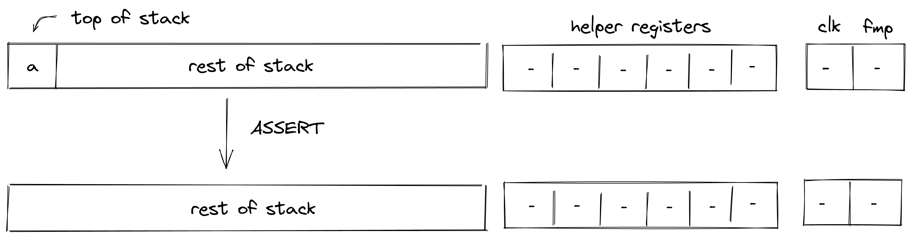
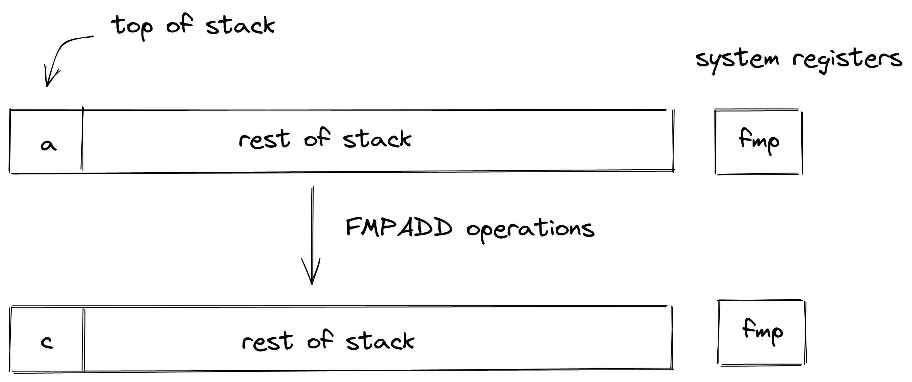
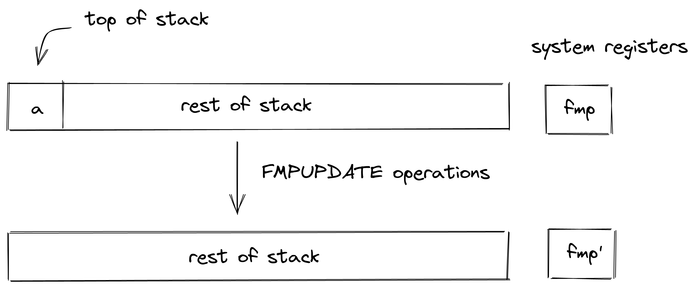

# System Operations
In this section we describe the AIR constraints for Miden VM system operations.

## NOOP
The `NOOP` operation advances the cycle counter but does not change the state of the operand stack (i.e., the depth of the stack and the values on the stack remain the same).

The `NOOP` operation does not impose any constraints besides the ones needed to ensure that the entire state of the stack is copied over. This constraint looks like so:

>$$
s'_i - s_i = 0 \ \text{ for } i \in \{0, .., 15\} \text { | degree} = 1
$$

## ASSERT
The `ASSERT` operation pops an element off the stack and checks if the popped element is equal to $1$. If the element is not equal to $1$, program execution fails..

Stack transition for this operation must satisfy the following constraints:

>$$
s_0 - 1 = 0 \text{ | degree} = 1
$$

The effect on the rest of the stack is:
* **Left shift** starting from position $1$.

## FMPADD
The `FMPADD` operation pops an element off the stack, adds the current value of the `fmp` register to it, and pushes the result back onto the stack. The diagram below illustrates this graphically.

Stack transition for this operation must satisfy the following constraints:

>$$
s_0' - (s_0 + fmp) = 0 \text{ | degree} = 1
$$

The effect on the rest of the stack is:
* **No change** starting from position $1$.

## FMPUPDATE
The `FMPUPDATE` operation pops an element off the stack and adds it to the current value of the `fmp` register. The diagram below illustrates this graphically.

The stack transition for this operation must follow the following constraint:

>$$
fmp' - (fmp + s_0) = 0 \text{ | degree} = 1
$$

The effect on the rest of the stack is:
* **Left shift** starting from position $1$.

## CLK
The `CLK` operation pushes the current value of the clock cycle onto the stack. The diagram below illustrates this graphically.

The stack transition for this operation must follow the following constraint:

>$$
s_0' - clk = 0 \text{ | degree} = 1
$$

The effect on the rest of the stack is:
* **Right shift** starting from position $0$.
