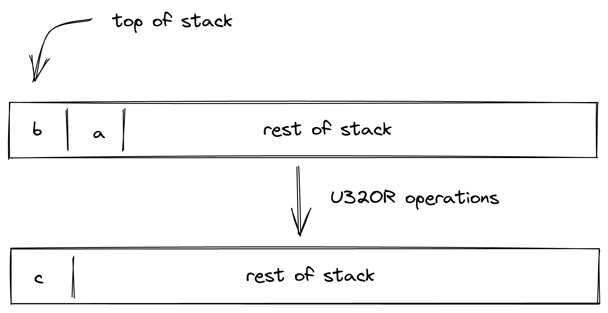

# u32 Operations
In this section we describe the AIR constraint for Miden VM u32 operations. 
In the sections below, we describe how we can implement common operations on u32 values (i.e., 32-bit unsigned integers) in this field very efficiently. This includes arithmetic operations and bitwise operations.

Vast majority of operations rely only on 16-bit range checks which can be implemented efficiently using a methodology described in [this note](https://maticnetwork.github.io/miden/design/range.html). Some operations, such as bitwise `AND`, `OR`, and `XOR` require lookups in additional auxiliary tables, which are described [here](https://maticnetwork.github.io/miden/design/chiplets/bitwise.html).

## Checking element validity
Another nice property of this field is that checking whether four 16-bit values form a valid field element can be done relatively cheaply. Assume $t_0$, $t_1$, $t_2$, and $t_3$ are known to be 16-bit values (e.g., less than $2^{16}$), and we want to verify that $2^{48} \cdot t_3 + 2^{32} \cdot t_2 + 2^{16} \cdot t_1 + t_0$ is a valid field element.

For simplicity, let's denote:

> $$
v_{hi} = 2^{16} \cdot t_3 + t_2 \\
v_{lo} = 2^{16} \cdot t_1 + t_0
$$

We can then impose the following constraint to verify element validity:

> $$
\left(1 - m \cdot (2^{32} - 1 - v_{hi})\right) \cdot v_{lo} = 0
$$

The above constraint holds only if either of the following hold:

* $v_{lo} = 0$
* $v_{hi} \ne 2^{32} - 1$

To satisfy the latter constraint, the prover would need to set $m = (2^{32} - 1 - v_{hi})^{-1}$, which is possible only when $v_{hi} \ne 2^{32} - 1$.

This constraint is sufficient because modulus $2^{64} - 2^{32} + 1$ in binary representation is 32 ones, followed by 31 zeros, followed by a single one:

> $$
1111111111111111111111111111111100000000000000000000000000000001
$$

This implies that the largest possible 64-bit value encoding a valid field element would be 32 ones, followed by 32 zeros:

> $$
1111111111111111111111111111111100000000000000000000000000000000
$$

Thus, for a 64-bit value to encode a valid field element, either the lower 32 bits must be all zeros, or the upper 32 bits must not be all ones (which is $2^{32} - 1$).

## U32SPLIT

Assume $a$ is a field element. `U32SPLIT` operation computes $a \rightarrow (b,c)$, where $b$ contains the lower 32-bits of $a$, and $c$ retains the upper 32 bits of $a$. The diagram below illustrates this graphically.

To facilitate this operation, the prover needs to provide five non-deterministic 'helper' values $t_0$, $t_1$, $t_2$, $t_3$, and $m$ such that:

> $$
s_{0} = 2^{48} \cdot t_3 + 2^{32} \cdot t_2 + 2^{16} \cdot t_1 + t_0 \text{ | degree } = 1\\
s_{1}' = 2^{16} \cdot t_1 + t_0 \text{ | degree } = 1\\
s_{0}' = 2^{16} \cdot t_3 + t_2 \text{ | degree } = 1\\
b_{range}' \cdot \left((\alpha + t_0) \cdot (\alpha + t_1) \cdot (\alpha + t_2) \cdot (\alpha + t_3))\right) = b_{range} \text{ | degree } = 5
$$

where $b_{range}$ is the running product of range check column and $\alpha$ is a random value sent from the verifier to the prover for use in permutation checks. 

The prover splits $a$ into two $32$-bit integer limbs and then splits both of these limbs into two $16$-bit integer limbs. So, a $64$-bit number is broken down into four $16$-bit limbs which are represented by $t_0​,t_1​,t_2​, and \space t_3$​.

The prover generates $m$ as following:

> $$
\left(1 - m \cdot (2^{32} - 1 - s_0')\right) \cdot s_1' = 0 \text{ | degree } = 3\\
$$

This ensures that the decomposition of $s_0$ into four 16-bit values is done in such a way that these values encode a valid field element (as described [here](#Checking-element-validity)).

The `U32SPLIT` operation will shift the stack to the right by one. The maximum degree of this operation is $5$.

## U32ADD

Assume $a$ and $b$ are known to be 32-bit values. `U32ADD` operation computes $a + b \rightarrow (c, d)$, where $c$ contains the low 32-bits of the result and $d$ is the carry bit. The diagram below illustrates this graphically.

To facilitate this operation, the prover needs to provide four non-deterministic 'helper' values $t_0$, $t_1$, $t_2$ and $t_3$ such that:

> $$
s_1 + s_0= s_1' + 2^{32} \cdot s_0' \text{ | degree } = 1\\
s_0'^2 - s_0' = 0 \text{ | degree } = 2\\
s_1' = 2^{16} \cdot t_1 + t_0 \text{ | degree } = 1\\
b_{range}' \cdot \left((\alpha + t_0) \cdot (\alpha + t_1) \cdot (\alpha + t_2) \cdot (\alpha + t_3))\right) = b_{range} \text{ | degree } = 5
$$

where $b_{range}$ is the running product of range check column and $\alpha$ is a random value sent from the verifier to the prover for use in permutation checks. 

The prover splits $c$ into two $16$-bit integer limbs which are represented by $t_0​,t_1​$​. Even though no range checks are required for $d$ as its a binary, we are still forcing `U32ADD` to consume 4 range checks by sending $0$ to the range check operation which is represented by $t_2, t_3$. This is required for making the constraints more uniform and grouping the opcodes of operations requiring range checks under a common degree-4 prefix as discussed [here](https://github.com/maticnetwork/miden/issues/203#issuecomment-1127178122).

The `U32ADD` operation will not change the depth of the stack i.e. the stack doesn't shift while transitioning. The maximum degree of this operation is $5$.

## U32ADD3

Assume $a$, $b$, $c$ are known to be 32-bit values.`U32ADD3` operation computes $a + b + c \rightarrow (d, e)$, where $d$ contains the low 32-bits of the result and $e$ is the carry bit. The diagram below illustrates this graphically.

To facilitate this operation, the prover needs to provide four non-deterministic 'helper' values $t_0$, $t_1$, $t_2$ and $t_3$ such that:

> $$
s_0 + s_1 + s_2 = 2^{32} \cdot t_2 + 2^{16} \cdot t_1 + t_0 \text{ | degree } = 1\\
s_0' = t_2 \text{ | degree } = 1\\
s_1' = 2^{16} \cdot t_1 + t_0 \text{ | degree } = 1\\
b_{range}' \cdot \left((\alpha + t_0) \cdot (\alpha + t_1) \cdot (\alpha + t_2) \cdot (\alpha + t_3))\right) = b_{range} \text{ | degree } = 5
$$

where $b_{range}$ is the running product of range check column and $\alpha$ is a random value sent from the verifier to the prover for use in permutation checks.

The prover splits both $d$ and $e$ into two $16$-bit integer limbs respectively which are represented by $t_0​,t_1​,t_2​, and \space t_3$​.

The `U32ADD3` operation will shift the stack to the left by one. The maximum degree of this operation is $5$.

## U32SUB

Assume $a$ and $b$ are known to be 32-bit values. `U32SUB` operation computes $a - b \rightarrow (c, d)$, where $c$ contains the 32-bit result in two's complement and $d$ is the borrow bit. The diagram below illustrates this graphically.

To facilitate this operation, the prover needs to provide four non-deterministic 'helper' values $t_0$, $t_1$, $t_2$ and $t_3$ such that:

> $$
s_1 = s_0 + s_1' + 2^{32} \cdot s_0' \text{ | degree } = 1\\
s_0'^2 - s_0' = 0 \text{ | degree } = 2\\
s_1' = 2^{16} \cdot t_1 + t_0 \text{ | degree } = 1\\
b_{range}' \cdot \left((\alpha + t_0) \cdot (\alpha + t_1) \cdot (\alpha + t_2) \cdot (\alpha + t_3))\right) = b_{range} \text{ | degree } = 5
$$

where $b_{range}$ is the running product of range check column and $\alpha$ is a random value sent from the verifier to the prover for use in permutation checks. 

The prover splits $c$ into two $16$-bit integer limbs which are represented by $t_0​,t_1​$​. Even though no range checks are required for $d$ as its a binary, we are still forcing `U32SUB` to consume 4 range checks by sending $0$ to the range check operation which is represented by $t_2, t_3$. This is required for making the constraints more uniform and grouping the opcodes of operations requiring range checks under a common degree-4 prefix as discussed [here](https://github.com/maticnetwork/miden/issues/203#issuecomment-1127178122).

The `U32SUB` operation will not change the depth of the stack i.e. the stack doesn't shift while transitioning. The maximum degree of this operation is $5$.

## U32MUL
Assume $a$ and $b$ are known to be 32-bit values. `U32MUL` operation computes $a \cdot b \rightarrow (c, d)$, where $c$ contains the low 32 bits of the result and $d$ contains the upper 32 bits of the result. The diagram below illustrates this graphically.

To facilitate this operation, the prover needs to provide five non-deterministic 'helper' values $t_0$, $t_1$, $t_2$, $t_3$, and $m$ such that:

> $$
s_0 \cdot s_1 = 2^{48} \cdot t_3 + 2^{32} \cdot t_2 + 2^{16} \cdot t_1 + t_0 \text{ | degree } = 1\\
s_1' = 2^{16} \cdot t_1 + t_0 \text{ | degree } = 1\\
s_0' = 2^{16} \cdot t_3 + t_2 \text{ | degree } = 1\\
b_{range}' \cdot \left((\alpha + t_0) \cdot (\alpha + t_1) \cdot (\alpha + t_2) \cdot (\alpha + t_3))\right) = b_{range} \text{ | degree } = 5
$$

where $b_{range}$ is the running product of range check column and $\alpha$ is a random value sent from the verifier to the prover for use in permutation checks. 

The prover splits both $c$ and $d$ into two $16$-bit integer limbs respectively which are represented by $t_0​,t_1​,t_2​, and \space t_3$​.

The prover generates $m$ as following:

> $$
\left(1 - m \cdot (2^{32} - 1 - s_0')\right) \cdot s_1' = 0 \text{ | degree } = 3\\
$$

This ensures that the decomposition of $s_0 \cdot s_1$ into four 16-bit values is done in such a way that these values encode a valid field element (as described [here](#Checking-element-validity)).

The `U32MUL` operation will not change the depth of the stack i.e. the stack doesn't shift while transitioning. The maximum degree of this operation is $5$.

## U32MADD
In implementing efficient big integer arithmetic, it may be convenient to have an "multiply-add" operation which has the following semantics. Assume $a$, $b$, and $c$ are known to be 32-bit values. `U32MADD` operation computes $c \cdot b + a \rightarrow (d, e)$, where $d$ contains the low 32 bits of the result and $e$ contains the upper 32 bits of the result. The diagram below illustrates this graphically.

To facilitate this operation, the prover needs to provide five non-deterministic 'helper' values $t_0$, $t_1$, $t_2$, $t_3$, and $m$ such that:

> $$
s_0 \cdot s_1 + s_2 = 2^{48} \cdot t_3 + 2^{32} \cdot t_2 + 2^{16} \cdot t_1 + t_0 \text{ | degree } = 1\\
s_1' = 2^{16} \cdot t_1 + t_0 \text{ | degree } = 1\\
s_0' = 2^{16} \cdot t_3 + t_2 \text{ | degree } = 1\\
b_{range}' \cdot \left((\alpha + t_0) \cdot (\alpha + t_1) \cdot (\alpha + t_2) \cdot (\alpha + t_3))\right) = b_{range} \text{ | degree } = 5
$$

where $b_{range}$ is the running product of range check column and $\alpha$ is a random value sent from the verifier to the prover for use in permutation checks. 

The prover splits both $d$ and $e$ into two $16$-bit integer limbs respectively which are represented by $t_0​,t_1​,t_2​, and \space t_3$​.

The prover generates $m$ as following:

> $$
\left(1 - m \cdot (2^{32} - 1 - s_0')\right) \cdot s_1' = 0 \text{ | degree } = 3\\
$$

This ensures that the decomposition of $s_0 \cdot s_1 + s_2$ into four 16-bit values is done in such a way that these values encode a valid field element (as described [here](#Checking-element-validity)).

The `U32MADD` operation will shift the stack to the left by one. The maximum degree of this operation is $5$. 

**Note**: that the above constraints guarantee the correctness of the operation iff $c \cdot b + a$ cannot overflow field modules (which is the case for the field with modulus $2^{64} - 2^{32} + 1$).

## U32DIV
Assume $a$ and $b$ are known to be 32-bit values. `U32DIV` operation computes $a / b \rightarrow (c, d)$, where $c$ contains the quotient and $d$ contains the remainder. The diagram below illustrates this graphically.

To facilitate this operation, the prover needs to provide four non-deterministic 'helper' values $t_0$, $t_1$, $t_2$, and $t_3$ such that:

> $$
s_1 = s_0 \cdot s_1' + s_0' \text{ | degree } = 2\\
s_1 - s_1' = 2^{16} \cdot t_1 + t_0 \text{ | degree } = 1\\
s_0 - s_0' - 1= 2^{16} \cdot t_2 + t_3 \text{ | degree } = 1\\
b_{range}' \cdot \left((\alpha + t_0) \cdot (\alpha + t_1) \cdot (\alpha + t_2) \cdot (\alpha + t_3))\right) = b_{range} \text{ | degree } = 5
$$

where $b_{range}$ is the running product of range check column and $\alpha$ is a random value sent from the verifier to the prover for use in permutation checks. The second constraint enforces that $s_1' \leq s_1$, while the third constraint enforces that $s_0' < s_0$.

The prover splits both $a-c$ and $b - d - 1$ into two $16$-bit integer limbs respectively which are represented by $t_0​,t_1​,t_2​, and \space t_3$​.

The `U32DIV` operation will not change the depth of the stack i.e. the stack doesn't shift while transitioning. The maximum degree of this operation is $5$. 

## U32ASSERT2
Assume $a$ and $b$ are known to be field element defined on a 64-bit prime field. `U32ASSERT2` operation checks if the top two elements in the stack are 32-bit unsigned integer or not. The diagram below illustrates this graphically.

To facilitate this operation, the prover needs to provide four non-deterministic 'helper' values $t_0$, $t_1$, $t_2$ and $t_3$ such that:

> $$
s_0 - s_0' = 0 \text{ | degree } = 1\\
s_1 - s_1' = 0 \text{ | degree } = 1\\
s_0' = 2^{16} \cdot t_3 + t_2 \text{ | degree } = 1\\
s_1' = 2^{16} \cdot t_1 + t_0 \text{ | degree } = 1\\
b_{range}' \cdot \left((\alpha + t_0) \cdot (\alpha + t_1) \cdot (\alpha + t_2) \cdot (\alpha + t_3))\right) = b_{range} \text{ | degree } = 5
$$

where $b_{range}$ is the running product of range check column and $\alpha$ is a random value sent from the verifier to the prover for use in permutation checks.

The prover splits both $a$ and $b$ into two $16$-bit integer limbs which are represented by $t_0​,t_1​,t_2​, and \space t_3$​.

The `U32ASSERT2` operation will not change the depth of the stack i.e. the stack doesn't shift while transitioning. The maximum degree of this operation is $5$. 

## U32AND
Assume $a$ and $b$ are known to be a 32-bit values. `U32AND` operation computes $(a \land b) \rightarrow c$, where $c$ is the result of performing a bitwise AND of $a$ and $b$. The diagram below illustrates this graphically.

To facilitate this operation, we will need to perform a lookup in a table described [here](https://maticnetwork.github.io/miden/design/chiplets/bitwise.html). The lookup in the table can be accomplished by including the value into the lookup product such that it follows the following constraint:

> $$
b_{aux}' \cdot \left(\alpha_0 + \alpha_1 \cdot 2 + \alpha_2 \cdot s_0 + \alpha_3 \cdot s_1 +  \alpha_4 \cdot s_0'  \right) = b_{aux} \text{ | degree } = 2
$$

where $b_{aux}$ is the running product column of auxiliary table and $\alpha_0$, $\alpha_1$, $\alpha_2$ etc... are random values sent from the verifier to the prover for use in permutation checks. 

The $2$ in the permutation check is the unique identifier of bitwise `AND` operation which has been explained [here](../stack/unique_identifier.md#identifiers).

The `U32AND` operation will shift the stack to the left by one. The maximum degree of this operation is $2$. 

## U32OR
Assume $a$ and $b$ are known to be a 32-bit values. `U32OR` operation computes $(a \lor b) \rightarrow c$, where $c$ is the result of performing a bitwise OR of $a$ and $b$. The diagram below illustrates this graphically.

To facilitate this operation, we will need to perform a lookup in a table described [here](https://maticnetwork.github.io/miden/design/chiplets/bitwise.html). The lookup in the table can be accomplished by including the value into the lookup product such that it follows the following constraint:

> $$
b_{aux}' \cdot \left(\alpha_0 + \alpha_1 \cdot {10} + \alpha_2 \cdot s_0 + \alpha_3 \cdot s_1 +  \alpha_4 \cdot s_0'  \right) = b_{aux} \text{ | degree } = 2
$$

where $b_{aux}$ is the running product column of auxiliary table and $\alpha_0$, $\alpha_1$, $\alpha_2$ etc... are random values sent from the verifier to the prover for use in permutation checks. 

The $10$ in the permutation check is the unique identifier of bitwise `OR` operation which has been explained [here](../stack/unique_identifier.md#identifiers).

The `U32OR` operation will shift the stack to the left by one. The maximum degree of this operation is $2$. 

## U32XOR
Assume $a$ and $b$ are known to be a 32-bit values. `U32XOR` operation computes $(a \oplus b) \rightarrow c$, where $c$ is the result of performing a bitwise XOR of $a$ and $b$. The diagram below illustrates this graphically.

To facilitate this operation, we will need to perform a lookup in a table described [here](https://maticnetwork.github.io/miden/design/chiplets/bitwise.html). The lookup in the table can be accomplished by including the value into the lookup product such that it follows the following constraint:

> $$
b_{aux}' \cdot \left(\alpha_0 + \alpha_1 \cdot {6} + \alpha_2 \cdot s_0 + \alpha_3 \cdot s_1 +  \alpha_4 \cdot s_0'  \right) = b_{aux} \text{ | degree } = 2
$$

where $b_{aux}$ is the running product column of auxiliary table and $\alpha_0$, $\alpha_1$, $\alpha_2$ etc... are random values sent from the verifier to the prover for use in permutation checks. 

The $6$ in the permutation check is the unique identifier of bitwise `XOR` operation which has been explained [here](../stack/unique_identifier.md#identifiers).

The `U32XOR` operation will shift the stack to the left by one. The maximum degree of this operation is $2$. 
