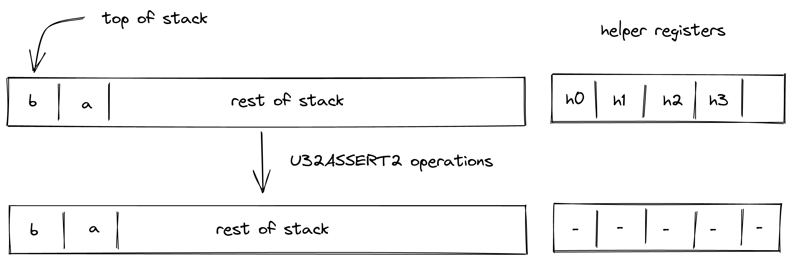
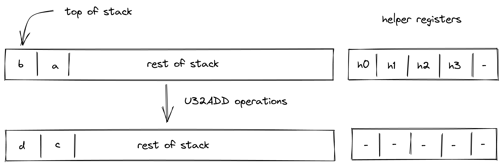
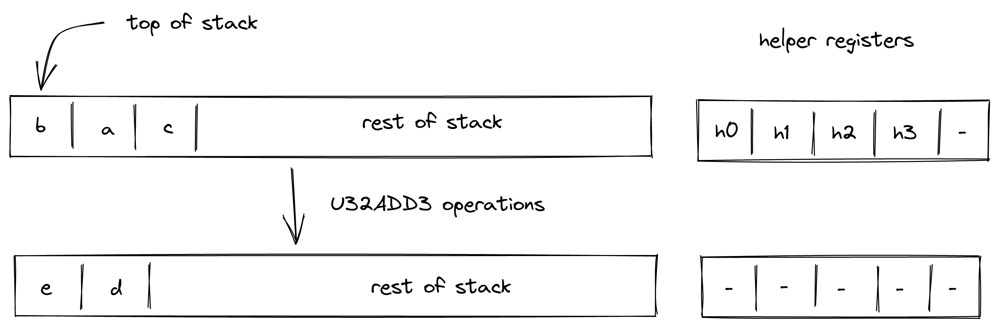
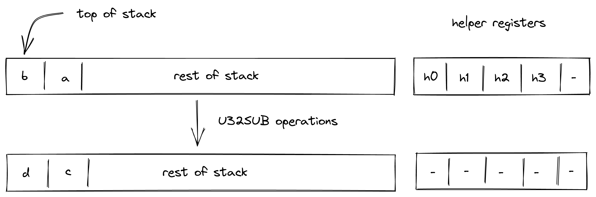
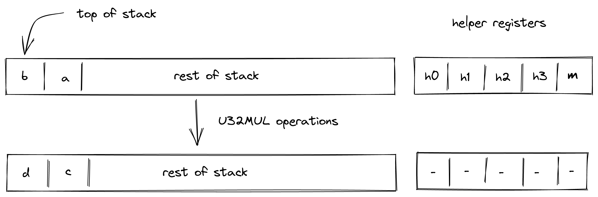
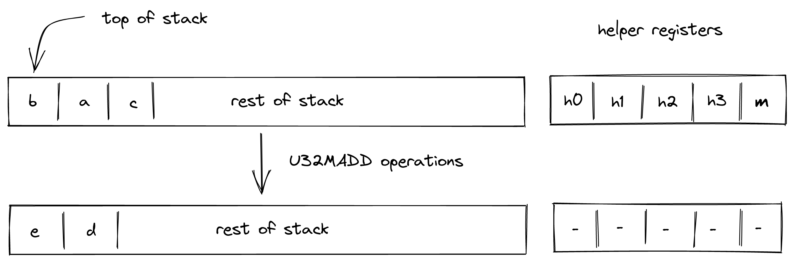
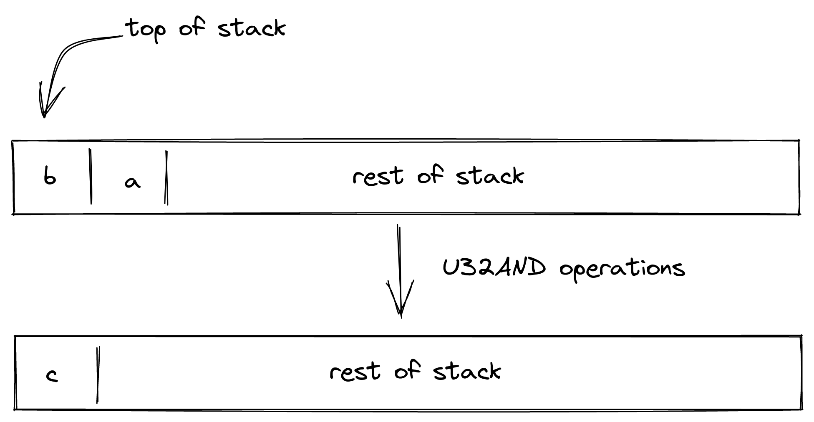
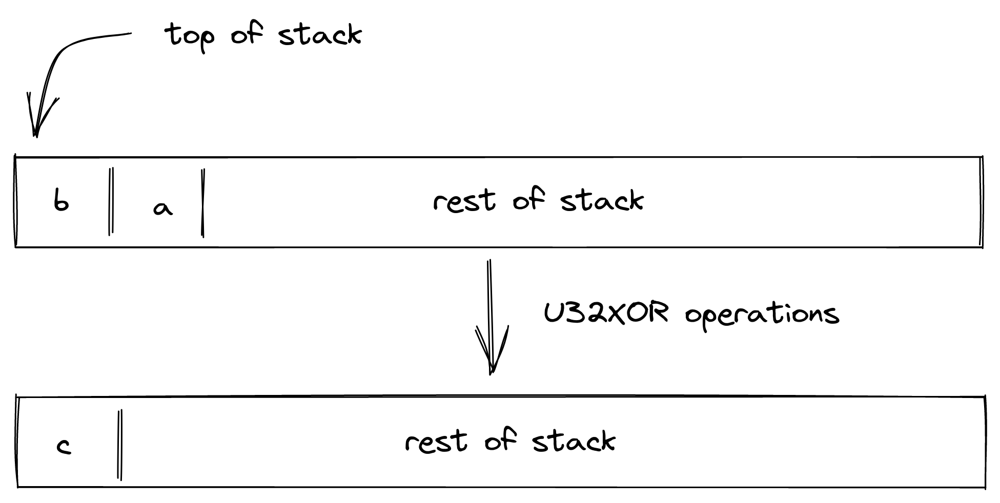

# u32 Operations
In this section we describe semantics and AIR constraints of operations over u32 values (i.e., 32-bit unsigned integers) as they are implemented in Miden VM.

### Range checks
Most operations described below require some number of 16-bit range checks (i.e., verifying that the value of a field element is smaller than $2^{16}$). The number of required range checks varies between $2$ and $4$, depending on the operation. However, to simplify the constraint system, we force each relevant operation to consume exactly $4$ range checks.

To perform these range checks, the prover puts the values to be range-checked into helper registers $h_0, ..., h_3$, and then divides the range checker bus column $b_{range}$ by a randomized product of these values. This operation is enforced via the following constraint:

>$$
b_{range}' \cdot (\alpha_0 + h_0) \cdot (\alpha_0 + h_1) \cdot (\alpha_0 + h_2) \cdot (\alpha_0 + h_3) = b_{range} \text{ | degree} = 5
$$

The above is just a partial constraint as it does not show the range checker's part of the constraint, which multiplies the required values into the bus column. It also omits the [selector flag](./op_constraints.md#operation-flags) which is used to turn this constraint on only when executing relevant operations.

### Checking element validity
Another primitive which is required by most of the operations described below is checking whether four 16-bit values form a valid field element. Assume $t_0$, $t_1$, $t_2$, and $t_3$ are known to be 16-bit values, and we want to verify that $2^{48} \cdot t_3 + 2^{32} \cdot t_2 + 2^{16} \cdot t_1 + t_0$ is a valid field element.

For simplicity, let's denote:

$$
v_{hi} = 2^{16} \cdot t_3 + t_2 \\
v_{lo} = 2^{16} \cdot t_1 + t_0
$$

We can then impose the following constraint to verify element validity:

> $$
\left(1 - m \cdot (2^{32} - 1 - v_{hi})\right) \cdot v_{lo} = 0 \text{ | degree} = 3
$$

Where $m$ is a value set non-deterministically by the prover.

The above constraint should hold only if either of the following hold:

* $v_{lo} = 0$
* $v_{hi} \ne 2^{32} - 1$

To satisfy the latter equation, the prover needs to set $m = (2^{32} - 1 - v_{hi})^{-1}$, which is possible only when $v_{hi} \ne 2^{32} - 1$.

This constraint is sufficient because modulus $2^{64} - 2^{32} + 1$ in binary representation is 32 ones, followed by 31 zeros, followed by a single one:

$$
1111111111111111111111111111111100000000000000000000000000000001
$$

This implies that the largest possible 64-bit value encoding a valid field element would be 32 ones, followed by 32 zeros:

$$
1111111111111111111111111111111100000000000000000000000000000000
$$

Thus, for a 64-bit value to encode a valid field element, either the lower 32 bits must be all zeros, or the upper 32 bits must not be all ones (which is $2^{32} - 1$).

## U32SPLIT
Assume $a$ is the element at the top of the stack. The `U32SPLIT` operation computes $(b,c) \leftarrow a$, where $b$ contains the lower 32 bits of $a$, and $c$ contains the upper 32 bits of $a$. The diagram below illustrates this graphically.

To facilitate this operation, the prover sets values in $h_0, ..., h_3$ to 16-bit limbs of $a$ with $h_0$ being the least significant limb. Thus, stack transition for this operation must satisfy the following constraints:

>$$
s_{0} = 2^{48} \cdot h_3 + 2^{32} \cdot h_2 + 2^{16} \cdot h_1 + h_0 \text{ | degree} = 1
$$

>$$
s_{1}' = 2^{16} \cdot h_1 + h_0 \text{ | degree} = 1
$$

>$$
s_{0}' = 2^{16} \cdot h_3 + h_2 \text{ | degree} = 1
$$

In addition to the above constraints, we also need to verify that values in $h_0, ..., h_3$ are smaller than $2^{16}$, which we can do using 16-bit range checks as described [previously](#range-checks). Also, we need to make sure that values in $h_0, ..., h_3$, when combined, form a valid field element, which we can do by putting a nondeterministic value $m$ into helper register $h_4$ and using the technique described [here](#checking-element-validity).

The effect of this operation on the rest of the stack is:
* **Right shift** starting from position $1$.

## U32ASSERT2
Assume $a$ and $b$ are the elements at the top of the stack. The `U32ASSERT2` verifies that both $a$ and $b$ are smaller than $2^{32}$. The diagram below illustrates this graphically.

To facilitate this operation, the prover sets values in $h_0$ and $h_1$ to low and high 16-bit limbs of $a$, and values in $h_2$ and $h_3$ to to low and high 16-bit limbs of $b$. Thus, stack transition for this operation must satisfy the following constraints:

>$$
s_0' = 2^{16} \cdot h_3 + h_2 \text{ | degree} = 1
$$

>$$
s_1' = 2^{16} \cdot h_1 + h_0 \text{ | degree} = 1
$$

In addition to the above constraints, we also need to verify that values in $h_0, ..., h_3$ are smaller than $2^{16}$, which we can do using 16-bit range checks as described [previously](#range-checks).

The effect of this operation on the rest of the stack is:
* **No change** starting from position $0$ - i.e., the state of the stack does not change.

## U32ADD
Assume $a$ and $b$ are the values at the top of the stack which are known to be smaller than $2^{32}$. The `U32ADD` operation computes $(c,d) \leftarrow a + b$, where $c$ contains the low 32-bits of the result, and $d$ is the carry bit. The diagram below illustrates this graphically.

To facilitate this operation, the prover sets values in $h_0$, $h_1$, and $h_2$ to 16-bit limbs of $a+b$ with $h_0$ being the least significant limb. Value in $h_3$ is set to $0$. Thus, stack transition for this operation must satisfy the following constraints:

>$$
s_0 + s_1 = 2^{32} \cdot h_2 + 2^{16} \cdot h_1 + h_0 \text{ | degree} = 1
$$

>$$
s_0' = h_2 \text{ | degree} = 1
$$

>$$
s_1' = 2^{16} \cdot h_1 + h_0 \text{ | degree} = 1
$$

In addition to the above constraints, we also need to verify that values in $h_0, ..., h_3$ are smaller than $2^{16}$, which we can do using 16-bit range checks as described [previously](#range-checks).

The effect of this operation on the rest of the stack is:
* **No change** starting from position $2$.

## U32ADD3
Assume $a$, $b$, $c$ are the values at the top of the stack which are known to be smaller than $2^{32}$. The `U32ADD3` operation computes $(d, e) \leftarrow a + b + c$, where $c$ and $d$ contains the low and the high 32-bits of the result respectively. The diagram below illustrates this graphically.

To facilitate this operation, the prover sets values in $h_0$, $h_1$, and $h_2$ to 16-bit limbs of $a+b+c$ with $h_0$ being the least significant limb. Value in $h_3$ is set to $0$. Thus, stack transition for this operation must satisfy the following constraints:

>$$
s_0 + s_1 + s_2 = 2^{32} \cdot h_2 + 2^{16} \cdot h_1 + h_0 \text{ | degree} = 1
$$

>$$
s_0' = h_2 \text{ | degree} = 1
$$

>$$
s_1' = 2^{16} \cdot h_1 + h_0 \text{ | degree} = 1
$$

In addition to the above constraints, we also need to verify that values in $h_0, ..., h_3$ are smaller than $2^{16}$, which we can do using 16-bit range checks as described [previously](#range-checks).

The effect of this operation on the rest of the stack is:
* **Left shift** starting from position $3$.

## U32SUB
Assume $a$ and $b$ are the values at the top of the stack which are known to be smaller than $2^{32}$. The `U32SUB` operation computes $(c, d) \leftarrow a - b$, where $c$ contains the 32-bit result in two's complement, and $d$ is the borrow bit. The diagram below illustrates this graphically.

To facilitate this operation, the prover sets values in $h_0$ and $h_1$ to the low and the high 16-bit limbs of $a-b$ respectively. Values in $h_2$ and $h_3$ are set to $0$. Thus, stack transition for this operation must satisfy the following constraints:

>$$
s_1 = s_0 + s_1' + 2^{32} \cdot s_0' \text{ | degree} = 1
$$

>$$
s_0'^2 - s_0' = 0 \text{ | degree} = 2
$$

>$$
s_1' = 2^{16} \cdot h_1 + h_0 \text{ | degree} = 1
$$

In addition to the above constraints, we also need to verify that values in $h_0, ..., h_3$ are smaller than $2^{16}$, which we can do using 16-bit range checks as described [previously](#range-checks).

The effect of this operation on the rest of the stack is:
* **No change** starting from position $2$.

## U32MUL
Assume $a$ and $b$ are the values at the top of the stack which are known to be smaller than $2^{32}$. The `U32MUL` operation computes $(c, d) \leftarrow a \cdot b$, where $c$ and $d$ contain the low and the high 32-bits of the result respectively. The diagram below illustrates this graphically.

To facilitate this operation, the prover sets values in $h_0, ..., h_3$ to 16-bit limbs of $a \cdot b$ with $h_0$ being the least significant limb. Thus, stack transition for this operation must satisfy the following constraints:

>$$
s_0 \cdot s_1 = 2^{48} \cdot h_3 + 2^{32} \cdot h_2 + 2^{16} \cdot h_1 + h_0 \text{ | degree} = 2
$$

>$$
s_1' = 2^{16} \cdot h_1 + h_0 \text{ | degree} = 1
$$

>$$
s_0' = 2^{16} \cdot h_3 + h_2 \text{ | degree} = 1
$$

In addition to the above constraints, we also need to verify that values in $h_0, ..., h_3$ are smaller than $2^{16}$, which we can do using 16-bit range checks as described [previously](#range-checks). Also, we need to make sure that values in $h_0, ..., h_3$, when combined, form a valid field element, which we can do by putting a nondeterministic value $m$ into helper register $h_4$ and using the technique described [here](#checking-element-validity).

The effect of this operation on the rest of the stack is:
* **No change** starting from position $2$.

## U32MADD
Assume $a$, $b$, $c$ are the values at the top of the stack which are known to be smaller than $2^{32}$. The `U32MADD` operation computes $(d, e) \leftarrow a +b \cdot c$, where $c$ and $d$ contains the low and the high 32-bits of $a + b \cdot c$. The diagram below illustrates this graphically.

To facilitate this operation, the prover sets values in $h_0, ..., h_3$ to 16-bit limbs of $a + b \cdot c$ with $h_0$ being the least significant limb. Thus, stack transition for this operation must satisfy the following constraints:

>$$
s_0 \cdot s_1 + s_2 = 2^{48} \cdot h_3 + 2^{32} \cdot h_2 + 2^{16} \cdot h_1 + h_0 \text{ | degree} = 2
$$

>$$
s_1' = 2^{16} \cdot h_1 + h_0 \text{ | degree} = 1
$$

>$$
s_0' = 2^{16} \cdot h_3 + h_2 \text{ | degree} = 1
$$

In addition to the above constraints, we also need to verify that values in $h_0, ..., h_3$ are smaller than $2^{16}$, which we can do using 16-bit range checks as described [previously](#range-checks). Also, we need to make sure that values in $h_0, ..., h_3$, when combined, form a valid field element, which we can do by putting a nondeterministic value $m$ into helper register $h_4$ and using the technique described [here](#checking-element-validity).

**Note**: that the above constraints guarantee the correctness of the operation iff $a + b \cdot c$ cannot overflow field modules (which is the case for the field with modulus $2^{64} - 2^{32} + 1$).

The effect of this operation on the rest of the stack is:
* **Left shift** starting from position $3$.

## U32DIV
Assume $a$ and $b$ are the values at the top of the stack which are known to be smaller than $2^{32}$. The `U32DIV` operation computes $(c, d) \leftarrow a / b$, where $c$ contains the quotient and $d$ contains the remainder. The diagram below illustrates this graphically.

To facilitate this operation, the prover sets values in $h_0$ and $h_1$ to 16-bit limbs of $a - c$, and values in $h_2$ and $h_3$ to 16-bit limbs of $b - d - 1$. Thus, stack transition for this operation must satisfy the following constraints:

>$$
s_1 = s_0 \cdot s_1' + s_0' \text{ | degree} = 2
$$

>$$
s_1 - s_1' = 2^{16} \cdot h_1 + h_0 \text{ | degree} = 1
$$

>$$
s_0 - s_0' - 1= 2^{16} \cdot h_2 + h_3 \text{ | degree} = 1
$$

The second constraint enforces that $s_1' \leq s_1$, while the third constraint enforces that $s_0' < s_0$.

The effect of this operation on the rest of the stack is:
* **No change** starting from position $2$.

## U32AND
Assume $a$ and $b$ are the values at the top of the stack. The `U32AND` operation computes $c \leftarrow (a \land b)$, where $c$ is the result of performing a bitwise AND on $a$ and $b$. The diagram below illustrates this graphically.

To facilitate this operation, we will need to make a request to the chiplet bus $b_{chip}$ by dividing its current value by the value representing bitwise operation request. This can be enforced with the following constraint:

>$$
b_{chip}' \cdot \left(\alpha_0 + \alpha_1 \cdot op_{u32and} + \alpha_2 \cdot s_0 + \alpha_3 \cdot s_1 +  \alpha_4 \cdot s_0'  \right) = b_{chip} \text{ | degree} = 2
$$

In the above, $op_{u32and}$ is the unique [operation label](../chiplets/main.md#operation-labels) of the bitwise `AND` operation.

**Note**: unlike for many other u32 operations, bitwise AND operation does not assume that the values at the top of the stack are smaller than $2^{32}$. This is because the lookup will fail for any inputs which are not 32-bit integers.

The effect of this operation on the rest of the stack is:
* **Left shift** starting from position $2$.

## U32XOR
Assume $a$ and $b$ are the values at the top of the stack. The `U32XOR` operation computes $c \leftarrow (a \oplus b)$, where $c$ is the result of performing a bitwise XOR on $a$ and $b$. The diagram below illustrates this graphically.

To facilitate this operation, we will need to make a request to the chiplet bus $b_{chip}$ by dividing its current value by the value representing bitwise operation request. This can be enforced with the following constraint:

> $$
b_{chip}' \cdot \left(\alpha_0 + \alpha_1 \cdot op_{u32xor} + \alpha_2 \cdot s_0 + \alpha_3 \cdot s_1 +  \alpha_4 \cdot s_0'  \right) = b_{chip} \text{ | degree} = 2
$$

In the above, $op_{u32xor}$ is the unique [operation label](../chiplets/main.md#operation-labels) of the bitwise `XOR` operation.

**Note**: unlike for many other u32 operations, bitwise XOR operation does not assume that the values at the top of the stack are smaller than $2^{32}$. This is because the lookup will fail for any inputs which are not 32-bit integers.

The effect of this operation on the rest of the stack is:
* **Left shift** starting from position $2$.
