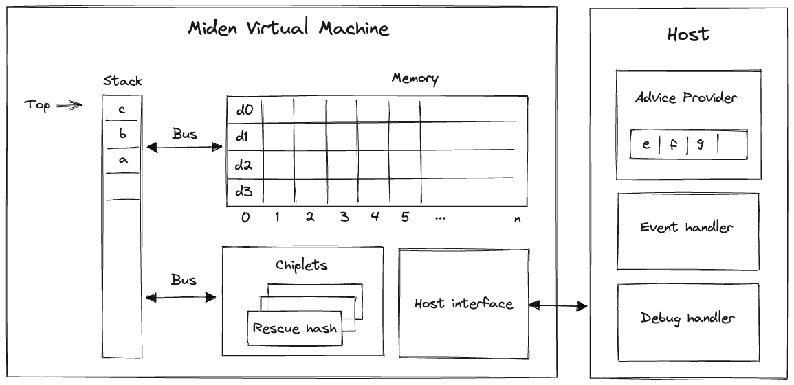

## Miden VM overview
Miden VM is a stack machine. The base data type of the MV is a field element in a 64-bit [prime field](https://en.wikipedia.org/wiki/Finite_field) defined by modulus $p = 2^{64} - 2^{32} + 1$. This means that all values that the VM operates with are field elements in this field (i.e., values between $0$ and $2^{64} - 2^{32}$, both inclusive).

Miden VM consists of three high-level components as illustrated below.

These components are:
* **Stack** which is a push-down stack where each item is a field element. Most assembly instructions operate with values located on the stack. The stack can grow up to $2^{32}$ items deep, however, only the top 16 items are directly accessible.
* **Memory** which is a linear random-access read-write memory. The memory is word-addressable, meaning, four elements are located at each address, and we can read and write elements to/from memory in batches of four. Memory addresses can be in the range $[0, 2^{32})$.
* **Advice provider** which is a way for the prover to provide nondeterministic inputs to the VM. The advice provider is composed of a single *advice stack*, an *advice map*, and a *merkle store*. The *advice stack* yields elements to the VM stack; the *advice map* stores key-mapped element lists which can be pushed onto the advice stack; finally, the Merkle store contains structured Merkle tree data and serves Merkle paths to the VM.

In the future, additional components (e.g., storage, logs) may be added to the VM.

## Writing programs
Our goal is to make Miden VM an easy compilation target for high-level blockchain-centric languages such as Solidity, Move, Sway, and others. We believe it is important to let people write programs in the languages of their choice. However, compilers to help with this have not been developed yet. Thus, for now, the primary way to write programs for Miden VM is to use [Miden assembly](../user_docs/assembly/main.md).

While writing programs in assembly is far from ideal, Miden assembly does make this task a little bit easier by supporting high-level flow control structures and named procedures.

## Inputs and outputs
External inputs can be provided to Miden VM in two ways:

1. Public inputs can be supplied to the VM by initializing the stack with desired values before a program starts executing. Any number of stack items can be initialized in this way, but providing a large number of public inputs will increase the cost for the verifier.
2. Secret (or nondeterministic) inputs can be supplied to the VM via the [*advice provider*](#nondeterministic-inputs). There is no limit on how much data the advice provider can hold.

After a program finishes executing, the elements remaining on the stack become the outputs of the program. Since these outputs will be public inputs for the verifier, having a large stack at the end of execution will increase cost to the verifier. Therefore, it's best to drop unneeded output values. We've provided the [`truncate_stack`](../user_docs/stdlib/sys.md) utility function in the standard library for this purpose.

The number of public inputs and outputs of a program can be reduced by making use of the advice stack and Merkle trees. Just 4 elements are sufficient to represent a root of a Merkle tree, which can be expanded into an arbitrary number of values.

For example, if we wanted to provide a thousand public input values to the VM, we could put these values into a Merkle tree, initialize the stack with the root of this tree, initialize the advice provider with the tree itself, and then retrieve values from the tree during program execution using `mtree_get` instruction (described [here](../user_docs/assembly/cryptographic_operations.md#hashing-and-merkle-trees)).

In the future, other ways of providing public inputs and reading public outputs (e.g., storage commitments) may be added to the VM.

### Stack depth restrictions
For reasons explained [here](../design/stack/main.md), the VM imposes the restriction that the stack depth cannot be smaller than $16$. This has the following effects:

- When initializing a program with fewer than $16$ inputs, the VM will pad the stack with zeros to ensure the depth is $16$ at the beginning of execution.
- If an operation would result in the stack depth dropping below $16$, the VM will insert a zero at the deep end of the stack to make sure the depth stays at $16$.

### Nondeterministic inputs
The *advice provider* component is responsible for supplying nondeterministic inputs to the VM. These inputs only need to be known to the prover (i.e., they do not need to be shared with the verifier).

The advice provider consists of three components:
* **Advice stack** which is a one-dimensional array of field elements. Being a stack, the VM can either push new elements onto the advice stack, or pop the elements from its top.
* **Advice map** which is a key-value map where keys are words and values are vectors of field elements. The VM can copy values from the advice map onto the advice stack as well as insert new values into the advice map (e.g., from a region of memory).
* **Merkle store** which contain structured data reducible to Merkle paths. Some examples of such structures are: Merkle tree, Sparse Merkle tree, and a collection of Merkle paths. The VM can request Merkle paths from the Merkle store, as well as mutate it by updating or merging nodes contained in the store.

The prover initializes the advice provider prior to executing a program, and from that point on the advice provider is manipulated solely by executing operations on the VM.
