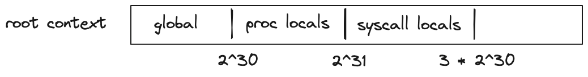

## Execution contexts
Miden assembly program execution can span multiple isolated contexts. An execution context defines its own memory space which is not accessible from other execution contexts.

All programs start executing in a *root* context. Thus, the main procedure of a program is always executed in the root context. To move execution into a different context, we can invoke a procedure using the `call` instruction. In fact, any time we invoke a procedure using the `call` instruction, the procedure is executed in a new context. We refer to all non-root contexts as *user contexts*.

While executing in a user context, we can request to execute some procedures in the root context. This can be done via the `syscall` instruction. The set of procedures which can be invoked via the `syscall` instruction is limited by the [kernel](#kernels) against which a program is compiled. Once the procedure called via `syscall` returns, the execution moves back to the user context from which it was invoked. The diagram below illustrates this graphically:


### Procedure invocation semantics
As mentioned in the [previous section](./code_organization.md), procedures in Miden assembly can be invoked via three different instructions: `exec`, `call`, and `syscall`. Invocation semantics of `call` and `syscall` instructions are basically the same, the only difference being that the `syscall` instruction can be used only with procedures which are defined in the program's kernel. The `exec` instruction is different, and we explain these differences below.

#### Invoking via `call` and `syscall` instructions
When a procedure is invoked via a `call` or a `syscall` instruction, the following happens:
* Execution moves into a different context. In case of a `call` instruction, a new user context is created. In case of a `syscall` instruction, the execution moves back into the root context.
* All stack items beyond the 16th item get "hidden" from the invoked procedure. That is, from the standpoint of the invoked procedure, the initial stack depth is set to 16.

When a procedure returns from a `call` or a `syscall`, the following happens:
* Execution moves back to the context from which the procedure was invoked.
* Stack depth is set to its original depth. Before the stack depth is reset, the VM checks if the current stack depth is exactly 16, and fails otherwise.

The manipulations of the stack depth described above have the following implications:
- The top 16 elements of the stack can be used to pass parameters and return values between the caller and the callee.
- Caller's stack beyond the top 16 elements is inaccessible to the callee, and thus, is guaranteed not to change as the result of the call.
- At the end of its execution, the callee must ensure that stack depth is exactly 16. If this is difficult to ensure manually, the [`truncate_stack`](../stdlib/sys.md) procedure can be used to drop all elements from the stack except for the top 16.

#### Invoking via `exec` instruction
Procedures invoked via the `exec` instruction, are inlined at their call sites during compilation. Thus, from the standpoint of the final program, executing procedures this way is indistinguishable from manually including procedure code in place of the `exec` instruction. This also means that procedures invoked via the `exec` instruction are executed in the same context as the caller.

### Kernels
A *kernel* defines a set of procedures which can be invoked from user contexts to be executed in the root context. Miden assembly programs are always compiled against some kernel. The default kernel is empty - i.e., it does not contain any procedures. To compile a program against a non-empty kernel, the kernel needs to be specified when instantiating the [Miden Assembler](https://crates.io/crates/miden-assembly).

A kernel can be defined similarly to a regular [library module](./code_organization.md#library-modules) - i.e., it can have internal and exported procedures. However, there are some small differences between what procedures can do in a kernel module vs. what they can do in a regular library module. Specifically:

- Procedures in a kernel module cannot use `call` or `syscall` instructions. This means that creating a new context from within a `syscall` is not possible.
- Unlike procedures in regular library modules, procedures in a kernel module can use the `caller` instruction. This instruction puts the hash of the procedure which initiated the parent context onto the stack.

### Memory layout
As mentioned earlier, procedures executed within a given context can access memory only of that context. This is true for both memory reads and memory writes.

Address space of every context is the same: the smallest accessible address is $0$ and the largest accessible address is $2^{32} - 1$. Any code executed in a given context has access to its entire address space. However, by convention, we assign different meanings to different regions of the address space.

For user contexts we have the following:
- The first $2^{30}$ words (each word is 4 field elements) are assumed to be global memory.
- The next $2^{30}$ words are reserved for memory locals of procedures executed in the same context (i.e., via the `exec` instruction).
- The remaining address space has no special meaning.


For the root context we have the following:
- The first $2^{30}$ words are assumed to be global memory.
- The next $2^{30}$ words are reserved for memory locals of procedures executed in the root context.
- The next $2^{30}$ words are reserved for memory locals of procedures executed from within a `syscall`.
- The remaining address space has no special meaning.



For both types of contexts, writing directly into regions of memory reserved for procedure locals is not advisable. Instead, `loc_load`, `loc_store` and other similar dedicated instructions should be used to access procedure locals.

### Example
To better illustrate what happens as we execute procedures in different contexts, let's go over the following example.

```
kernel
--------------------
export.baz.2
    <instructions>
    caller
    <instructions>
end

program
--------------------
proc.bar.1
    <instructions>
    syscall.baz
    <instructions>
end

proc.foo.3
    <instructions>
    call.bar
    <instructions>
    exec.bar
    <instructions>
end

begin
    <instructions>
    call.foo
    <instructions>
end
```

Execution of the above program proceeds as follows:
1. The VM starts executing instructions immediately following the `begin` statement. These instructions are executed in the *root* context (let's call this context `ctx0`).
2. When `call.foo` is executed, a new context is created (`ctx1`). Memory in this context is isolated from `ctx0`. Additionally, any elements on the stack beyond the top 16 are hidden from `foo`.
3. Instructions executed inside `foo` can access memory of `ctx1` only. The address of the first procedure local in `foo` (e.g., accessed via `loc_load.0`) is $2^{30}$.
4. When `call.bar` is executed, a new context is created (`ctx2`). The stack depth is set to 16 again, and any instruction executed in this context can access memory of `ctx2` only. The first procedure local of `bar` is also located at address $2^{30}$.
5. When `syscall.baz` is executed, the execution moves back into the root context. That is, instructions executed inside `baz` have access to the memory of `ctx0`. The first procedure local of `baz` is located at address $2^{31}$. When `baz` starts executing, the stack depth is again set to 16.
6. When `caller` is executed inside `baz`, the first 4 elements of the stack are populated with the hash of `bar` since `baz` was invoked from `bar`'s context.
7. Once `baz` returns, execution moves back to `ctx2`, and then, when `bar` returns, execution moves back to `ctx1`. We assume that instructions executed right before each procedure returns ensure that the stack depth is exactly 16 right before procedure's end.
8. Next, when `exec.bar` is executed, `bar` is executed again, but this time it is executed in the same context as `foo`. Thus, it can access memory of `ctx1`. Moreover, the stack depth is not changed, and thus, `bar` can access the entire stack of `foo`. Lastly, this first procedure local of `bar` now will be at address $2^{30} + 3$ (since the first 3 locals in this context are reserved for `foo`).
9. When `syscall.baz` is executed the second time, execution moves into the root context again. However, now, when `caller` is executed inside `baz`, the first 4 elements of the stack are populated with the hash of `foo` (not `bar`). This happens because this time around `bar` does not have its own context and `baz` is invoked from `foo`'s context.
10. Finally, when `baz` returns, execution moves back to `ctx1`, and then as `bar` and `foo` return, back to `ctx0`, and the program terminates.
